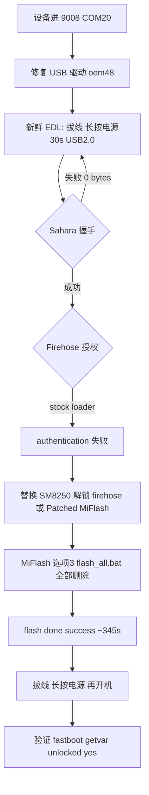

# dagu EDL 救砖完整流程记录

> **设备：** 小米平板5 Pro 12.4（`dagu`，22081281AC，256GB，SM8250）  
> **原系统：** HyperOS 2.0.10.0.ULZCNXM（Android 14）  
> **项目：** [xiaomi-pad870-win11-arm](../README.md) — Win11 ARM / edk2-msm 移植  
> **记录日期：** 2026-07-19 ～ 2026-07-21  
> **结果：** ✅ EDL 线刷成功，设备已恢复开机；Bootloader 保持解锁（刷机时未选 lock 脚本）

相关文档：

- [救砖技术附录（分区 / 小包 / firehose）](dagu-recovery-and-brick-record.md)
- [「魔改 boot」与假死/9008 原因分析](why-boot-modification-caused-dead-device.md)
- [Mass Storage 阻塞分析](mass-storage-blocker-analysis.md)
- [硬件调试流程](hardware-debug-workflow.md)

---

## 1. 背景：我们在做什么

本项目目标是在 dagu 上 bring-up **Windows 11 ARM**，路径参考 Renegade / edk2-msm / nabu WoA 社区方案。

已完成的准备工作包括：

| 阶段 | 内容 |
|------|------|
| Phase 0 | Golden Baseline 采集（`dumps/dagu-20260719-*`） |
| Bootloader | 2026-07-19 解锁，`fastboot getvar unlocked` → `yes` |
| UEFI port | 构建 `artifacts/boot-dagu-latest.img`，**仅** `fastboot boot` 测试 |
| LSMS | 自编 SM8250 Mass Storage 内核 + DTB patch，目标是通过 USB 暴露 UFS 改 GPT |
| 测试实验室 | `tools/test-lab/`、`test-lab.json` — 强调链式引导、不写 boot 分区 |

**实验铁律（文档与脚本一致）：** 调试期只用 `fastboot boot`，禁止 `fastboot flash boot`，避免刷坏 Android 启动分区。

---

## 2. 砖机现象

设备最终进入 **Qualcomm EDL 9008**，PC 识别为：

```text
Qualcomm HS-USB QDLoader 9008 (COM20)
```

无法正常使用 Android / Fastboot（或只能反复进 9008），需要通过 **线刷（EDL）** 恢复。

---

## 3. 「魔改分区」—— 实际改了什么、没改什么

用户担心砖机由 **GPT / 分区魔改** 导致。根据仓库记录，结论如下：

### 3.1 没有持久化写入 UFS 的操作

| 操作 | 是否写入磁盘 | 说明 |
|------|--------------|------|
| `fastboot boot boot-dagu.img` | **否** | UEFI 仅在 RAM 运行，不动 boot 分区 |
| `patch-dagu-dtb-for-msc.sh` | **否** | DTB 改动在构建产物内，不写 `dtbo` 分区 |
| GPT resize / 新建 WIN 分区 | **否（未成功）** | WoA 规划步骤；MSC 从未在 PC 上枚举出盘，无改盘日志 |
| `fastboot flash boot` | **否** | 项目规范禁止，会话内未执行 |

### 3.2 可能导致启动链异常的因素

1. **大量 UEFI / LSMS 链式引导** — 黑屏、watchdog 重启、slot/metadata 状态异常  
2. **WoA 路线上的 GPT 改造意图** — 若曾用其它工具改过分区（非本仓库脚本），需以当时操作为准  
3. **救砖/刷机未完成或 EDL 会话超时** — Sahara 握手失败、刷写中断  

### 3.3 降级小包的角色

社区 **「小米平板5 Pro 12.4 降级小包」** 针对 **GPT / 启动链损坏** 设计：

- 含 `gpt_*.bin`、`rawprogram0–5.xml` — 重写 UFS 分区表 + xbl/abl/boot 等  
- `super.img` 仅 **~270KB**（sparse 壳），**不能**单独恢复完整 HyperOS  
- 完整恢复仍需再刷 **官方完整 ROM**（~8.6GB `super.img`）

路径示例：`D:\Download\Edge\小米平板5Pro12.4降级小包\`

---

## 4. 救砖资源准备

### 4.1 官方完整 ROM

```text
D:\rom\dagu-recovery\dagu_images_OS2.0.10.0.ULZCNXM\dagu_images_OS2.0.10.0.ULZCNXM_14.0\
  flash_all.bat
  flash_all_lock.bat.DISABLED   ← 已重命名，防止误锁 BL
  images\
    super.img                     (~8.6 GB)
    prog_ufs_firehose_sm8250_ddr_5.elf
    rawprogram0.xml … rawprogram5.xml
```

下载脚本：`tools/download-dagu-recovery.ps1`

### 4.2 MiFlash

```text
D:\rom\dagu-recovery\MiFlash20220507\MiFlash20220507\XiaoMiFlash.exe
E:\Download\Chrome\MiFlash20220218\XiaoMiFlash.exe   ← 备用副本
```

### 4.3 仓库内工具

| 脚本 | 用途 |
|------|------|
| `tools/flash-dagu-recovery.ps1` | 启动 MiFlash、强制 `flash_all.bat`、禁用 lock 脚本 |
| `tools/flash-dagu-edl.ps1` | Qualcomm QSaharaServer + fh_loader 直刷（绕过 MiFlash GUI） |
| `tools/fix-miflash-ghost-device.ps1` | 修复 log 目录、幽灵设备、config |
| `tools/install-qdloader9008-driver.ps1` | Code 52 驱动修复（oem48.inf） |

---

## 5. 诊断过程（按时间线）

### 5.1 驱动与 MiFlash 环境

| 问题 | 现象 | 处理 |
|------|------|------|
| 缺少 `log\` 目录 | MiFlash `DirectoryNotFoundException` | 创建 `log`、`restore`、`tmp` |
| 幽灵设备 `20170726905923` | 列表里总有假设备 | `fix-miflash-ghost-device.ps1` 关 PDL 扫描 |
| Code 52 驱动 | 9008 黄色感叹号 | `install-qdloader9008-driver.ps1 -FixCode52Only`，绑定 oem48.inf |
| 只可选 MiFlash 选项 3 | 正常 — 设备在 EDL 不在 Fastboot | 选项 1–2 仅 fastboot 模式可用 |

### 5.2 Sahara 握手

| 状态 | 现象 | 处理 |
|------|------|------|
| 失败 | `Unable to read packet header. Only read 0 bytes` | EDL 会话超时 — **拔 USB → 长按电源 30s → USB 2.0 重插** |
| 成功 | `736052 bytes transferred` / `Sahara protocol completed` | 可进入 firehose 阶段 |

验证命令（MiFlash 自带工具）：

```powershell
cd D:\rom\dagu-recovery\MiFlash20220507\MiFlash20220507
.\QSaharaServer.exe -p "\\.\COM20" -s "13:D:\rom\...\images\prog_ufs_firehose_sm8250_ddr_5.elf"
```

### 5.3 EDL 授权（真正瓶颈）

Sahara 成功后，MiFlash / fh_loader 均失败：

```text
ERROR: Only nop and sig tag can be received before authentication.
MiFlash 状态: edl authentication → 结果: authentication
```

**含义：** 官方 stock `prog_ufs_firehose_sm8250_ddr_5.elf` 启用了小米 **EDL Auth（SLA）**，必须收到服务器/工具签发的 **sig** 才能写分区。  
这与 Bootloader 是否解锁 **无关**；换官方 ROM / 降级小包 **不能** 绕过。

实测：完整 ROM、降级小包、2023/2025 两套 stock firehose — **全部需要授权**。

---

## 6. 成功路径（最终做法）

### 6.1 方案概览



### 6.2 解锁 firehose（SM8250 / 与 Poco F3 同源）

dagu 与 **Poco F3（骁龙 870）** 使用相同 firehose 文件名：

```text
images\prog_ufs_firehose_sm8250_ddr_5.elf
```

步骤：

1. 备份 ROM `images\` 内 **原厂** 两个 firehose 到其它目录  
2. 从 XDA 获取解锁 loader（见 [附录链接](dagu-recovery-and-brick-record.md#62-dagu-可用的社区方案同-sm8250--ddr5-ufs)）  
3. **重命名**为 `prog_ufs_firehose_sm8250_ddr_5.elf` 放入 `images\`  
4. 或使用 **[Patched MiFlash for Poco F3](https://xdaforums.com/t/patched-miflash-for-poco-f3-edl-flash-no-internet-required.4723044/)**（无需小米账号；若先报 auth 错误 **等待 ~30 秒** 再自动开刷）

### 6.3 MiFlash 刷机设置（成功配置）

| 项 | 值 |
|----|-----|
| ROM 路径 | `D:\rom\dagu-recovery\...\dagu_images_OS2.0.10.0.ULZCNXM_14.0` |
| 刷机选项 | **全部删除**（`flash_all.bat`） |
| **禁止** | 「全部删除并 lock」/ `flash_all_lock.bat` |
| 模式 | EDL — 选项 **3** |
| 设备 | COM20 |
| 耗时 | 约 **345 秒** |
| 结果 | **flash done / success** |

### 6.4 可选两阶段（GPT 严重损坏时）

若仅刷完整 ROM 仍异常，可先：

1. **阶段 A：** EDL 刷 **降级小包**（恢复 GPT + 启动链）  
2. **阶段 B：** EDL 再刷 **完整 HyperOS ROM**

本次最终以 **完整 ROM 单次刷机成功** 恢复（用户确认已可正常开机）。

---

## 7. 刷机后如何启动

1. **拔掉 USB**  
2. **长按电源 10～30 秒**（强制关机）  
3. **短按电源** 开机  
4. 首次启动可能 **5～15 分钟** 停在 logo — 属正常，勿反复按键  
5. 进入 **HyperOS 开机向导**（因选了「全部删除」，数据已清空）

### 7.1 必做验证

```powershell
cd E:\Projects\xiaomi-pad870-win11-arm\tools\platform-tools

# 关机后 电源+音量下 进 Fastboot
.\fastboot.exe getvar unlocked    # 期望: yes
.\fastboot.exe getvar product     # 期望: dagu
.\fastboot.exe reboot             # 回 Android
```

---

## 8. 恢复后继续 WoA 实验

设备救回后，继续 UEFI 工作请遵守：

```powershell
# 链式引导 — 不写 boot 分区
.\tools\boot-dagu.ps1
```

| 规则 | 原因 |
|------|------|
| 只用 `fastboot boot` | 失败仍可回 Android |
| MSC 未打通前不改 GPT | 避免再次 EDL 救砖 |
| DTB 改动留在构建链 | 不写 dtbo 分区 |
| EDL 前禁用 `flash_all_lock.bat` | 保持 BL 解锁 |

---

## 9. 问题速查表

| 症状 | 可能原因 | 动作 |
|------|----------|------|
| `cannot receive hello packet` / Sahara 0 bytes | EDL 超时 | 拔线 → 长按电源 30s → USB 2.0 |
| `edl authentication` | stock firehose 要 sig | 换解锁 loader 或 Patched MiFlash |
| MiFlash 假设备一直存在 | PDL/BT 干扰 | `fix-miflash-ghost-device.ps1` |
| Code 52 | 驱动未签名 | `install-qdloader9008-driver.ps1` |
| 刷完无法开机 | 未拔线 / 首启时间长 | 拔线强制关机再开，等 15 分钟 |
| `unlocked: no` | 误用 lock 脚本 | 重新 EDL 刷 `flash_all.bat`，勿用 lock |

---

## 10. 经验总结

1. **9008 不等于完蛋** — 驱动 + Sahara + firehose 授权三步，前两步可自测，第三步是 HyperOS 国行常见卡点。  
2. **官方 MiFlash + 官方 firehose 在 HyperOS 上常卡在 authentication** — 需社区解锁 loader 或 Patched MiFlash，与 Poco F3 共用 SM8250 资源。  
3. **本仓库 WoA 实验未持久化改分区** — 砖机更可能与启动链/EDL 刷机过程相关；降级小包针对 GPT 损坏场景。  
4. **救砖成功仍可能清空 userdata** — 「全部删除」= 恢复出厂，重要数据应事前备份。  
5. **保持 Bootloader 解锁** 对后续 WoA 至关重要 — 刷机前后都要 `getvar unlocked` 确认。

---

## 11. 一键命令索引

```powershell
# 修复 MiFlash 环境
.\tools\fix-miflash-ghost-device.ps1 -MiFlashRoot "D:\rom\dagu-recovery\MiFlash20220507\MiFlash20220507"

# 修复 9008 驱动
.\tools\install-qdloader9008-driver.ps1 -FixCode52Only

# 启动 MiFlash（强制 flash_all.bat、禁用 lock）
.\tools\flash-dagu-recovery.ps1

# EDL 直刷（需已通过 firehose 授权）
.\tools\flash-dagu-edl.ps1
.\tools\flash-dagu-edl.ps1 -RomDir "D:\Download\Edge\小米平板5Pro12.4降级小包"

# 刷机后 UEFI 实验
.\tools\boot-dagu.ps1
```

---

*本文档由 2026-07-21 dagu EDL 救砖会话整理，随工具链更新可增补 PR。*
