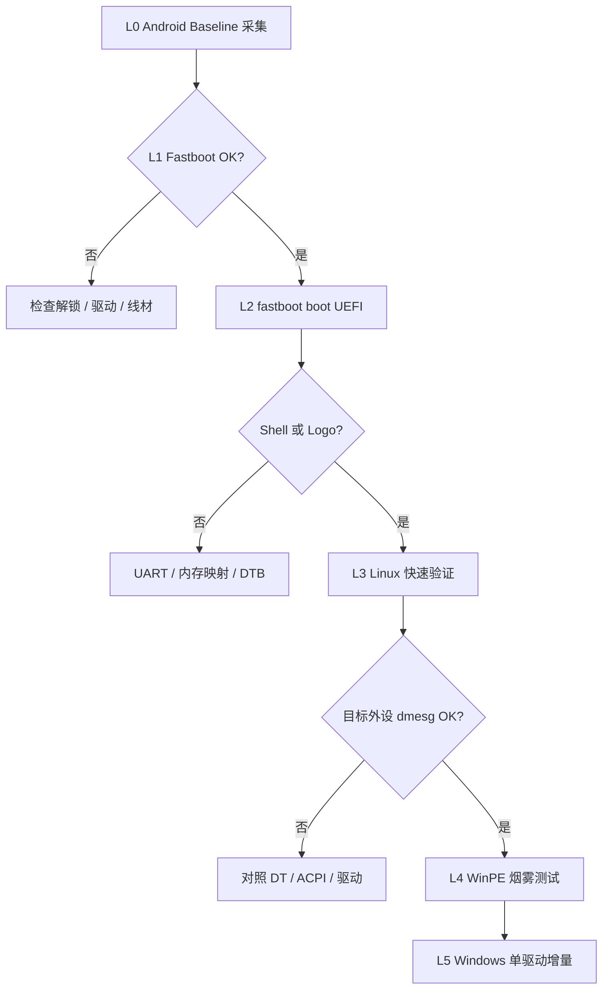

# 硬件快速调试流程 — dagu (小米平板5 Pro 12.4)

> 目标：在 bring-up 阶段 **尽快得到可验证的结论**，避免「改一堆 → 刷机 → 黑屏 → 不知道哪错了」的低效循环。  
> 适用阶段：Phase 0（硬件摸底）～ Phase 4（外设/GPU），贯穿 UEFI / Linux / Windows 全栈。

相关文档：[方案调研](solution-research.md) · [硬件清单模板](hardware-inventory.md)

---

## 1. 设计原则

| 原则 | 含义 | 违反时的典型后果 |
|------|------|------------------|
| **分层验证** | 先在低层 OS（Android → UEFI Shell → Linux）确认硬件，再进 Windows | Windows BSOD 无法定位是 ACPI 还是驱动问题 |
| **链式引导，暂不刷写** | UEFI 调试期只用 `fastboot boot boot-dagu.img`，不写 boot 分区 | 刷坏 boot 导致无法回 Android |
| **一次采集，持续 diff** | 建立 Golden Baseline 后，每次改动只对比差异 | 重复手工 adb 命令，遗漏关键节点 |
| **单变量实验** | 每次只改一项（一个 ACPI 节点 / 一个驱动 / 一条内存映射） | 无法 bisect 回归 |
| **先通路后优化** | 优先「能启动 + 有日志」，再追求性能/120Hz | 在无串口时纠结 GPU 帧率 |
| **Linux 先行** | SM8250 主线内核对时钟/GPU/存储验证更快 | 每个假设都走完整 Windows 安装（数小时） |

**核心指标：** 单次实验从「改代码」到「看到结果」应控制在 **5～15 分钟**（UEFI 链式引导 + 日志）；Windows 全量安装不应出现在日常调试循环里。

---

## 2. 调试栈分层模型

从下到上，每一层通过后再进入上一层。跳层 = 调试成本指数上升。

```
L0  Android (Stock / 已 root)     ← 硬件清单、分区、DTB、iomem 【必做 baseline】
L1  Fastboot / Bootloader        ← 解锁状态、分区可见性、救砖通路
L2  UEFI (fastboot boot)         ← SimpleFb、Shell、按键菜单、UART
L3  Linux (UEFI 引导)            ← dmesg 验证 clk/UFS/USB/面板/GPU
L4  WinPE                         ← 存储/USB/基础 ACPI 是否够安装程序跑起来
L5  Windows + 驱动包 (增量)       ← 单驱动、单 ACPI 变更验证
```



---

## 3. Golden Baseline（一次性，约 30 分钟）

在 **任何 UEFI/分区改动之前** 完成。所有后续 diff 都相对此快照。

### 3.1 采集内容

| 类别 | 路径 / 命令 | 用途 |
|------|-------------|------|
| 设备身份 | `getprop ro.product.device` `ro.board.platform` `ro.hardware` | 确认 dagu / SM8250 |
| 分区表 | `ls -l /dev/block/by-name/` + `by-name/*` 大小 | GPT 改造前备份 |
| 内存布局 | `/proc/iomem` | UEFI 内存映射 |
| 设备树 | `/sys/firmware/fdt` 或 boot.img 解包 DTB | reserved-memory、外设地址 |
| CPU/GPU | `/proc/cpuinfo` `/sys/class/kgsl/kgsl-3d0/` | 确认 Adreno 650 |
| 存储 | `/sys/class/block/` `df` | UFS LUN 布局 |
| USB | `lsusb` (需 USB OTG + PC) | 控制器型号 |
| 输入 | `getevent -lp` | 触控 IC、按键 |
| 音频 | `/proc/asound/cards` `dmesg \| grep -i wcd` | Codec 型号 |
| 无线 | `dmesg \| grep -iE 'wlan\|cnss\|qca'` | Wi-Fi 芯片 |
| 显示 | `/sys/class/drm/` `dmesg \| grep -iE 'dsi\|mdp'` | 面板 / DSI 节点 |
| 传感器 | `dumpsys sensorservice` 或 `ls /sys/bus/iio/devices/` | IMU、光感等 |

### 3.2 一键采集

在 PC 上（已安装 adb，平板 USB 调试已开）：

```bash
# 仓库 tools/ 目录下
./tools/collect-hw-dump.sh
# 或 Windows PowerShell
.\tools\collect-hw-dump.ps1
```

输出目录：`dumps/dagu-YYYYMMDD-HHMMSS/`，**纳入 git 时脱敏序列号**。

### 3.3 必须额外人工保存

- [ ] 相机拍摄：**设置 → 关于平板** 全页（型号 22081281AC）
- [ ] 相机拍摄或抄写：**fastboot getvar all** 完整输出
- [ ] 导出：**默认 GPT 分区名与顺序**（改分区前）
- [ ] 确认：**EDL 救砖线 / 备用线刷包** 可用

完成后填写 [hardware-inventory.md](hardware-inventory.md)。

---

## 4. 日常快速实验循环（The Loop）

每次调试会话遵循同一结构，保证结果可复现、可对比。

### 4.1 会话前（2 分钟）

```
1. 记录：git commit / 改了什么（一条 bullet）
2. 确认：Android 仍可正常启动（或已知当前卡在哪个层）
3. 确认：PC 端 adb / fastboot 可用
4. 可选：UART 线已接，串口终端 115200 8N1 打开
```

### 4.2 构建（UEFI 改动时）

```bash
cd edk2-msm
./build.sh -d dagu --skip-rootfs-gen   # 后续构建务必 skip，节省大量时间
# 产物：boot-dagu.img
```

### 4.3 链式引导（不写 flash）

```bash
adb reboot bootloader
# 等进入 fastboot
fastboot boot boot-dagu.img
```

**禁止** 在 L2～L4 调试期使用 `fastboot flash boot`，除非已有完整 Android 线刷包且明确要固化。

### 4.4 观察点（按优先级）

| 顺序 | 观察 | 通过标准 |
|------|------|----------|
| 1 | 屏幕 | Renegade Logo / UEFI 菜单 / Shell 提示符 |
| 2 | UART | 若有线：最后 50 行无重复 panic |
| 3 | USB | PC 识别 UEFI 虚拟盘或 Linux/WinPE 安装介质 |
| 4 | 键盘 | USB 键盘在 Shell 中可输入 |

### 4.5 会话后（3 分钟）

在 `docs/sessions/YYYY-MM-DD.md`（自建）记录：

```markdown
## 实验 #N
- 假设：
- 改动：
- 命令：fastboot boot ...
- 结果：✅/❌ + 现象（截图/串口末尾）
- 下一步：
```

失败时必须 **先回 Android**（长按电源 / `fastboot reboot`），确认基线未破坏，再进行下一实验。

---

## 5. 分阶段调试手册

### 5.1 L0 — Android 硬件摸底

**目标：** 在不动分区的前提下，确认各外设 Linux 驱动名与硬件 ID。

**快速命令包：**

```bash
adb shell su -c 'cat /proc/iomem' > iomem.txt
adb shell su -c 'cp /sys/firmware/fdt /sdcard/fdt.dtb'
adb pull /sdcard/fdt.dtb
adb shell getevent -lp
adb shell dumpsys display | head -80
```

**结论模板：**

| 子系统 | 芯片/节点 | 证据来源 | Windows ACPI 需覆盖 |
|--------|-----------|----------|---------------------|
| 触控 | ? | getevent | _HID / _CRS |
| Wi-Fi | ? | dmesg | CNSS / BDF |
| 音频 | ? | /proc/asound | ADSP / SoundWire |
| 面板 | ? | drm dmesg | MDSS / DSI |

### 5.2 L2 — UEFI 冒烟测试

**目标：** 证明 `boot-dagu.img` 能起来，不追求 Windows。

**通过阶梯：**

1. 黑屏 → 有背光无内容 → **查 SimpleFb 分辨率 / DTB 面板节点**
2. Logo 后卡死 → **查内存映射 reserved region 与 /proc/iomem 冲突**
3. 进 Shell → **跑 `map -r` `devices` 确认 DXE 加载**
4. 菜单可选 Simple Init / Shell → **不要再走自编 USB Mass Storage**

**UART：** SM8250 常见调试 UART 需从 DT 或 schematics 确认；edk2-msm 可配 `QcomGeniSerialPortLib`。无 UART 时，**屏幕 + USB 是唯一反馈**，改动需更小步。

### 5.3 L3 — Linux 快速验证（强烈推荐）

**为什么：** 一次 Linux 启动 + `dmesg` 往往 **5 分钟内** 告诉你 clk、regulator、GPU、UFS 是否枚举；同等信息在 Windows 可能要多次 BSOD。

**路径：**

- edk2-msm 引导 **主线内核 + dagu DTB**（或 PostmarketOS / 社区 SM8250 镜像若可用）
- 内核参数建议：`clk_ignore_unused` `pd_ignore_unused`（SM8250 早期 port 常用）
- 关注：`gpucc` `mdss` `ufshcd` `cnss` `wcd938x` `i2c` 相关行

**通过标准示例：**

```
[    2.xxx] msm-dsi-display bind OK
[    3.xxx] ufshcd 1d84000.ufshc: UFS device found
[    4.xxx] adreno 3d00000.qcom,kgsl-3d0: GPU identified as A650
```

Linux 某外设 OK → 再移植到 ACPI/Windows 驱动，**不是** Linux 失败却直接上 Windows。

### 5.4 L4 — WinPE 烟雾测试

**目标：** 安装程序能否看到磁盘、键鼠、（可选）网络。

**原则：**

- 使用 **定制 PE**，预注入 **已验证最小驱动集**
- 不在此阶段灌入完整 WOA-Drivers
- 失败时看：`X:\Windows\Panther\setuperr.log`（若可 Mass Storage 挂载）

### 5.5 L5 — Windows 单驱动增量

**目标：** 每次只增加一个驱动或一个 ACPI 变更。

**推荐顺序（与依赖关系一致）：**

```
1. 存储 (UFS) + USB 主控     → 能进系统
2. 基础 PMIC / 时钟 (ACPI)   → 不随机 BSOD
3. 显示 (MDSS/QCDX)          → 有桌面（可先软件渲染）
4. 触控                      → 可交互
5. Wi-Fi / 蓝牙
6. 音频
7. GPU 硬件加速
8. 亮度 / 传感器 / 旋转 / 休眠
```

**驱动注入：**

```powershell
# 离线，Mass Storage 挂载 Windows 分区于 X:
.\extract.ps1 dagu
DriverUpdater.exe -d "...\definitions\..." -r "..." -p X:\
```

每次只新增 **一个** INF 组，重启，记录 Device Manager 与 `C:\Windows\Minidump\`。

---

## 6. 日志与观测矩阵

| 层级 | 主要日志 | 获取方式 | 典型问题 |
|------|----------|----------|----------|
| Android | `dmesg`, `logcat` | adb | 硬件节点名、固件路径 |
| UEFI | 串口、SimpleFb | UART / 屏幕 | DXE 加载失败、内存冲突 |
| Linux | `dmesg`, `/sys` | 串口 / adb | clk/regulator/GPU |
| WinPE | Panther 日志 | Mass Storage | 磁盘不可见 |
| Windows | Event Viewer, Minidump, `dxdiag` | 系统内 / 离线挂载 | BSOD 驱动、GPU |

**BSOD 快速分类：**

| 停止码 / 现象 | 优先怀疑 |
|---------------|----------|
| 早期启动即 BSOD | ACPI 内存/SOC 表、UFS 驱动 |
| 登录界面前后 | 显示/GPU、触控 filter |
| 装驱动后立即 | 该 INF 与硬件不匹配 |
| 随机 BSOD | 电源/休眠、错误 _CRS 地址 |

---

## 7. 子系统检查表（可打印）

调试某外设时，逐项打勾，避免遗漏。

### 7.1 显示 / 面板

- [ ] Android `dmesg` 中 mdss / dsi 节点名已记录
- [ ] DTB 中 panel timing 与 2560×1600 一致
- [ ] UEFI SimpleFb 分辨率与物理面板匹配
- [ ] reserved-memory 未覆盖 framebuffer 区域
- [ ] Windows：Basic Display vs QCDX 驱动状态

### 7.2 存储 (UFS)

- [ ] `/proc/iomem` 中 UFHCS 基地址已记录
- [ ] WinPE / USB 安装介质能识别 UFS 容量
- [ ] WinPE 安装程序识别磁盘容量正确
- [ ] 不使用过时 UFS 驱动（参考 nabu 社区 UFS 警告）

### 7.3 触控

- [ ] `getevent -lp` 记录设备名与 bus
- [ ] Android 内核 touch 驱动模块名
- [ ] Windows HID 或定制 INF 的 _HID
- [ ] 旋转/分辨率变换后坐标是否仍正确

### 7.4 Wi-Fi / 蓝牙

- [ ] `dmesg` 确认 cnss / qca 型号与 BDF 路径
- [ ] ACPI 中 MAC/BDF 节点与 Android 一致
- [ ] 先测 Wi-Fi，蓝牙后测（共用 PMIC 依赖）

### 7.5 GPU (Adreno 650)

- [ ] Linux `kgsl` 或 `msm` drm 是否绑定
- [ ] Windows：先 **软件渲染进桌面**，再装 QCDX
- [ ] `dxdiag` 记录 Driver Model (WDDM) 版本
- [ ] 每次只动 GPU 相关 ACPI + 一个驱动包

---

## 8. 失败决策树（简版）

```
无法 fastboot？
  → 线材/驱动/按键组合 → 仍不行 → EDL 线刷恢复

fastboot boot 后黑屏？
  → 有 UART？→ 看 panic 点
  → 无 UART → 回退上一 boot-dagu.img → 只改一项（内存 map 或 DTB）

UEFI OK，Linux 卡 earlycon？
  → 对照 iomem 与 reserved-memory
  → 试 clk_ignore_unused

Linux OK，WinPE 无盘？
  → Mass Storage / UFS 驱动 / 分区 GPT

WinPE OK，Windows BSOD？
  → 最后一项驱动或 ACPI 变更回滚
  → 分析 Minidump（WinDbg preview）

Windows 进桌面但某外设不工作？
  → Device Manager 硬件 ID → 对照 Android 同名节点 → 补 ACPI 或 INF
```

---

## 9. 可靠性的工程保障

### 9.1 版本与产物管理

```
dumps/          # baseline，只追加不修改
artifacts/
  boot-dagu-YYYYMMDD-commit.img
docs/sessions/  # 实验日志
```

每个 **可启动** 的 `boot-dagu.img` 用 `日期+git短hash` 命名存档，Regression 时可 `fastboot boot` 旧镜像 bisect。

### 9.2 安全护栏

| 规则 | 原因 |
|------|------|
| 改 GPT 前导出完整分区表 | nabu 社区有 userdata 被误删案例 |
| 调试期不 `fastboot flash boot` | 保留 Android 回退路径 |
| 电量 > 50% 再做分区/刷写 | UFS 操作中断风险 |
| 准备 Mi 线刷包 + EDL 短接图 | 最后手段 |

### 9.3 PC 端环境建议

- **Windows PC：** 编译 edk2、DriverUpdater、WinPE、WinDbg
- **Linux：** edk2-msm 官方推荐 Arch/Ubuntu 编译链
- **adb / fastboot：** Google platform-tools，固定 PATH
- **串口：** USB-TTL + 杜邦线（若硬件支持 UART test point）

### 9.4 时间预算参考

| 活动 | 预期耗时 |
|------|----------|
| Golden Baseline 采集 | 30 min（一次） |
| UEFI 增量编译 + fastboot boot | 5～15 min |
| Linux 启动 + dmesg 分析 | 10～20 min |
| WinPE 烟雾测试 | 15～30 min |
| 完整 Windows 重装 | **2～4 h（仅里程碑，非日常）** |

---

## 10. 与项目路线图的对齐

| 项目 Phase | 本流程层 | 退出标准 |
|------------|----------|----------|
| Phase 0 硬件摸底 | L0 | Golden Baseline + hardware-inventory 填完 |
| Phase 1 UEFI | L2 | Shell + 按键菜单稳定 3 次连续成功 |
| Phase 1.5 可选 | L3 | Linux dmesg 中 UFS+显示+USB OK |
| Phase 2 Windows | L4～L5 | WinPE 见盘 + 最小驱动进桌面 |
| Phase 3～4 外设/GPU | L5 增量 | 检查表 7.x 逐项通过 |

---

## 11. 相关工具与链接

- 采集脚本：[`tools/collect-hw-dump.sh`](../tools/collect-hw-dump.sh) / [`.ps1`](../tools/collect-hw-dump.ps1)
- [Renegade Porting Guide](https://renegade-project.tech/en/porting) — 移植所需 Android 文件
- [erdilS nabu 指南](https://github.com/erdilS/Port-Windows-11-Xiaomi-Pad-5) — 分区与双系统安全实践
- [Silicium-ACPI](https://github.com/Project-Silicium/Silicium-ACPI) — SM8250 ACPI 参考

---

**文档版本：** 2026-07 · 随 bring-up 进展更新通过标准与 dagu 特有节点。
