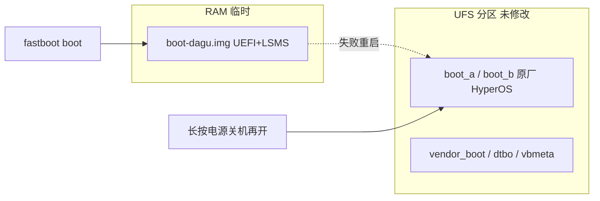
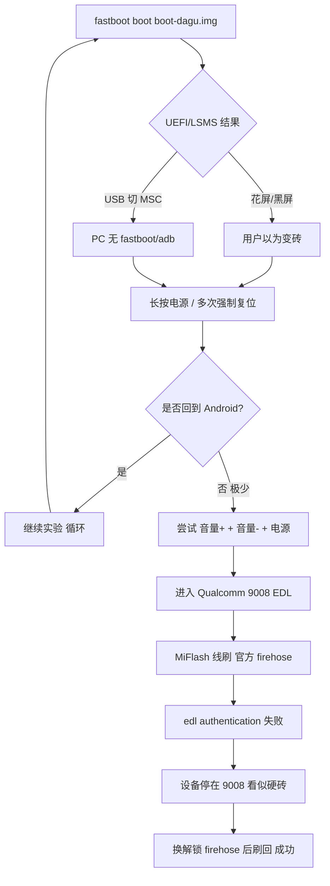

# 为什么「魔改 boot」会让 dagu 看起来死机 — 技术说明

> 设备：小米平板5 Pro 12.4（`dagu`，SM8250，A/B slot）  
> 项目阶段：edk2-msm UEFI 移植 + LinuxSimpleMassStorage（LSMS）  
> 记录日期：2026-07-21  
> 关联：[UEFI 移植说明](uefi-port-dagu.md) · [MSC 阻塞分析](mass-storage-blocker-analysis.md) · [EDL 救砖流程](dagu-edl-recovery-full-playbook.md)

---

## 0. 先给结论（避免误解）

| 说法 | 是否准确 |
|------|----------|
| 「我们把磁盘上的 Android `boot` 分区刷坏了」 | **按项目规范：不应发生** — 全程约定只用 `fastboot boot`，不写 `boot_a`/`boot_b` |
| 「魔改 boot 导致机器彻底变砖、只能 9008」 | **通常不是单因** — 链式引导本身**不改 UFS**；最终 9008 多与 **进 EDL + 线刷/授权** 路径叠加有关 |
| 「魔改 boot 会让平板黑屏、假死、PC 连不上」 | **是，且多次发生** — 这是我们实验期的**主要故障形态** |
| 「实验失败后 Android 还在不在？」 | **在** — 长按电源重启后多次验证可回 HyperOS；救砖前仍是「启动链/状态异常 + 用户无法恢复」，而非分区被覆盖 |

**一句话：** 我们「魔改」的是 **`boot-dagu.img`（临时 UEFI 载荷）**，不是官方 HyperOS 的 **`boot.img` 分区内容**。  
但这份载荷 **极不完整、反复 ExitBootServices 进自编 Linux**，在 dagu 上会造成 **假死、黑屏、USB 断连**；若此时误判为砖并 **反复进 EDL / 失败线刷**，才会落到 **9008 救砖** 局面。

---

## 1. 「魔改 boot」在本项目里指什么

口语里的「改 boot」容易混淆。在本仓库中有 **两层含义**：

### 1.1 我们实际做的（RAM 里的 UEFI 镜像）

```powershell
fastboot boot artifacts\boot-dagu-latest.img
```

| 项目 | 说明 |
|------|------|
| 产物名 | `boot-dagu.img`（~6–7 MB，随 KEYFIX 迭代） |
| 本质 | **edk2-msm 编出来的 UEFI 固件包**，封装成 Android `boot.img` 头格式，供 ABL 在 RAM 中加载 |
| 内含 | Renegade UEFI + SimpleFb + BootManager + **自编 LSMS 内核** + 多版 DTB patch + ACPI 占位 |
| 是否写盘 | **`fastboot boot` 不写分区** — 断电/重启后仍从 UFS 上的 **原厂 boot 槽** 启动 Android |
| 构建脚本 | `tools/build-dagu-uefi.sh` → `port/dagu/` overlay → `edk2-msm` |

### 1.2 我们刻意不做的（持久化改 boot 分区）

```powershell
# 项目规范禁止，直到有 golden boot 备份
fastboot flash boot ...
fastboot flash boot_a ...
```

若执行上述命令，才会 **真正覆盖** UFS 上 192MB 的 `boot_a`/`boot_b`，Android 可能永久起不来 — 这才是传统意义上的「刷坏 boot」。

**仓库记录：** 会话与 Test Lab 日志均为 **`fastboot boot` OKAY**，无 `fastboot flash boot` 成功记录。

---

## 2. dagu 正常启动链 vs 链式引导

### 2.1 原厂路径（写在 UFS 里）

```text
上电
  → XBL / UEFI 预环境（xbl、abl、imagefv 等分区）
  → ABL 读当前 slot（a/b）的 boot + vendor_boot + dtbo + vbmeta
  → 校验 Verified Boot（解锁后 orange）
  → 启动 Android 内核（HyperOS）
```

### 2.2 实验路径（`fastboot boot`，只在 RAM）

```text
用户进 Fastboot
  → PC: fastboot boot boot-dagu.img
  → ABL 把 PC 传来的镜像载入 RAM（不写入 boot 分区）
  → 执行其中的 UEFI（非 Android 内核）
  → 用户选 Shell / Mass Storage 等
  → 可能再 ExitBootServices → 自编 Linux（LSMS）
```



**关键：** 出问题的是 **RAM 里的 BD**；**BA 仍在磁盘上**。  
所以多数失败应能通过 **强制关机 → 正常开机** 回到 Android — 除非人已经进了 EDL 或做了 flash。

---

## 3. 我们的 boot-dagu.img 里「魔改」了哪些高风险点

以下每一项都可能导致 **黑屏 / 挂死 / 自动重启**，且 **与是否写 boot 分区无关**。

### 3.1 设备树（DTB）— 最长故障源

| 阶段 | 问题 |
|------|------|
| 早期 | `dagu.dtb` 直接复制 **elish（11" OLED）** → 面板/DSI 节点错误 → **花屏竖条** |
| 中期 | 从官方 ROM 合并 vendor_boot+dtbo → LCD **L81A** 正确，但 LSMS 仍用 **借来的 generic-msd.dtb** |
| MSC 路径 | CAF `qcom,dwc-usb3-msm` ≠ mainline `qcom,dwc3` → EBS 后 USB 绑定失败 → **内核 panic** |
| FDT 注入 | UEFI 向 DT 扩 `/memory`、关 MDSS — 若与 GetMemoryMap 冲突会 **毒化 EBS**（KEYFIX-12 曾修） |

相关脚本：`tools/patch-dagu-dtb-for-msc.sh`、`tools/fetch-dagu-stock-dtb.sh`、`tools/build-sm8250-generic-msd-dtb.sh`

### 3.2 内存映射（PlatformMemoryMapLib）

- 初版从 **j716f 平板模板** 拷贝，**未用 dagu 真机 `/proc/iomem` 校验**（HyperOS 无 root 读不到）。
- UEFI 若访问错误 MMIO → **Data Abort / 静默挂死**。
- LSMS 若 `/memory` 与真机 RAM 不符 → **early boot panic**。

### 3.3 显示（SimpleFb / GOP）

- 分辨率曾在 **2560×1600 横屏** 与 **1600×2560 竖屏** 间修正。
- stride 不匹配时出现 **彩色竖条** — 看起来像「乱码 boot」，实为 framebuffer 参数错误。
- KEYFIX-16 关闭 LSMS 帧缓冲后 → **故意黑屏**（无法从屏幕判断内核是否活着）。

### 3.4 LinuxSimpleMassStorage（LSMS）— 最容易「假死」

选菜单 **USB Mass Storage** 后：

```text
UEFI 释放 USB 控制器
  → LoadImage(LinuxSimpleMassStorage.efi)
  → ExitBootServices()
  → 跳转 Linux 5.15.69（sm8250-minimal）
  → 初始化 DWC3 gadget + UFS + configfs MSC
```

在 dagu 上 **L3 从未成功**（见 [mass-storage-blocker-analysis.md](mass-storage-blocker-analysis.md)）：

| 失败子项 | 用户可见现象 |
|----------|--------------|
| 内核 panic / oops | 黑屏数秒～数十秒 → **自动重启进 Android** |
| USB 重新枚举为 MSC | PC 上 **fastboot/adb 消失** → 以为「死机」 |
| Watchdog 超时 | 无响应直至 ABL 复位 |
| 无串口、关 printk | **零日志** — 无法区分 hang / panic / 正常 MSC |

### 3.5 自动启动 MSC / TestLab（加剧「连不上 PC」）

部分镜像在 UEFI 启动约 **0.5s 后自动进 Mass Storage**，导致：

- 刚进 Fastboot 链式引导，USB 就从 **Fastboot 协议** 切走；
- PC 端 `fastboot devices` 为空；
- 用户无法执行 `fastboot reboot` → 只能 **长按电源**。

### 3.6 反复 KEYFIX 迭代（8～20+）

每次改动覆盖：BootManager、PlatformBm、FDT、LSMS config、PMIC pwrkey 等。  
**单次引导失败不会写盘**，但会：

- 增加 **异常断电 / 长按强制复位** 次数；
- 增加 **误触 EDL 组合键** 概率（见下节）；
- 在心理上形成「一 boot 就坏」的印象。

---

## 4. 从「黑屏假死」到「只能 9008」的演化链

纯 `fastboot boot` **理论上不应** 把机器变成 **只能 EDL**。实际会话中的演化更可能是：



### 4.1 为什么「像死机」但 Android 还在

| 现象 | 技术解释 |
|------|----------|
| 屏幕黑、无 touch | UEFI GOP 已 EBS；或 LSMS 关 FB；或 hang 在 early boot |
| PC 找不到设备 | USB 从 Fastboot 切到 MSC 或未枚举 |
| 长按 15～30s 后又能进 HyperOS | 证明 **磁盘 boot 槽未被覆盖** |
| 文档多次写「不是变砖」 | 指 **未 flash boot 分区** 时的可恢复性 |

### 4.2 为什么会落到 9008

9008 是 **Qualcomm 紧急下载模式**，进入方式包括：

- **音量上 + 音量下 + 电源**（dagu 常见 EDL 组合）；
- `fastboot oem edl`（需 BL 解锁 — 你们已解锁）；
- 某些 **启动链严重损坏** 时自动 fallback（相对少见，且通常仍与分区内容有关）。

在本案例中，更符合：

1. 多次 UEFI 实验后 **用户主动或误触进入 EDL** 尝试救砖；  
2. 在 EDL 下用 **官方 stock firehose** 线刷 → **authorization 失败** → 设备 **长时间停在 9008**；  
3. 这与「boot 魔改写坏分区」**无直接因果关系**，而是 **救砖手段 + HyperOS EDL 授权** 的叠加。

### 4.3 与「GPT / 分区魔改」的关系

- WoA 路线 **计划** 在 MSC 成功后用 PC 改 GPT — **MSC 未成功，仓库无改盘记录**。  
- 若 UFS **GPT 真被改坏**，需要 **降级小包** 重写 `gpt_*.bin`；这与 boot-dagu 链式引导 **是不同故障类**。  
- 最终 EDL **完整刷机成功** 后，GPT + boot + super 均已恢复出厂布局。

---

## 5. 故障分级：我们经历的是哪一级

| 级别 | 典型原因 | 本项目的匹配 |
|------|----------|--------------|
| **L1 软挂死** | UEFI/LSMS hang 在 RAM | ✅ 多次（花屏、黑屏、USB 断） |
| **L2 启动循环** | panic → watchdog → Android | ✅ MSC 失败后的「过一会回 Android」 |
| **L3 Fastboot 不可用** | 误 flash boot / vbmeta | ⚠️ 未证实；规范上应避免 |
| **L4 仅 EDL** | 分区损坏 / 主动进 EDL / 刷机中断 | ✅ 救砖阶段（9008 + auth） |
| **L5 真硬砖** | UFS 控制器/物理损坏 | ❌ 已通过线刷恢复 |

---

## 6. 按时间线：boot 相关实验与现象

| 时间 | boot 相关操作 | 现象 | 是否写 boot 分区 |
|------|---------------|------|------------------|
| 07-19 上午 | 解锁 BL | Fastboot 正常 | 否 |
| 07-19 10:17 | 首版 `boot-dagu.img`，elish DTB | 链式引导 OK；花屏可能 | 否 |
| 07-19 10:47 | 修正 SimpleFb 1600×2560 + 真 dagu DTB | 菜单可读 | 否 |
| 07-19 11:58+ | TestLab 自动 MSC / KEYFIX 8～16 | 黑屏、USB 断、重启回 Android | 否 |
| 07-19～07-21 | 反复 `test-uefi` / `boot-dagu.ps1` | MSC 未通；多次假死 | 否 |
| 07-21 | EDL 线刷 HyperOS | 9008 → auth → 解锁 firehose → **success** | **是（官方 ROM 全量写盘，属于救砖）** |

---

## 7. 根因总结（写给以后的自己）

### 7.1 直接技术原因（为什么一 boot 就「死」）

1. **boot-dagu.img 不是官方 boot** — 半成品 UEFI + 未验证内存图 + 借板 DTB。  
2. **LSMS 在 SM8250/dagu 上未 bring-up** — EBS 后内核必死或 USB 乱切换。  
3. **无调试通道** — 关 printk / 无 UART / 黑屏策略 → 所有失败都像「死机」。  
4. **USB 角色切换** — PC 失去 Fastboot，无法软件恢复，只能靠 **物理按键**。

### 7.2 间接原因（为什么最后变成 9008 救砖）

1. 把 **RAM 假死** 误判为 **分区损坏**。  
2. 进 **EDL** 后使用 **需授权的 stock firehose**，刷写失败，设备 **停在 9008**。  
3. dagu **不支持 `fastboot fetch`** — 无本地 boot 备份，心理压力大，更容易走 EDL 全刷。

### 7.3 若真的 `fastboot flash boot` 会怎样（对比）

| 操作 | 失败后磁盘状态 | 恢复手段 |
|------|----------------|----------|
| `fastboot boot boot-dagu.img` | 原厂 boot 不变 | 长按电源 → Android；或 `fastboot reboot` |
| `fastboot flash boot` | **当前 slot boot 被 UEFI 镜像覆盖** | 切 slot / EDL 刷 boot.img / 线刷 |
| EDL `flash_all.bat` | **全分区重写** | 仅当 intentional 救砖 |

---

## 8. 以后如何避免

### 8.1 实验纪律（仍适用，救砖成功后）

```powershell
# 唯一推荐的 boot「魔改」入口
.\tools\boot-dagu.ps1
```

| 规则 | 原因 |
|------|------|
| 禁止 `fastboot flash boot` | 无 golden boot.img 备份 |
| MSC 未稳定前不做 GPT | 避免真分区损坏 |
| 卡死：先 **长按电源 30s** | 不要第一时间 EDL |
| 进 EDL 前确认有 **解锁 firehose** | 避免 auth 卡死 |
| 单变量 KEYFIX | 便于 bisect |

### 8.2 改进 boot-dagu 安全性的工程方向

1. **默认禁用自动 MSC** — 仅菜单手动触发。  
2. **保留 UART 或 FB console** — 至少一种可见日志。  
3. **用 dagu 真 iomem 校验 MemoryMap** — 需 root 或官方 dump。  
4. **LSMS 前先 L3 Linux fastboot boot** — 分开验证内核与 UEFI。  
5. **Magisk 后备份 boot 分区** — 再考虑 flash 固化 UEFI。

---

## 9. 相关文件索引

| 文件 | 内容 |
|------|------|
| `artifacts/boot-dagu-latest.img` | 当前链式引导镜像 |
| `tools/build-dagu-uefi.sh` | 构建入口 |
| `port/dagu/` | dagu UEFI / PlatformBm / KEYFIX 源码 |
| `tools/lsms/` | 自编 LSMS 内核配置 |
| `docs/mass-storage-blocker-analysis.md` | KEYFIX 8～16 与 MSC 根因 |
| `docs/dagu-edl-recovery-full-playbook.md` | 9008 救砖全流程 |
| `test-lab.json` | Golden 备份与 recover 策略 |

---

## 10. 给非开发者的简短版

**问：我们改的 boot 是不是把平板搞坏了？**  

**答：** 我们改的是电脑通过 `fastboot boot` 临时塞进内存里的 **测试系统**，不是把你磁盘里的 **官方 Android 启动分区** 换掉。所以大多数情况 **关机再开还能回 HyperOS**。  

但这份测试系统 **很不完善**，一跑就可能 **黑屏、电脑也连不上**，看起来像死机。若这时去 **9008 线刷**，又会遇到 **小米授权**，才会变成 **真救砖**。  

**2026-07-21** 已用线刷恢复；以后继续 WoA 实验仍用 **`fastboot boot`**，不要 **flash boot**。
