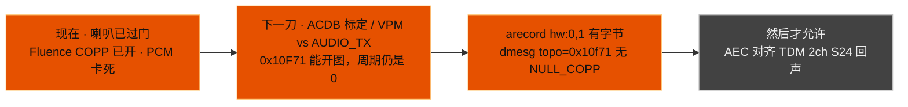
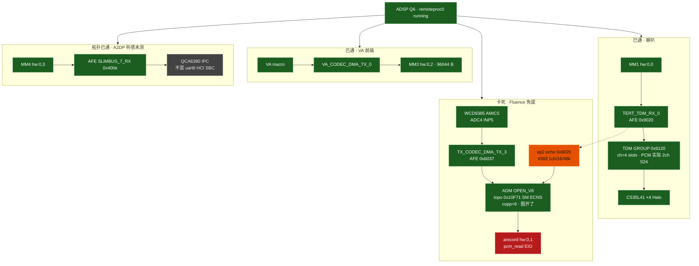
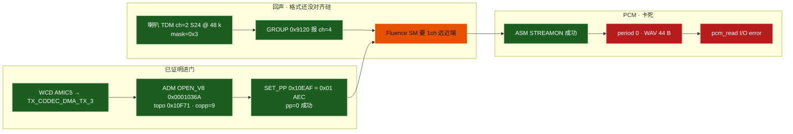
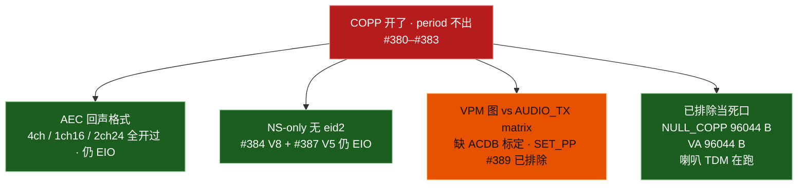

# dagu：ADSP 语音三路与 Fluence 卡死点

对照 **`#389`**（2026-09-17 21:15 CST）。喇叭 **Q6 + CS35L41 Halo 已过门**。本刀补的是 **ADSP（Audio Digital Signal Processor，音频数字信号处理器）** 上的语音图，不是 CPU 回声、不是 HCI SBC。

细账：`dagu-adsp-voice.md`。总表：`dagu-adaptation-status.md`。评估：`dagu-arm-linux-eval.md`。

图例：绿 = 板上已证明 · 橙 = 正在飞、图开了像素/PCM 没出来 · 红 = 卡死 · 灰 = 本阶段不做 / 无硬件。

## 0. 本阶段目标：Fluence 交出非零 PCM — **未过门**

`#383` `scripts/dagu-adsp-voice-test.sh`（喇叭 440 Hz + `arecord hw:0,1` 1s）：

- ADSP `remoteproc0` **running**
- mixer `Fluence AEC NS` / `SLIMBUS_7_RX Audio Mixer MultiMedia4` **在**
- `dagu adm open_v8 topo=0x10f71 ep1=0xb037 1ch/16/48000 ep2=0x9020 1ch/16/48000`（`#383` AEC）
- `#388` AEC OPEN_V8：`ep1=0xb037 1ch/16/48000 ep2=0x9020 2ch/24/48000`（对齐正在跑的 TDM）`effect=0x1` — **仍 EIO**
- `#389` 同 OPEN_V8 · **跳过 SET_PP** `effect=skip` — **仍 EIO**。回声格式和 `0x10EAF` 都不是出帧条件。
- 下一刀：**ACDB（Audio Calibration Data Base，音频校准库）/ VPM 图 vs AUDIO_TX**。`0x10F71` 在 AUDIO 矩阵上能 OPEN，但没有安卓那套标定，图可能永远等模块。
- `dagu fluence topo=0x10f71 ec_idx=56 effect=0x1 pp=0 copp=9` — **COPP（COnnection Processing Protocol，ADSP 设备处理图）已开**
- `Fluence Off` → `NULL_COPP` 麦 **96044 字节**（证明 TX_CODEC_DMA 和 ASM 能出帧）
- `AEC_NS` 开着时 `arecord hw:0,1` **pcm_read I/O error**（WAV 头 44 字节，周期没出来）
- VA（Voice Activation，语音激活）`hw:0,2` **96044 字节**
- A2DP（Advanced Audio Distribution Profile，蓝牙立体声）AFE（Audio Front End，音频前端）`0x400e` **已打到 ADSP**（听感要配对耳机）

怎么对齐安卓：`dumps/dagu-android-live/audio/audio_platform_info_intcodec.xml` 里 `SND_DEVICE_IN_SPEAKER_MIC_AEC_NS` 模块 **`0x10F31`**、参数 **`0x10EAF`**：`<aec>` 写 **`0x01`**，`<ns>` 写 **`0x02`**。禁止一次写成 `0x03`。拓扑 **`0x10F89` SM ECNS V2** OPEN 被 ADSP `EFAILED`，飞行件用 **`0x10F71` SM ECNS**。禁止 CPU AEC、禁止 PipeWire SBC 软编当产品路径。本 SKU **没有** 3.5 mm，也没有 WSA 头戴 ANC（Active Noise Cancellation，主动降噪）回路。



## 1. 总图：ADSP 处分叉

喇叭、免提麦、VA、A2DP 共用同一颗 Hexagon Q6。分叉在 **ADM（Audio Device Manager，音频设备管理）** 和 **AFE 口**，不是 CPU。



一句话：**喇叭 TDM 在动；Fluence COPP 在 ADSP 上打开了；NULL_COPP 能录，证明麦口不是死的；AEC（Acoustic Echo Cancellation，声学回声消除）图画开之后周期不出来。**

## 2. Fluence 内部：绿到红



`OPEN` 成功不能当成出帧。`NULL_COPP` 同口同 `arecord` 有字节，卡死点在 **Fluence 图等远近端对上**，不是 ALSA 设备节点。

## 3. 安卓对照 vs Linux 本阶段


Linux 不搬 ACDB 全表。对齐的是硅、AFE 口、拓扑 ID、`0x10EAF` 取值。KWS（Keyword Spotting，关键词唤醒）检测仍在 ADSP 固件里；Linux 只把 VA 前端 PCM 拉出来，禁止 CPU spotter。

## 4. PCM 卡死上还没证伪的刀



门过的定义：`dagu-adsp-voice-test.sh` 绿，且 `dmesg` 有 `topo=0x10f71`、**没有** `NULL_COPP` 回落，且 `hw:0,1` 字节 > 1000。NS-only 只能当证伪，不能当产品终点——产品要 AEC 在 Hexagon 上。

## 5. 刷写日志（进行中）

| 核 | 图 | 回声 ep2 | `0x10EAF` | 麦 |
|----|----|----------|-----------|-----|
| `#380` | `0x10F71` OPEN 成功 | `0x9020` 4ch/24/48k（对齐 GROUP） | `AEC\|NS` 一次写 `0x03` | EIO |
| `#381` | 同 | 同 4ch | SET_PP `pp=jiffies` 实为成功 | EIO |
| `#383` | 同 · 近端改 1ch/16/48k | `0x9020` **1ch/16/48k**（SM 远近端） | **`0x01` AEC**（安卓 `<aec>`） | **仍 EIO** |
| `#384` | 同 · NS-only 无 eid2 | **无** `ep2=0xffff` | **`0x02` NS** | **仍 EIO** — 不是单纯等回声 |
| `#387` | NS-only **OPEN_V5** | **无** `eid2=0xffff` | **`0x02` NS** | **仍 EIO** — 不是 V8 包本身 |
| `#388` | AEC OPEN_V8 ep2 **2ch/24/48k**（对齐正在跑的 TDM） | `0x9020` 2ch S24 | **`0x01` AEC** | **仍 EIO** — 不是回声格式 |
| 未刷 | 同 OPEN_V8 2ch/24 · **跳过 SET_PP** | 同 | 模块默认 | 未测 |

`0x10F89` V2：OPEN `EFAILED`，不要再当第一拓扑。SET_PP opcode 是 CAF **`0x00010328`**，不是 `0x10323`。`wait_event_timeout` 剩下的 jiffies 是成功。喇叭 TDM 实测 **`ch=2 rate=48000 bw=24 slots=4 mask=0x3`**，GROUP 仍报 `ch=4 mask=0xf`——4ch ep2 是按 GROUP 猜的，和正在跑的 PCM 不一致。

验收：

```bash
# 板上
/usr/local/sbin/dagu-adsp-voice-test.sh
dmesg | grep -E 'dagu fluence|dagu adm open_v8'
# Fluence Off → 有字节；AEC_NS → 也要有字节，且 topo=0x10f71
```
