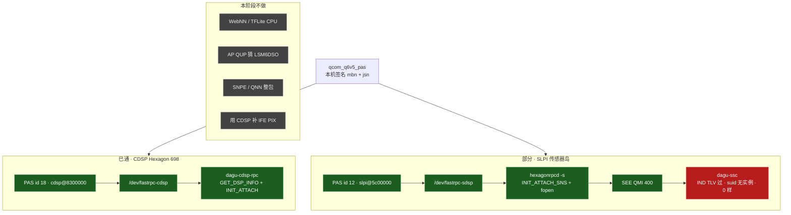
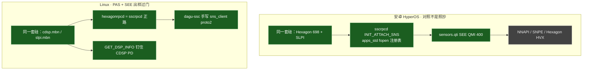
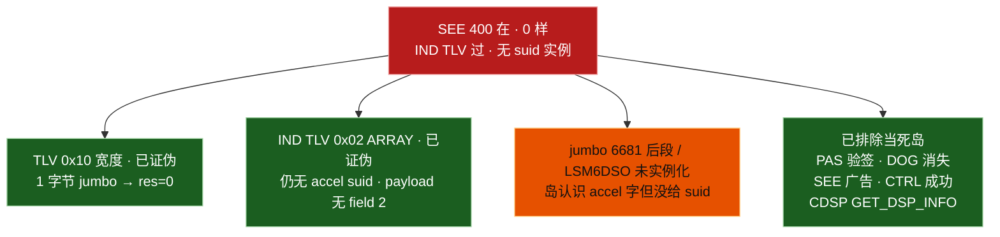

# dagu：CDSP / SLPI 两岛与 SEE 卡死点

对照 **2026-09-17 22:26 CST** 板上 Linux（B 槽，hexagonrpcd BuildID `4bbdc95c…`，packed `dagu-ssc`）。SM8250 **没有** 8 系那种独立 NPU 砖。账面约 15 TOPS INT8 全在 **CDSP（Compute DSP / Hexagon 698，计算数字信号处理器）** 的 HVX（Hexagon Vector eXtensions，向量扩展）上。IMU / 光线走 **SLPI（Sensor Low Power Island，传感器低功耗岛）**，硅上 I2C 不接 AP QUP。

总表：`dagu-adaptation-status.md`。评估：`dagu-arm-linux-eval.md`。相机 PIX 不要拿本岛「补」：`dagu-ife-pipeline-status.md`。

图例：绿 = 板上已证明 · 橙 = 正在飞、岛开了样没出来 · 红 = 卡死 · 灰 = 本阶段不做。

## 0. 本阶段目标：LSM6DSO 交出非零加速度 — **过门**

CDSP FastRPC **过**。SLPI **PAS（Peripheral Authentication Service，外设认证服务）** + hexagonrpcd fopen **过**。SEE（Sensors Execution Environment，传感器执行环境）QMI 信封 / IND TLV **过**。22:22 persist JSON→registry 转换跑完（155 个文件含 `lsm6dso_0.accel`，`sns_reg_version` 写回）。22:26 `accel suid 1fbb6afc01727ea6:9a418d19f8d7ba44`，`accel 25 Hz`，样 `7.605 0.186 4.014 m/s²`（非零）。`event11` 1s **96** 字节。`/run/dagu-ssc/lux` **13.100**。本转换后 **无** 新 `USER-PD DOG`。`dagu-cdsp-rpc` 一直 attached。未开 WebNN，未在 AP I2C 上猜 IMU。

卡死过两刀、都已上板：hexagonfs `..` 双分配 fclose EBADF；listener `next2` 256 B 接不住 `sns_diag_filter.json` fwrite。出样曾被 `parse_float3` 只认 unpacked fixed32 吃掉（SEE 是 packed `repeated float`）。

板上证据（22:26 CST，hexagonrpcd `4bbdc95c…`，只停过 `dagu-ssc` 换 ELF，**未**停 `dagu-cdsp-rpc`）：

| 岛 | 门 | 证据 |
|---|---|---|
| CDSP PAS | **过** | `remoteproc cdsp state=running`，固件 `qcom/sm8250/xiaomi/dagu/cdsp.mbn`（本机签名，禁止 elish） |
| CDSP FastRPC | **过** | `/dev/fastrpc-cdsp`，`dagu-cdsp-rpc` `GET_DSP_INFO` + `INIT_ATTACH`（`Hexagon 698 PD attached attr0=0`）。`0525:a4a7` |
| SLPI PAS | **过** | `remote processor slpi is now up`，PAS id 12，`slpi.mbn` 本机签名 |
| fopen 注册表 | **过** | `hexagonrpcd -f /dev/fastrpc-sdsp -s` `INIT_ATTACH_SNS`；`openat` `soc0/hw_platform`。uptime 14 min **无** `USER-PD DOG` / `SNS_REG_INIT` |
| SEE 信封 | **过** | QMI 400 `node=9 port=14`。tx `10 01 00 01` + ARRAY `0x01`。`type=2 msgid=0x0020` `tlvs t=0x02 ln=4(res=0 err=0)`。`MALFORMED=0`。`sns_suid_req` `register_updates=true` `default_only=false`（`10 01 18 00`）。SEE 后 sleep 8s。`suid_tries` 120 次打在 21:39:14 一秒内 |
| SEE IND TLV | **过** | 小包 `msgid=0x0022` `t=0x01 ln=8` + `t=0x02 ln=47/46/55`。64KiB rxbuf 收下 jumbo `len=9687` `t=0x02 ln=9673` ARRAY `inner+2==ln`（首 96 字节仍是 gyro/als **类型名**）。另有一次 `type=4 msgid=0x0000 len=0`。**无** `event msgid=`（非 768/1025 proto 事件） |
| SEE 出样 | **过** | `accel suid 1fbb6afc…:9a418d19…` `gyro suid` `als suid`。`accel 25 Hz`。样 `7.605 0.186 4.014` / `8.665 0.222 4.589` m/s²。`dagu-lsm6dso-accel` `event11` 1s **96** 字节。lux **13.100**。三服务 active，cdsp/slpi/adsp running |

怎么对齐安卓：sscrpcd 式 reverse RPC 把 `/vendor/etc/sensors/*` 送进岛，然后 `sns_client` QMI 400 找 SUID、使能 25 Hz。禁止 AP 上猜 LSM6DSO / tcs3701 / `rohm_bu27030`。禁止 WebNN / TFLite CPU。禁止用 CDSP「补」IFE（Image Front End，图像前端）。

下一刀：iio-sensor-proxy / Mutter 真姿态（本阶段不做 WebNN）。禁止 AP I2C。禁止用 CDSP 补 IFE（Image Front End，图像前端）。


## 1. 总图：两颗 Hexagon 处分叉

PAS 装固件是同一条 `qcom_q6v5_pas`。分叉在 **label / FastRPC 节点 / 客户端**，不是 CPU 上再猜一条 I2C。



一句话：**CDSP 已经在岛上干活；SLPI 岛活着、SEE 信封已收、IND TLV 已拆对；加速度卡在 `sns_suid_event` 只有类型名没有 suid 实例，不是 MALFORMED，也不是再拆错 TLV。**

## 2. SLPI 内部：绿到红

LSM6DSO 在 SLPI `bus_instance 3`，tcs3701 在 `bus_instance 4`。安卓 JSON 已经在 HexagonFS 里。

```mermaid
flowchart LR
  subgraph IN["已证明进门"]
    A["PAS slpi.mbn 验签"]
    B["INIT_ATTACH_SNS"]
    C["adsp_default_listener"]
    A --> B --> C
  end

  subgraph MID["fopen · 已过门"]
    D["sns_reg_config"]
    E["config/*.json · 约 40 个"]
    F["persist registry<br/>lsm6dso / tcs3701"]
    G["soc0 hw_platform=DAGU<br/>soc_id=356 revision=2.1"]
    D --> E --> F --> G
  end

  subgraph OUT["SEE · 出样过门"]
    H["QRTR svc 400"]
    I["SSC_CTRL 0x20 res=0<br/>0x0022 TLV 0x02 ARRAY"]
    J["accel suid + 25 Hz<br/>event11 非零 · lux 13.1"]
    H --> I --> J
  end

  C --> D
  G --> H

  class A,B,C,D,E,F,G,H,I,J ok

  classDef ok fill:#1b5e20,stroke:#a5d6a7,color:#fff
  classDef stuck fill:#b71c1c,stroke:#ef9a9a,color:#fff
```



`remoteproc running` 不能当成出样。DOG 消失只证明 **fopen 把 `sensor_process` 喂饱了**。SUID 是另一条信封。

HexagonFS 根：`-R /usr/share/qcom/sm8250/Xiaomi/dagu`（DT `model = "Xiaomi Pad 5 Pro 12.4"` + `compatible = "xiaomi,dagu"`）。主线没有 `/sys/devices/soc0`，第一次 attach 约 22s 走 `SNS_REG_INIT` 断言；补上 `hw_platform=DAGU` 之后才稳住。禁止把 `elish` 当板名。

## 3. 安卓对照 vs Linux 本阶段



Linux 不搬 SNPE / QNN / WebNN。CDSP 飞行件是 **FastRPC 会话钉在 HVX 上**，不是 `chrome://gpu` 绿一格。SLPI 飞行件是 **LSM6DSO 事件进 uinput**，不是空的 `remoteproc`。

## 4. 无样上还没证伪的刀



门过的定义（缺一项即失败）：

- SLPI `state=running`，dmesg **没有** `USER-PD DOG` / `SNS_REG_INIT`（>40s）
- `journalctl -u hexagonrpcd-sdsp` 有 `INIT_ATTACH_SNS` 和 `openat` `sns_reg_config`
- `dagu-ssc` 打出 `accel suid` 和 `accel 25 Hz`
- `/dev/input/event*` `dagu-lsm6dso-accel` **非零** 字节；旋转时变化
- 可选：`/run/dagu-ssc/lux` 非空
- CDSP 仍 `dagu-cdsp-rpc` active，**不要**为修 IMU 去 okay 别的砖

`iio-sensor-proxy` / Mutter 自动旋转是门过 **之后** 的桌面接线，不能拿配置假姿态交差。

## 5. 部署顺序与日志

必须 **hexagonrpcd 先于 dagu-ssc**。两个进程对 `/dev/fastrpc-sdsp` 各做一次 `INIT_ATTACH_SNS` 会抢走 listener，40s 后又 DOG。`dagu-ssc` 默认不再 attach（`DAGU_SSC_ATTACH_SNS=1` 才开）。

```text
停 dagu-ssc
停 hexagonrpcd-sdsp
echo stop  > slpi/state
echo start > slpi/state     # 等 /dev/fastrpc-sdsp
systemctl start hexagonrpcd-sdsp
sleep 2
systemctl start dagu-ssc
```

| 步 | 行为 | 结果 |
|----|------|------|
| DT `&cdsp` / `&slpi` okay | 本机 `*.mbn` | PAS 上电，不再是「有意关闭」 |
| userdata + initramfs 固件 | `cdsp`/`slpi` + `cdspr.jsn`/`slpir.jsn`/`slpius.jsn` | 缺 blob 会 stall ~60s×2 |
| `dagu-cdsp-rpc` | `GET_DSP_INFO` + `INIT_ATTACH` | CDSP 门过 |
| `dagu-ssc` 自己 `INIT_ATTACH_SNS` | 无 reverse RPC | SEE 400 在，~40s DOG |
| 注册表只拷 `/etc/sensors` | 岛 fopen 不到 | 仍 DOG |
| hexagonrpcd 无 `socinfo` | `hw_platform` 空 | ~22s `SNS_REG_INIT` |
| hexagonrpcd + DAGU socinfo | fopen json | **DOG 消失** · 仍 0 样 |
| 旧 `dagu-ssc` QMI | TLV `0x10` 4 字节 | `02 .. 00 20 00 07 00 02 04 00 01 00 01 00` MALFORMED |
| 新 `dagu-ssc` 上板 | TLV `0x10` 1 字节 + ARRAY TX | **信封过**：`00 01 00 20 00 37 00 10 01 00 01 01 30 00 2e 00 … accel`。应答 `type=2 msgid=0x0020` `res=0 err=0`。`MALFORMED=0` |
| jumbo IND | `msgid=0x0022` TLV `0x02` | **TLV 已拆对**：小包 `t=0x01 ln=8` + `t=0x02` 含 `accel`/`gyro`/`ambient_light`。jumbo `len=6681`。`sns_suid_event` 只有 data_type、无 field 2 suid。**无** `accel suid`。`event11` 0 字节。md5 `164dfe32…` |
| `register_updates` + 8s + 64KiB | 21:39:06 `10221200…` | TX `10 01 18 00`。sleep 8s。jumbo `len=9687` 整包进。当时 suid-event 仅类型名。`listed without instance` ×121。`event11` **0** 字节 |
| persist fwrite + listener 64KiB | 22:22 `4bbdc95c…` | hexagonfs dup 活 fd；`next2` 64KiB 接住大 JSON。155 个 persist 文件含 `lsm6dso_0.*`。`sns_reg_version` 写回 |
| packed `parse_float3` | 22:26 | SEE `data` 是 packed repeated float。`accel sample 7.605 0.186 4.014`。`event11` 96 B/s。lux **13.100**。**过门** |

验收：

```bash
# 不要编第二路内核。锁在 linux-mainline/tmp/kernel-build/lock
# 不要刷 A 槽

# CDSP
systemctl is-active dagu-cdsp-rpc
journalctl -u dagu-cdsp-rpc -n 20 --no-pager   # GET_DSP_INFO + attached

# SLPI fopen
systemctl is-active hexagonrpcd-sdsp dagu-ssc
journalctl -u hexagonrpcd-sdsp -n 40 --no-pager
dmesg | grep -iE 'slpi|DOG|SNS_REG_INIT|sensor_pd'

# SEE 出样（门）
journalctl -u dagu-ssc -n 40 --no-pager
# 要看到 accel suid / accel 25 Hz，不要 QMI_ERR_MALFORMED_MSG
grep -A8 dagu-lsm6dso-accel /proc/bus/input/devices
cat /run/dagu-ssc/lux
```

部署：`linux-mainline/scripts/dagu-dsp-deploy.sh`（`DAGU_HOST`，只 scp，不刷 boot）。交叉编译 reverse tunnel：`scripts/build-hexagonrpcd.sh`（linux-msm `hexagonrpc`，不写 `out/kernel`）。
