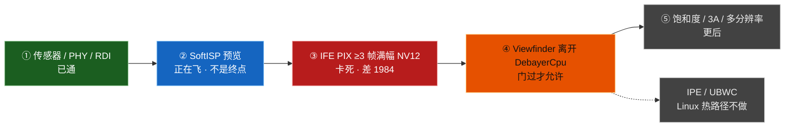
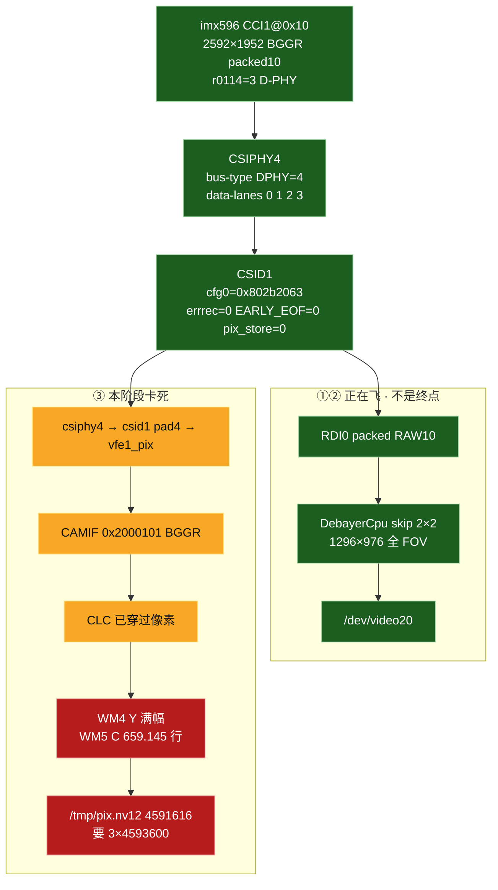

# dagu：前置 imx596 还要走的流水线

对照 **`#437`**（2026-09-18 15:54 CST）。`#420` 活 Demux `0x3058` **仍 0 字节**。后置 s5kjn1 **IFE（Image Front End，图像前端）PIX（Pixel path，像素通路）门已过**（`#360` / `#365`）。本文件只画 **前置还没走完的门**，按顺序，缺一不准跳。

卡死细账（已刷刀、证伪清单）：`dagu-ife-front-pipeline-status.md`。后置总图：`dagu-ife-pipeline-status.md`。总表：`dagu-adaptation-status.md`。飞行规则：`.cursor/rules/dagu-camera-front.mdc`。

图例：绿 = 板上已证明 · 蓝 = 正在飞的软预览 · 黄 = 寄存器粘住、像素没满幅 · 红 = 本阶段卡死 · 灰 = 本阶段不做。

**禁止**抄后置 Crop last `0xfef0bf3` / Demux even `0xac`。禁止 C-PHY、禁止解 CSID（CSI Decoder，CSI 解码器）SOT mask、禁止 Dual-IFE `COMP_CFG`、禁止空 `0x5e00`、禁止把 SoftISP 当产品终点。

## 0. 一句话

桌面前置 **能看**：RDI（Raw Dump Interface，原始旁路出口）+ SoftISP skip 2×2 → 1296×976 @~30fps，`/dev/video20`。  
硬件 PIX **不能交**：1 帧非零 NV12 **4591616 / 4593600**（chroma 差 1984）。门过之前，Viewfinder **不准**离开 `DebayerCpu`。



## 1. 硅上链路（缺一不准瞎编）

```text
CCI（Camera Control Interface，相机控制接口）CCI1@0x10
 → CSIPHY4（CSI Physical Layer，CSI 物理层）D-PHY 4-lane
 → CSID1
 → IFE1 CAMIF（Camera Interface，相机接口）
 → CLC（Camera Logic Core，相机逻辑核）
 → BUS WM4/5（Write Master，AXI 写通道）线性 NV12
```

分叉在 CSID1：pad 1 = RDI0（现在的预览），pad 4 = PIX（还没过门）。IFE0 闲。Linux 节点名是 VFE（Video Front End，视频前端），硅上是 IFE。



## 2. 还要过的门（按序，不准跳）

| # | 门 | 状态 | 过门证据 | 不过不许做什么 |
|---|---|---|---|---|
| ① | 传感器 + CSIPHY4 D-PHY | **已通** | `r0114=3`，`chip id 0x0596`，DT `MEDIA_BUS_TYPE_CSI2_DPHY` | 禁止改成 C-PHY / `0x0114=0x0301` |
| ② | RDI + SoftISP 预览 | **已通（软）** | skip 2×2 → **1296×976** @~30，`/dev/video20` | 禁止拿掉 `/2` 上限再 /2 变成 648×488；禁止 PipeWire 1920 把 skip 打回 1×1 |
| ③ | IFE PIX ≥3 帧满幅 NV12 | **卡死** | 要 `/tmp/pix.nv12` **≥3×7593696**，UV~128，`viol≠19`，`g_serial` >30s | 不准切 Viewfinder 离 `DebayerCpu` |
| ④ | 预览吃 IFE NV12 | **未做** | Snapshot / PipeWire 打开 `msm_vfe1_video3`，不再 STREAMON RDI+CPU | 禁止双路 loopback + PIX 同时 STREAMON（EBUSY） |
| ⑤ | 几何 / 3A / 饱和度 | **未做** | 全 FOV 2320×1320（CamX Display Full 2304×1296 垫齐），不是 1920 中心裁 | 后置饱和度 `#366` 不是本刀；Linux 不搬 IPE（Image Processing Engine，图像处理引擎） |

③ 的现况：identity **0 字节**。`#420` Demux `0x3058` 第一表已粘仍静默。下一刀 `#421` 只改 DS411 C `0x5504` identity `{0x79f,0xa1f}`。禁止再扩 640 dest。禁止只改 WM 成 2592。禁止 WM 640。禁止 Dual-IFE `COMP_CFG`。禁止 `0x04df04df`。禁止抄 `0x5d04` 488×648。禁止再写 H_SIZE dest `0x090f0a1f`。禁止再写 H_PHASE `0xc047b058`。禁止写非 0 `IMAGE_CFG_1`。禁止把 `0xc081999a` 打进 MNDS `0x4c60`。禁止刷 `53dcc70`。

验收 ③：

```bash
DAGU_IFE_PIX=front linux-mainline/scripts/dagu-ife-pix-test.sh
# 板上 /tmp/pix.nv12 须 ≥3×7593696，dmesg 无 OVERFLOW、viol 不是 19
```

## 3. 本阶段不做

- **IPE / UBWC（Universal Bandwidth Compression，高通带宽压缩）**：安卓 Camera ID 1 用 IPE 从 2304×1296 裁 `[192,108,1920,1080]`。Linux 热路径是线性 WM NV12，不搬 UBWC。
- **DSX10 / WM6/7 / 空 `0x5e00`**：没有完整 LUT 禁止开。
- **CSID SOT 解 mask / FIFO `0x20000`**：已毁过 Snapshot。
- **后置 C-PHY / `0x0114=0x0301`**：改前置不得捎带回后置。
- **把 SoftISP 写成产品终点**。

## 4. 和后置的差别（不要抄）

| | 后置 s5kjn1 | 前置 imx596 |
|---|---|---|
| 传感器 | CCI0@0x10，csiphy1，4080×3060 GBRG | CCI1@0x10，csiphy4，2592×1952 BGGR |
| `0x0114` | `0x0300` D-PHY | `3` D-PHY |
| 预览 skip | 4×4 → 1020×764 | 2×2 → 1296×976 |
| IFE PIX | **≥3 帧已过** `#365` | **1 帧截断** `#421` |
| Demux even/odd | `0xac` / `0xc9` | **`0xca` / `0x9c`** |
| Crop last | 禁止抄 `0xfef0bf3` 到前置 | 活流 `0x0a1f05bf` |

## 5. 文档分家

| 文件 | 写什么 |
|---|---|
| **本文件** `dagu-front-camera-pipeline-status.md` | 前置还要过哪些门 |
| `dagu-ife-front-pipeline-status.md` | 前置 IFE PIX 已刷刀 / 证伪 |
| `dagu-ife-pipeline-status.md` | 后置已过门 + 两路对照 |
| `dagu-ife-pix-nv12-attempts.md` | 线性 NV12 尝试总账 |
