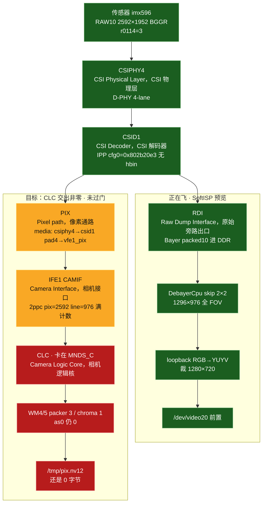
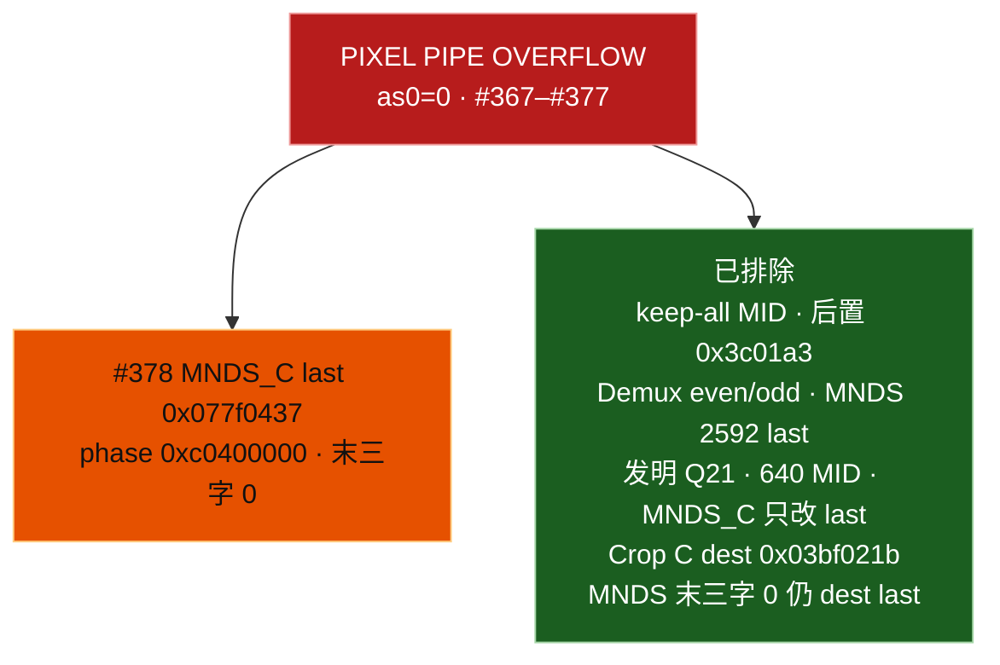

# dagu：前置 imx596 与 IFE PIX 卡死点

对照 **`#390`**（2026-09-17 21:19 CST）。后置 **CLC（Camera Logic Core，相机逻辑核）门已过**（`#360` / `#365`）。本文件只画 **前置**：**CSIPHY4（CSI Physical Layer，CSI 物理层）→ CSID1（CSI Decoder，CSI 解码器）IPP → IFE1（Image Front End，图像前端）CAMIF（Camera Interface，相机接口）→ CLC → WM4/5 线性 NV12**。桌面仍走 RDI（Raw Dump Interface，原始旁路出口）SoftISP skip 2×2。后置总图：`dagu-ife-pipeline-status.md`。细账：`dagu-ife-pix-nv12-attempts.md`。

图例：绿 = 板上已证明 · 蓝 = 正在飞的软预览 · 黄 = 寄存器粘住、像素没证明穿过 · 红 = 卡死 · 灰 = 本阶段不做。

**禁止**抄后置 `0xfef0bf3` / Demux `0x0bf40ff0` / `0x3090` even `0xac`。禁止 C-PHY、禁止 CamX blob、禁止空 `0x5e00`、禁止 Dual-IFE `COMP_CFG`、禁止 CSID SOT 解 mask。后置饱和度 `#366` **不是本刀**。

## 0. 本阶段目标：前置 CLC 交出非零 NV12 — **未过门**

`DAGU_IFE_PIX=front ./scripts/dagu-ife-pix-test.sh`（IFE1，imx596，2592×1952 → Display **1920×1080**，STREAMON 12s）：

- HyperOS Camera ID 1 活流：IFE1 + CSID1，CSIPHY4，不是 CamX 节点名 `IFE0`
- 传感器 CCI1@0x10，SBGGR10 2592×1952，`0x0114=3`（D-PHY）
- Linux media：`csiphy4 → csid1 pad4 → vfe1_pix`
- 门：`/tmp/pix.nv12` **≥3 帧非零**，UV ~128，来自 IFE PIX + CLC，不是 RDI + `DebayerCpu`
- `#367`–`#377` 已刷 B：仍 PIXEL PIPE OVERFLOW，`as0=0`，0 字节
- `#373`/`#374` 第一次打出 **`viol_id=19` MNDS_C（MN Down Scaler chroma）**
- `#376`（`#387` STREAMON）：Crop C last **`0x03bf021b`** 粘住，**仍 viol 19**。`mnds_c` `vph=0x21b` `vst=0x3bf`
- `#377`（`#390` STREAMON）：MNDS `vph=0 vst=0` 粘住，**仍 viol 19** `packer 0x22a`

怎么对齐安卓：逆向 Camera ID 1 live CDM / 堆 IQ 的 **CLC 值**，写成 `camss-vfe-480.c` 的 `writel`。1MB CDM 是 **640×480 预览表**；Display Full **1920×1080** 是另一份堆对象 last `0x077f0437`。禁止把 `0xc081999a`（2592/640）打进 1920 WM。禁止发明 Q21 `0xc02b3333`（#370，堆里没有）。

Viewfinder 仍 skip 2×2 → 1296×976。门过了才**允许**离开 `DebayerCpu`。

### 0.1 下一刀 `#378`：MNDS_C 回到 1MB CDM 的 last+2× 相位

`#377` 末三字 0 粘住，仍 **viol 19**。前置 1MB CDM `@0x4e60` 是 **last `0x0a1f079f` + phase `0xc0400000` + 末三字 0**，不是 dest last identity。`#373` 抄过 2× 相位但 V_STRIPE 是 Crop unpacked。`#378` 保持末三字 0，MNDS_C last **`0x077f0437`**（与 Crop Y Display 同域）phase **`0xc0400000`**。禁止发明 `0xc02b3333`。禁止抄 `0xfef0bf3`。禁止再塞 unpacked last。


## 1. 总图：CSID1 处分叉

前置和后置共用 **CSID1 + IFE1**（IFE0 闲）。分叉在 CSID pad：pad 1 = RDI0，pad 4 = PIX。



一句话：**CAMIF 满计数；Demux / Crop Display last 已粘住；像素卡在 MNDS_C，AXI `as0` 不起，DDR 没有 NV12。**

## 2. IFE1 内部：绿到红

```mermaid
flowchart LR
  subgraph IN["已证明进门"]
    A["CSID1 IPP SOF/EOF"]
    B["CAMIF 0x2000101 BGGR<br/>pix=2592 line=976"]
    A --> B
  end

  subgraph MID["CLC · 黄到红"]
    D["Demux last 0x07a00a20<br/>0x3090 even 0xca odd 0x9c"]
    E["Crop Y 0x077f0437 · C 0x03bf021b<br/>#376 粘住"]
    M["MNDS Y last 0x077f0437"]
    C["MNDS_C viol_id=19<br/>#387 vph/vst 仍是 Crop unpacked"]
    R["RoundClamp PRE 0x3cf/0xa1f<br/>MID/POST Y 0x437/0x77f"]
    D --> E --> R --> M --> C
  end

  subgraph OUT["AXI · 没写过帧"]
    H["WM4/5 EN=1 PLAIN<br/>stride 0x780"]
    I["as0=0 · packer 0x22a"]
    J["/tmp/pix.nv12 0 字节"]
    H --> I --> J
  end

  B --> D
  C --> H

  class A,B,D,E,R,M ok
  class C,H,I,J stuck

  classDef ok fill:#1b5e20,stroke:#a5d6a7,color:#fff
  classDef stuck fill:#b71c1c,stroke:#ef9a9a,color:#fff
```



`clcstat` 在 `#373` 第一次出现 `mnds=1`（以前全 0）。`viol_id=0` 的匿名 overflow 已经走到具名 **MNDS_C**。packer `#372` stop `0x2aa` → `#373` `0x22a`。

## 3. 安卓对照 vs Linux 本阶段

```mermaid
flowchart TB
  subgraph AND["安卓 HyperOS Camera ID 1 · 对照不是照抄"]
    A1["同一套硅：CSIPHY4 → CSID1 → IFE1"]
    A2["Display Full 1920×1080<br/>堆 Crop last 0x077f0437"]
    A3["1MB CDM 是 640 预览表<br/>0xc081999a 不给 1920 WM"]
    A4["IPE 画质 · UBWC NV12"]
    A1 --> A2 --> A3 --> A4
  end

  subgraph LIN["Linux · CLC 还没交出非零"]
    L1["同一套硅：CSIPHY4 → CSID1 → IFE1"]
    L2["Demux/Crop/PRE/MID 已粘住"]
    L3["WM4/5 线性 NV12 packer 3<br/>chroma packer 1"]
    L4["#376 Crop C 粘住<br/>门：≥3 帧非零"]
    L1 --> L2 --> L3 --> L4
  end

  class A1,L1,A2,L2 ok
  class L3,L4 gap
  class A3 ok
  class A4 later

  classDef ok fill:#1b5e20,stroke:#a5d6a7,color:#fff
  classDef gap fill:#e65100,stroke:#ffcc80,color:#111
  classDef later fill:#424242,stroke:#bdbdbd,color:#eee
```



Linux 不搬 UBWC（Universal Bandwidth Compression，高通带宽压缩）和 IPE（Image Processing Engine，图像处理引擎）。对齐的是硅和几何：2592×1952 → 1920×1080 全 FOV，不是 1440、不是中心裁。

## 4. overflow 上还没证伪的刀



门过的定义：`dagu-ife-pix-test.sh` front 绿，`/tmp/pix.nv12` ≥3 帧非零，UV ~128，`r0114=3`，`g_serial` `0525:a4a7` >30s。640×480 **不是**产品终点。

## 5. 刷写日志（进行中）

| 核 | Crop last | MNDS | RoundClamp | 麦 |
|----|-----------|------|------------|-----|
| `#367` | `0xa1f079f` 传感器 | 同 | MID Linux keep-all `0xa1f0000` | 0 字节 overflow |
| `#368` | 同 | 同 | MID 后置 `0x3c01a3`/`0x27f` | 仍 overflow |
| `#369` | 同 | 同 | 同；Demux `0xca`/`0x9c` 粘住 | 仍 0 字节 · even/odd 排除 |
| `#370` | 同 | 发明 `0xc02b3333` | 同 | 仍 overflow · 堆里没有这字 |
| `#372` | **`0x077f0437` Display** | 仍 `0xa1f079f` | MID 640 `0x1df` | packer `0x2aa` · Crop/MNDS 错位 |
| `#373` `#378` | `0x077f0437` | Y 也 `0x077f0437` · C 抄 Crop `0xc0400000` | PRE `0x3cf/0xa1f` MID `0x437/0x77f` | **viol 19 MNDS_C** · packer `0x22a` |
| `#374` `#380` | 同 | C 相位 identity `0xc0200000` · last 仍 1920 | 同 | 仍 viol 19 |
| `#375` `#384` | Crop C 仍 luma `0x077f0437` | C last **`0x03bf021b`** 粘住 | 同 | **仍 viol 19** |
| `#376` `#387` | Crop C **`0x03bf021b`** 粘住 | C last 同 · `vph=0x21b vst=0x3bf` | 同 | **仍 viol 19** · Crop unpacked 塞进 MNDS V |
| `#377` `#390` | 同 | dest last · **末三字 0** 粘住 | 同 | **仍 viol 19** packer `0x22a` |
| `#378` | 同 | last **`0x077f0437`** phase **`0xc0400000`** 末三字 0 | 同 | 待刷 |

粘住过的前置特有值（不要被后置覆盖）：

- Demux last **`0x07a00a20`**；`0x3090` even **`0xca`** odd **`0x9c`**；`0x08c908c9`×4
- Demosaic WB **`0x05fa0400` / `0x82c`**
- Crop MODULE **`0x101`** last **`0x077f0437`**
- CAMIF pattern BGGR `camif go=0x2000101`

验收：

```bash
# 主机
DAGU_IFE_PIX=front linux-mainline/scripts/dagu-ife-pix-test.sh
# 板上
ls -l /tmp/pix.nv12          # 须 >0 且 3×3110400
dmesg | grep -E 'dagu ife1 pix|OVERFLOW|viol_id'
# 期望：无 OVERFLOW，as0 消费，viol 不是 19
```
