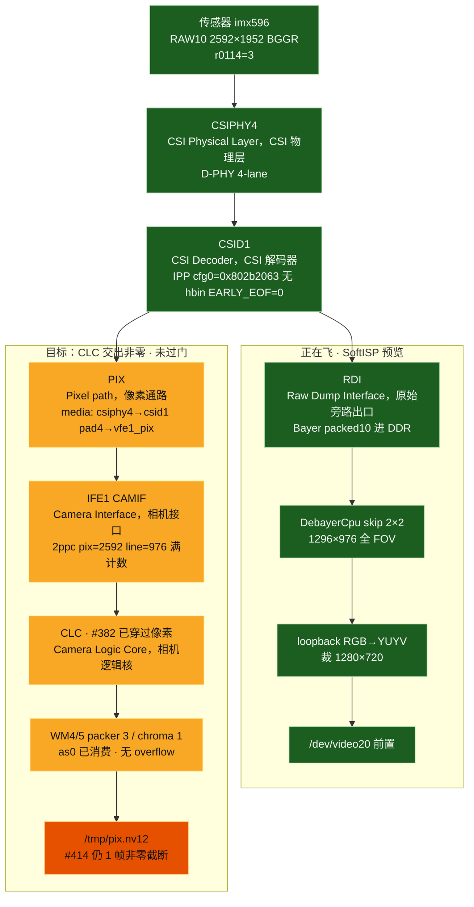

# dagu：前置 imx596 与 IFE PIX 卡死点

对照 **`#437`**（2026-09-18 15:54 CST；`#420` 活 Demux `0x3058` 粘住，**仍 0 字节**）。后置 **CLC（Camera Logic Core，相机逻辑核）门已过**（`#360` / `#365`）。本文件只画 **前置 IFE PIX 卡死细账**：**CSIPHY4（CSI Physical Layer，CSI 物理层）→ CSID1（CSI Decoder，CSI 解码器）IPP → IFE1（Image Front End，图像前端）CAMIF（Camera Interface，相机接口）→ CLC → WM4/5 线性 NV12**。桌面仍走 RDI（Raw Dump Interface，原始旁路出口）SoftISP skip 2×2。前置还要过哪些门：`dagu-front-camera-pipeline-status.md`。后置总图：`dagu-ife-pipeline-status.md`。细账：`dagu-ife-pix-nv12-attempts.md`。

图例：绿 = 板上已证明 · 蓝 = 正在飞的软预览 · 黄 = 寄存器粘住、像素没证明穿过 · 红 = 卡死 · 灰 = 本阶段不做。

**禁止**抄后置 `0xfef0bf3` / Demux `0x0bf40ff0` / `0x3090` even `0xac`。禁止 C-PHY、禁止 CamX blob、禁止空 `0x5e00`、禁止 Dual-IFE `COMP_CFG`、禁止 CSID SOT 解 mask。后置饱和度 `#366` **不是本刀**。

## 0. 本阶段目标：前置 CLC 交出非零 NV12 — **未过门**

`DAGU_IFE_PIX=front ./scripts/dagu-ife-pix-test.sh`（IFE1，imx596，2592×1952 identity NV12，STREAMON 12s）：

- HyperOS Camera ID 1 活流：IFE1 + CSID1，CSIPHY4，不是 CamX 节点名 `IFE0`
- 传感器 CCI1@0x10，SBGGR10 2592×1952，`0x0114=3`（D-PHY）
- Linux media：`csiphy4 → csid1 pad4 → vfe1_pix`
- 门：`/tmp/pix.nv12` **≥3×7593696**，UV ~128，来自 IFE PIX + CLC，不是 RDI + `DebayerCpu`
- `#367`–`#377` 已刷 B：仍 PIXEL PIPE OVERFLOW，`as0=0`，0 字节
- `#373`/`#374` 第一次打出 **`viol_id=19` MNDS_C（MN Down Scaler chroma）**
- `#376`（`#387` STREAMON）：Crop C last **`0x03bf021b`** 粘住，**仍 viol 19**。`mnds_c` `vph=0x21b` `vst=0x3bf`
- `#377`（`#390` STREAMON）：MNDS `vph=0 vst=0` 粘住，**仍 viol 19** `packer 0x22a`
- `#378`（`#392` STREAMON）：MNDS_C last **`0x077f0437`** phase **`0xc0400000`** `v*=0` 粘住，**仍 viol 19**。`/tmp/pix.nv12` **0 字节**。Crop C 仍是 `#376` 的 `0x03bf021b`
- `#379`（`#393` STREAMON）：Crop C last **`0x077f0437`** unity unpacked **`0x437/0x77f`** 粘住，MNDS_C 仍 2×，**仍 viol 19**。`streamon_rc=124`
- `#380`（`#394` STREAMON）：MNDS_C last **`0x077f0437`** identity **`0xc0200000`** `v*=0` 粘住，**仍 viol 19**。`/tmp/pix.nv12` **0 字节** packer `0x22a`
- `#381`（`#395` STREAMON）：Crop/MNDS last **`0x0a1f05bf`**（活流 2592×1472）Crop 相位 **`0xc023d82c`/`0xc047b058`**、MNDS_C **`0xc0400000`** 粘住，WM stride **`0x900`=2304。**viol_id=0**（不再是 19），`clcstat` 全 0，packer `0x2aa`，`as0=0`，0 字节。MID 仍 1920 `0x437/0x77f`
- `#382`（`#396` STREAMON）：MID/POST/OUT **`0x50f/0x8ff`** chroma **`0x287/0x47f`** 粘住。`streamon_rc=0`，**第一次非零 NV12**：`/tmp/pix.nv12` **4476928** 字节（整帧 4478976，差 2048），Y 全非零 91–147 avg 109，UV 125–140 avg 132 全在 96–160，`as0` 消费。**仍 viol_id=0** packer `0x2aa` CAMIF last line。门要 ≥3 帧，还没过。遥测 `out/camera/ife-pix-396/`
- `#383`（`#397` STREAMON）：Crop dest last **`0x08ff050f` / `0x047f0287`** 粘住。仍 4476928 字节非零，**viol_id=14** `clcstat crop=1`。dest last 证伪。`g_serial` 保住。遥测 `out/camera/ife-pix-397/`
- `#384`（`#398` STREAMON）：WM/V4L2 **2320×1320** 粘住 `cfg0=0x5280910`。**0 字节**，`as0=0`，`img=0x30`。同核 2304×1296：4476928 非零。**2320 WM 证伪**。遥测 `out/camera/ife-pix-398/`
- `#385`（`#399` STREAMON）：CAMIF last **735** `crop=0x2df0000` 粘住。仍 4476928 非零，**仍 viol_id=0 line=976**。CAMIF_CROP_HEIGHT 截不掉 CSID 满帧。证伪。遥测 `out/camera/ife-pix-399/`
- `#386`（`#400` STREAMON）：RC+WM 一起垫 **2320×1320** `mid_y=0x527/0x90f` `wm4=0x5280910` 粘住。`img=0x0` `as0` 消费。`/tmp/pix.nv12` **4591616**（整帧 4593600，差 1984），Y 全非零 87–101 avg 94，UV 128–137 avg 132.5。**仍 viol_id=0 line=976**。`#384` 是 RC 还停在 2304，不是 2320 本身禁。遥测 `out/camera/ife-pix-400/`
- `#387`（`#401` STREAMON）：CSID IPP VCROP last **`0x05bf`** `vcrop=0x5bf0000` 粘住。overflow **line 976→736**。仍 4591616 差 1984。多 480 行不是缺口。遥测 `out/camera/ife-pix-401/`
- `#388`（`#402` STREAMON）：`pipe_h=736` CAMIF **`0x2df0000`** PRE **`0x2df`** 粘住。**仍 viol_id=0 line=736** 4591616。CAMIF/PRE 对齐 CSID 窗截不掉末行 overflow。证伪。遥测 `out/camera/ife-pix-402/`
- `#389`（`#403` STREAMON）：CAMIF epoch **`0x140170`**（368 = 1472/4）粘住。`camif_irq1` 仍 `0x1 0xc 0x2`。**仍 viol_id=0 line=736** 4591616，Y 88–101 UV~132.5。Epoch 不是末行 drain。遥测 `out/camera/ife-pix-403/`
- `#390`（`#404` STREAMON）：CSID IPP **EARLY_EOF_EN** `cfg0=0xa02b20e3` `early_eof=True` 粘住。**仍 viol_id=0 line=736** 4591616。bit29 不改末行 overflow。遥测 `out/camera/ife-pix-404/`
- `#391`（`#405` STREAMON）：overflow ISR 先清 BUS latch 再处理 COMP_DONE。`ovf_recover irq0=0x80000000 bus=0x0` 粘住。**仍 viol_id=0 line=736** 4591616。PIXEL PIPE 是 TOP bit31，不是 BUS。遥测 `out/camera/ife-pix-405/`
- `#392`（`#406` STREAMON）：ISR pulse `CAMIF_EN` + `RUP 0x41`。`ovf_recover top irq0=0x80000000 bus=0x0 camif=0x2000101` 粘住。**仍 viol_id=0 line=736** 4591616，Y 88–101 UV~132.5。CAMIF irq1 仍 `0x1 0xc 0x2`，CSID 继续 SOF/EOF。Titan 480 CLC CAMIF EN 脉冲解不了 TOP hang。遥测 `out/camera/ife-pix-406/`
- `#393`（`#407` STREAMON）：overflow `vfe_buf_done` + RUP。`/tmp/pix.nv12` **9183232** = 2×4591616。chunk0 Y 88–103 UV~132.5；**chunk1 Y avg 0.1 UV 0**。camif irq1 仍一组 `0x1 0xc 0x2`，overflow **一次**。buf_done 退役的是空 pending WM，不是第二帧 SOF。遥测 `out/camera/ife-pix-407/`
- `#394`（`#408` STREAMON）：前置 `ERR_RECOVERY_CFG0=0` 粘住 `errrec=0x0`。**PIXEL PIPE OVERFLOW 消失**，`ipp_bp=False`，camif irq1 **`0x1 0xc 0x2 0x1`**（第二 SOF）。仍 **4591616** 差 1984，Y 88–102 avg 94.1 UV 128–137 avg 132.5，`viol=0` `irq0=0x0` `bus=0x4` packer `0x22a/0x206` `as0` 消费。多出来的 CSID recover 行是 overflow 源，**不是** chroma 缺口。**保留 errrec=0**。遥测 `out/camera/ife-pix-408/`
- `#395`（`#409` STREAMON）：CAMIF EOF `vfe_buf_done`。`eof_buf_done irq1=0x2 bus=0x0` 粘住一次。`/tmp/pix.nv12` **9183232** = 2×4591616。chunk0 Y 88–101 UV~132.5；**chunk1 Y avg 0.1 UV 0.2**。irq1 仍 `0x1 0xc 0x2 0x1`，只有一次 EOF。和 `#393` 一样退役空 pending WM。已撤回。禁止再 EOF buf_done。遥测 `out/camera/ife-pix-409/`
- `#396`（`#410` STREAMON）：前置 IPP **pix_store=0** `cfg0=0xa02b2063` 粘住。**仍 4591616** 差 1984。Y 全非零 88–102 avg 94.3，UV 128–137 avg 132.5，**659.145 行**（末行 336 字节）。`early_eof=True` `errrec=0x0` `ipp_bp=False` camif irq1 `0x1 0xc 0x2 0x1`。无 OVERFLOW。chroma 缺口不是 pix_store。遥测 `out/camera/ife-pix-410/`
- `#397`（`#411` STREAMON）：前置 IPP **EARLY_EOF=0** `cfg0=0x802b2063` `early_eof=False` 粘住。**仍 4591616** 差 1984。Y 87–103 avg 94.3，UV 128–137 avg 132.5，**659.145 行**（末行 336 字节）。`pix_store=False` `errrec=0x0` `ipp_bp=False` camif irq1 `0x1 0xc 0x2 0x1`。无 OVERFLOW。`streamon_rc=124`。EOF 提前不是 chroma 缺口。遥测 `out/camera/ife-pix-411/`
- `#398`（`#412` STREAMON）：前置 WM5 **IMAGE_CFG_0 宽度 2304** `wm5=0x2940900` 粘住。**0 字节**，`img=0x20`，`as0` Y 消费 C=0，dbg `0x269/0x265`。RC/Y 仍 2320。chroma 比 RoundClamp 窄 = `#384` 镜像。已撤回。遥测 `out/camera/ife-pix-412/`
- `#399`（`#414` STREAMON）：前置 WM5 **BURST_LIMIT=0** `burst5=0x0` 粘住。**仍 4591616** 差 1984。Y 88–100 avg 94.3，UV 128–137 avg 132.5，**659.145 行**（末行 336 字节）。`cfg0=0x802b2063` `wm5=0x2940910` `camif irq1=0x1 0xc 0x2 0x1`。无 OVERFLOW。末突发长度不是 chroma 缺口。遥测 `out/camera/ife-pix-414/`
- `#400`（`#415` STREAMON）：前置 WM5 **FRAME_INCR `2320×660−1984`** `incr5=0x175580` 粘住。**仍 4591616** 差 1984。Y 89–100 avg 94.3，UV 128–137 avg 132.5，**659.145 行**（末行 336 字节）。第二 SOF，无第二 COMP。帧完成不是 increment。已撤回。遥测 `out/camera/ife-pix-415/`
- `#401`（`#416` STREAMON）：前置 WM5 **IMAGE_CFG_0 高度 659** `wm5=0x2930910` `incr5=0x175430` 粘住。**`img=0x20`**，**仍 4591616**。Y 89–100 UV 0–137 avg 132.5，仍 659.145 行末 336。高度截不断末 336，开不了第二帧。已撤回。遥测 `out/camera/ife-pix-416/`
- `#402`（`#417` STREAMON）：前置 WM5 **packer 3** `packer5=0x3` 粘住。**仍 4591616**。Y 88–100 avg 94.2，**UV 2–38 avg 19.3**（#362 同类绿偏）。CamX `get_packer_fmt(NV12)=3` 是 UBWC 10-bit；线性 C 必须 PLAIN_8。已撤回。遥测 `out/camera/ife-pix-417/`
- `#403`（`#418` STREAMON）：前置 MNDS_C **V_SIZE `0x0293016f`** `vsz=0x293016f` 粘住。**仍 4591616**。Y 88–101 avg 94.2，UV 128–187 avg 132.6，**659.145 行**（末行 336）。`vst=0` `vph=0` `packer5=0x1`。V_SIZE 填不了 chroma 缺口。**保留**（mnds 恢复，UV 未毁）。遥测 `out/camera/ife-pix-418/`
- `#404`（`#419` STREAMON）：前置 MNDS_C **V_STRIPE `0x02930000`** `vst=0x2930000` 粘住。**仍 4591616**。Y 92–158 avg 110，UV 125–189 avg 132.4，**659.145 行**（末行 336）。`vsz=0x293016f` `vph=0` `packer5=0x1` `errrec=0x0` `cfg0=0x802b2063` camif irq1 `0x1 0xc 0x2 0x1`。`g_serial` Device 039 保住。V_STRIPE 填不了 chroma 缺口。**保留**。遥测 `out/camera/ife-pix-419/`

- `#405`（`#420` STREAMON）：前置 MNDS_C **V_PHASE `0x0011d7a9`** `vph=0x1117a9` 粘住（硅清 phase[15:14]）。**仍 4591616**。Y 92–150 avg 109.5，UV 125–189 avg 132.4，**659.145 行**（末行 336）。`vsz=0x293016f` `vst=0x2930000` `hst=0` `packer5=0x1`。`g_serial` Device 041 保住。V_PHASE 填不了 chroma 缺口。**保留**。遥测 `out/camera/ife-pix-420/`

- `#406`（`#421` STREAMON）：前置 MNDS_C **H_STRIPE `0x090f0000`** `hst=0x90f0000` 粘住。**仍 4591616**。Y 92–148 avg 109.4，UV 125–189 avg 132.4，**659.145 行**（末行 336）。`vsz=0x293016f` `vst=0x2930000` `vph=0x1117a9` `packer5=0x1`。`g_serial` Device 043 保住。H_STRIPE 填不了 chroma 缺口。**保留**。遥测 `out/camera/ife-pix-421/`

- `#407`（`#422` STREAMON）：前置 MNDS_C **H_SIZE `0x090f0a1f`** `hsz=0x90f0a1f` 粘住。**0 字节**，`viol=0x13`（19）MNDS_C，`as0` Y 消费 C=0，`dbg=0x269/0x226`，`bus=0x0`。安卓 Display Full dest 必须配相位 `0xc023d82c`，不能配 640 的 chroma 2× `0xc0400000`。已撤回。`#423` 撤回核：`hsz=0xa1f05bf` 回到 **4591616** UV 659.145。禁止再把 H_SIZE dest 当 chroma 缺口。遥测 `out/camera/ife-pix-422/`

- `#408`（`#424` STREAMON）：前置 MNDS_C **H_PHASE `0xc047b058`** `hph=0xc047b058` 粘住。**0 字节**，`img=0x20`，`as0` Y 消费 C=0，`bus=0x80000000`，`viol=0`，`dbg=0x269/0x206`。Display Full chroma 相位没有配对 dest（H_SIZE 仍 `0x0a1f05bf`，H_PAD 仍 640 2×）。已撤回。`#425` 撤回核：`hph=0xc0400000` 回到 **4591616** UV 659.145。禁止再把 `0xc047b058` 当 chroma 缺口。遥测 `out/camera/ife-pix-424/`

- `#409`（安卓 Camera ID 1 活流，只读 `53dcc70`）：CAF `WM:5 h_init 0x0` = `IMAGE_CFG_1`，Linux 已经写 0。**不是 chroma 缺口。** 活 WM4 `0x7A00A20` 2592×1952 / WM5 `0x3D00A20` 2592×976，`COMP_GRP_1` `0x80` 每帧，WM6/7 EN。禁止写非 0 `IMAGE_CFG_1`。禁止只改 WM 成 2592。dump `out/camera/ife-android-id1-wm5/`

- `#410`（`#426` STREAMON）：前置 MNDS_C **V_PAD `0x0011d7a9`** `vpd=0x0` 弹回。**仍 4591616** UV 659.145。硅不吃这个槽。已撤回。禁止再把 V_PAD 当 chroma 缺口。遥测 `out/camera/ife-pix-426/`

- `#411`（`#427` STREAMON）：前置 MNDS_C **H_PAD `0xc047b212`** `hpd=0xc047b212` 粘住。**0 字节**，`viol=0` `img=0x0` `as0` C=0 `bus=0x0` `dbg=0x269/0x2c6`。Camera ID 1 Crop C pad 配 640 chroma 2× 相位会卡住写出。已撤回。`#428` 撤回核：`hpd=0xc0400000` 回到 **4591616**。禁止再把 H_PAD 当 chroma 缺口。遥测 `out/camera/ife-pix-427/`

- `#412`（`#429` STREAMON）：identity WM+RC+MNDS+CSID。`wm4=0x7a00a20` `wm5=0x3d00a20` `vcrop=0x79f0000` `mid=0x79f/0xa1f` 粘住。**0 字节**，`img=0x10` `as0=0` `bus=0x80000000` `viol=0`。H_SIZE dest=src `0x0a1f0a1f` 盖掉 pack last `0x0a1f079f`，和 `#407` 同类。已撤回 H_SIZE。遥测 `out/camera/ife-pix-429/`
- `#413`（`#430` STREAMON）：pack last + V 恢复。`hsz=0xa1f079f` `hst=0` 粘住。**0 字节** `img=0x0` `bus=0x0` as0=0。
- `#414`（`#431` STREAMON）：H_STRIPE dest `0x0a1f0000` 粘住。**0 字节** `img=0x10` `bus=0x80000000`。已撤回。
- `#415`（`#432` STREAMON）：前置 MNDS_C pack **`0xc0400000`** `hph=0xc0400000` `hsz=0xa1f079f` 粘住。**0 字节**，`img=0x0` `bus=0x0` `as0=0` `viol=0`，和 `#413` 同类。2ppc 2× 不是 identity 卡死点。**保留 pack**（对齐 1MB CDM `0x4e60`）。遥测 `out/camera/ife-pix-432/`。禁止再把 MNDS_C 2× 当缺口。
- `#416`（`#433` STREAMON）：Crop Y **`0xc081999a`/`0xc0822222`** Crop C **`0xc1033334`/`0xc1044444`** 粘住（1MB CDM `0x4460/0x4660`）。**0 字节** `img=0x0` `bus=0x0` as0=0，和 `#413`/`#415` 同类。640 Crop + identity WM 2592 带不动 AXI。遥测 `out/camera/ife-pix-433/`。禁止把 `0xc081999a` 打进 MNDS `0x4c60`。
- `#417`（`#434` STREAMON）：MID **`0x1df/0x27f` / `0xef/0x13f`** 粘住（Camera ID 1 活 `0x4868/0x4a68`）。**0 字节** `img=0x0` `bus=0x0` as0=0 `viol=0`，camif irq1 `0x1 0xc 0x2 0x1`。Crop dest 640 vs POST/WM 2592 仍静默。遥测 `out/camera/ife-pix-434/`。禁止再把 MID 480×640 当 identity 卡死点。禁止刷 `53dcc70`。禁止 WM 640。

怎么对齐安卓：逆向 Camera ID 1 **活 BUS** 的 WM 尺寸。`#417` dump 证明 Crop 就是 `#416` 640 相位；活 MID 是 480×640，活 OUT **`0x5868=0x1e7/0x287`（488×648）**，POST 仍 identity。`#409` 活流 WM4/5 是 **2592×1952 / 2592×976**。禁止再把 dest/src 写进 H_SIZE。禁止把 `0xc081999a` 打进 MNDS `0x4c60`。禁止 Dual-IFE `COMP_CFG`。禁止只改 WM。禁止 WM 640。禁止刷 `53dcc70`。

- `#418`（`#435` STREAMON）：OUT pack **`0x1e7/0x287`**（活 `0x5868`）。**0 字节** `img=0x0` `bus=0x0` as0=0 `viol=0`，MID 仍 `0x1df/0x27f` POST 仍 identity。640 dest 链 + identity WM 仍静默。遥测 `out/camera/ife-pix-435/`。禁止再把 OUT 488×648 当 identity 卡死点。禁止 WM 640。禁止刷 `53dcc70`。
- `#419`（`#436` STREAMON）：活 Demux **`0x3090=0x04040404` `0x3068=0x20b1/0x17e7/0x7d5/0xab6`** 粘住。**0 字节** `img=0x0` `bus=0x0` as0=0 `viol=0`，`demux=0x3c003c01/0x4040404` `mid_y=0xe01/0x79f/0xa1f` camif irq1 `0x1 0xc 0x2 0x1`。compact gain **不是** identity 卡死点。**保留**。`0x3058` 当时还是后表 `{1,1,0xe24203}`。遥测 `out/camera/ife-pix-436/`。禁止再扩 640 dest。禁止 `0x04df04df`。禁止刷 `53dcc70`。
- `#420`（`#437` STREAMON）：活 Demux **`0x3058={0,0,0xe24003}`** 粘住（第一表，跟 `#419` 一包）。**0 字节** `img=0x0` `bus=0x0` as0=0 `viol=0`，`demux` 仍 `0x4040404` camif irq1 `0x1 0xc 0x2 0x1`。`0x3058` 第一表 **不是** identity 卡死点。**保留**。遥测 `out/camera/ife-pix-437/`。禁止 `0x04df04df`。禁止再扩 640 dest。禁止刷 `53dcc70`。

### 0.1 下一刀 `#421`：活 DS411 C 0x5504 identity

`#420` `#437` `0x3058` **0 字节**。1MB 第一表 `0x5504` 是 **`{0x79f,0xa1f}`**（identity），Linux 还把后置 **`0xb404eb/0x20781`** 打在 2592×1952 上。Y `0x5408` 已对齐。禁止抄 `0x5d04` 488×648。禁止空 DS411。禁止 Dual-IFE `COMP_CFG`。禁止 WM 640。禁止刷 `53dcc70`。


## 1. 总图：CSID1 处分叉

前置和后置共用 **CSID1 + IFE1**（IFE0 闲）。分叉在 CSID pad：pad 1 = RDI0，pad 4 = PIX。



一句话：**CAMIF 满计数；Demux / Crop / MID 2304 已粘住；`#414` 写出 1 帧非零 NV12（UV~128），AXI `as0` 已消费；无 OVERFLOW；`pix_store=0`、EARLY_EOF=0、BURST_LIMIT=0 都证伪，仍差 1984 字节、不到 3 帧。**

## 2. IFE1 内部：绿到红

```mermaid
flowchart LR
  subgraph IN["已证明进门"]
    A["CSID1 IPP SOF/EOF"]
    B["CAMIF 0x2000101 BGGR<br/>pix=2592 line=976"]
    A --> B
  end

  subgraph MID["CLC · 黄到红"]
    D["Demux last 0x07a00a20<br/>0x3090 even 0xca odd 0x9c"]
    E["Crop Y 0x077f0437 · C #376 0x03bf021b<br/>#392 仍 960"]
    M["MNDS Y last 0x077f0437"]
    C["MNDS_C viol_id=19<br/>#387 vph/vst 仍是 Crop unpacked"]
    R["RoundClamp PRE 0x3cf/0xa1f<br/>MID/POST Y 0x50f/0x8ff 2304"]
    D --> E --> R --> M --> C
  end

  subgraph OUT["AXI · #414 写过截断帧"]
    H["WM4/5 EN=1 PLAIN<br/>stride 0x900"]
    I["as0 消费 · packer 0x2aa"]
    J["/tmp/pix.nv12 4591616<br/>差 1984 · 无 overflow"]
    H --> I --> J
  end

  B --> D
  C --> H

  class A,B,D,E,R,M,H,I ok
  class C,J gap

  classDef ok fill:#1b5e20,stroke:#a5d6a7,color:#fff
  classDef stuck fill:#b71c1c,stroke:#ef9a9a,color:#fff
  classDef gap fill:#e65100,stroke:#ffcc80,color:#111
```



`clcstat` 在 `#373` 第一次出现 `mnds=1`（以前全 0）。`viol_id=0` 的匿名 overflow 已经走到具名 **MNDS_C**。packer `#372` stop `0x2aa` → `#373` `0x22a`。

## 3. 安卓对照 vs Linux 本阶段

```mermaid
flowchart TB
  subgraph AND["安卓 HyperOS Camera ID 1 · 对照不是照抄"]
    A1["同一套硅：CSIPHY4 → CSID1 → IFE1"]
    A2["Display Full 1920×1080<br/>堆 Crop last 0x077f0437"]
    A3["1MB CDM 是 640 预览表<br/>0xc081999a 不给 1920 WM"]
    A4["IPE 画质 · UBWC NV12"]
    A1 --> A2 --> A3 --> A4
  end

  subgraph LIN["Linux · CLC 还没交出非零"]
    L1["同一套硅：CSIPHY4 → CSID1 → IFE1"]
    L2["Demux/Crop/PRE/MID 已粘住"]
    L3["WM4/5 线性 NV12 packer 3<br/>chroma packer 1"]
    L4["#376 Crop C 粘住<br/>门：≥3 帧非零"]
    L1 --> L2 --> L3 --> L4
  end

  class A1,L1,A2,L2 ok
  class L3,L4 gap
  class A3 ok
  class A4 later

  classDef ok fill:#1b5e20,stroke:#a5d6a7,color:#fff
  classDef gap fill:#e65100,stroke:#ffcc80,color:#111
  classDef later fill:#424242,stroke:#bdbdbd,color:#eee
```



Linux 不搬 UBWC（Universal Bandwidth Compression，高通带宽压缩）和 IPE（Image Processing Engine，图像处理引擎）。对齐的是硅和几何：2592×1952 → 1920×1080 全 FOV，不是 1440、不是中心裁。

## 4. overflow 上还没证伪的刀

```mermaid
flowchart TB
  STUCK["#422 H_SIZE viol 19 0 字节<br/>撤回后回到 4591616 截断"]

  STUCK --> H1
  STUCK --> NO

  H1["#411 · MNDS_C H_PAD=0xc047b212 0 字节已撤回（禁 Dual-IFE COMP_CFG，禁 H_SIZE dest，禁 H_PHASE 0xc047b058，禁 V_PAD，禁 H_PAD，禁非 0 IMAGE_CFG_1，禁 WM-only 2592）"]
  NO["已排除<br/>keep-all MID · 后置 0x3c01a3<br/>Demux even/odd · MNDS 2592 last<br/>发明 Q21 · 640 MID · MNDS_C 只改 last<br/>Crop C dest 0x03bf021b<br/>MNDS 末三字 0 仍 dest last<br/>MNDS_C 2×+zeros 而 Crop C 仍 960<br/>Crop C 回堆 last 而 MNDS_C 仍 2×<br/>MNDS_C identity 同 Y dest 1920<br/>IFE last 0x0a1f05bf + 640 packing 而 MID 仍 1920<br/>MID 1920 留在 2304 WM<br/>Crop dest last 0x08ff050f viol 14<br/>CAMIF last 735 while CSID 1951<br/>WM-only 2320 而 RC 2304 img=0x30<br/>CSID extra 480 lines (line moved 976→736, same 4591616)<br/>CAMIF/PRE last 735 with CSID 736 still line=736<br/>CAMIF epoch 368 of CSID 1472 still line=736<br/>CSID IPP EARLY_EOF bit29 cfg0=0xa02b20e3 still line=736<br/>BUS overflow clear + COMP_DONE-before-dump bus=0 still 4591616<br/>CAMIF EN pulse + RUP 0x41 camif=0x2000101 irq1 did not repeat still 4591616<br/>overflow buf_done 9183232 chunk1 zeros still one SOF<br/>front IPP overflow_ctrl=0 errrec=0x0 overflow gone still 4591616 second SOF<br/>CAMIF EOF buf_done 9183232 chunk1 zeros still one EOF<br/>front IPP pix_store=0 cfg0=0xa02b2063 still 4591616 UV 659.145 lines<br/>front IPP EARLY_EOF=0 cfg0=0x802b2063 still 4591616 UV 659.145 lines<br/>front WM5 IMAGE_CFG_0 width 2304 wm5=0x2940900 img=0x20 as0 C=0 0 bytes<br/>front WM5 BURST_LIMIT=0 burst5=0x0 still 4591616 UV 659.145 lines<br/>front WM5 FRAME_INCR 2320×660-1984 incr5=0x175580 still 4591616<br/>front WM5 IMAGE_CFG_0 height 659 wm5=0x2930910 img=0x20 still 4591616<br/>front WM5 packer 3 packer5=0x3 UV avg 19.3 still 4591616<br/>front MNDS_C V_SIZE 0x0293016f vsz=0x293016f still 4591616<br/>front MNDS_C V_STRIPE 0x02930000 vst=0x2930000 still 4591616<br/>front MNDS_C V_PHASE 0x0011d7a9 vph=0x1117a9 still 4591616<br/>front MNDS_C H_STRIPE 0x090f0000 hst=0x90f0000 still 4591616<br/>front MNDS_C H_SIZE 0x090f0a1f hsz=0x90f0a1f viol 19 0 bytes as0 C=0<br/>front MNDS_C H_PHASE 0xc047b058 hph=0xc047b058 img=0x20 0 bytes as0 C=0"]

  class STUCK stuck
  class H1 gap
  class NO ok

  classDef ok fill:#1b5e20,stroke:#a5d6a7,color:#fff
  classDef gap fill:#e65100,stroke:#ffcc80,color:#111
  classDef stuck fill:#b71c1c,stroke:#ef9a9a,color:#fff
  classDef later fill:#424242,stroke:#bdbdbd,color:#eee
```



门过的定义：`dagu-ife-pix-test.sh` front 绿，`/tmp/pix.nv12` ≥3 帧非零，UV ~128，`r0114=3`，`g_serial` `0525:a4a7` >30s。640×480 **不是**产品终点。

## 5. 刷写日志（进行中）

| 核 | Crop last | MNDS | RoundClamp | 麦 |
|----|-----------|------|------------|-----|
| `#367` | `0xa1f079f` 传感器 | 同 | MID Linux keep-all `0xa1f0000` | 0 字节 overflow |
| `#368` | 同 | 同 | MID 后置 `0x3c01a3`/`0x27f` | 仍 overflow |
| `#369` | 同 | 同 | 同；Demux `0xca`/`0x9c` 粘住 | 仍 0 字节 · even/odd 排除 |
| `#370` | 同 | 发明 `0xc02b3333` | 同 | 仍 overflow · 堆里没有这字 |
| `#372` | **`0x077f0437` Display** | 仍 `0xa1f079f` | MID 640 `0x1df` | packer `0x2aa` · Crop/MNDS 错位 |
| `#373` `#378` | `0x077f0437` | Y 也 `0x077f0437` · C 抄 Crop `0xc0400000` | PRE `0x3cf/0xa1f` MID `0x437/0x77f` | **viol 19 MNDS_C** · packer `0x22a` |
| `#374` `#380` | 同 | C 相位 identity `0xc0200000` · last 仍 1920 | 同 | 仍 viol 19 |
| `#375` `#384` | Crop C 仍 luma `0x077f0437` | C last **`0x03bf021b`** 粘住 | 同 | **仍 viol 19** |
| `#376` `#387` | Crop C **`0x03bf021b`** 粘住 | C last 同 · `vph=0x21b vst=0x3bf` | 同 | **仍 viol 19** · Crop unpacked 塞进 MNDS V |
| `#377` `#390` | 同 | dest last · **末三字 0** 粘住 | 同 | **仍 viol 19** packer `0x22a` |
| `#378` `#392` | Crop C 仍 `0x03bf021b` | last **`0x077f0437`** phase **`0xc0400000`** `v*=0` 粘住 | 同 | **仍 viol 19** as0=0 · 0 字节 |
| `#379` `#393` | Crop C **`0x077f0437`** unity unpacked 粘住 | 仍 2× `v*=0` | 同 | **仍 viol 19** streamon_rc=124 |
| `#380` `#394` | 同 `#379` | last **`0x077f0437`** identity **`0xc0200000`** `v*=0` 粘住 | 同 | **仍 viol 19** 0 字节 |
| `#381` `#395` | Crop **`0x0a1f05bf`** 相位 **`0xc023d82c`/`0xc047b058`** 粘住 | last 同 · C **`0xc0400000`** `v*=0` 粘住 | MID 仍 `0x437/0x77f` | **viol_id=0** packer `0x2aa` as0=0 · 0 字节 · WM 2304 |
| `#382` `#396` | 同 `#381` INPUT last | 同 `#381` | MID/POST **`0x50f/0x8ff`** chroma **`0x287/0x47f`** 粘住 | **1 帧非零截断** Y 91–147 UV~128 as0 消费 · 仍 viol 0 packer `0x2aa` |
| `#383` `#397` | Crop dest **`0x08ff050f` / `0x047f0287`** 粘住 | 同 `#381` INPUT | 同 `#382` | 仍 4476928 非零 · **viol 14 crop=1** 证伪 dest last |
| `#385` `#399` | 同 `#381` INPUT | 同 `#381` | 同 `#382` 2304 | CAMIF last 735 证伪 · 仍 4476928 line=976 |
| `#388` `#402` | 同 `#381` INPUT | 同 `#381` | PRE **`0x2df`** 粘住 · MID 2320 | `pipe_h=736` CAMIF **`0x2df0000`** 仍 line=736 4591616 · 证伪窗对齐 |
| `#389` `#403` | 同 `#381` INPUT | 同 `#381` | 同 `#388` | epoch **`0x140170`** 粘住仍 line=736 4591616 · 证伪 epoch |
| `#390` `#404` | 同 `#381` INPUT | 同 `#381` | 同 `#388` | IPP EARLY_EOF **`cfg0=0xa02b20e3`** 粘住仍 line=736 4591616 |
| `#391` `#405` | 同 `#381` INPUT | 同 `#381` | 同 `#388` | ovf recover **`irq0=0x80000000 bus=0x0`** 仍 4591616 · TOP 不是 BUS |
| `#392` `#406` | 同 `#381` INPUT | 同 `#381` | 同 `#388` | CAMIF EN pulse **`camif=0x2000101`** irq1 仍 `0x1 0xc 0x2` 仍 4591616 |
| `#393` `#407` | 同 `#381` INPUT | 同 `#381` | 同 `#388` | overflow buf_done **9183232** chunk1 zeros · 仍一次 SOF/overflow |
| `#394` `#408` | 同 `#381` INPUT | 同 `#381` | 同 `#388` | **errrec=0x0 overflow 消失** 第二 SOF · 仍 4591616 packer `0x22a` · **保留 errrec=0** |
| `#395` `#409` | 同 `#381` INPUT | 同 `#381` | 同 `#388` | CAMIF EOF buf_done **9183232** chunk1 zeros · 仍一次 EOF · 已撤回 |
| `#396` `#410` | 同 `#381` INPUT | 同 `#381` | 同 `#388` | **pix_store=0** `cfg0=0xa02b2063` 仍 4591616 UV 659.145 行 · 证伪 pix_store |
| `#397` `#411` | 同 `#381` INPUT | 同 `#381` | 同 `#388` | **EARLY_EOF=0** `cfg0=0x802b2063` 仍 4591616 UV 659.145 行 · 证伪 bit29 |
| `#398` `#412` | 同 `#381` INPUT | 同 `#381` | 同 `#388` | **WM5 宽 2304** `wm5=0x2940900` **0 字节** `img=0x20` as0 C=0 · 已撤回 |
| `#399` `#414` | 同 `#381` INPUT | 同 `#381` | 同 `#388` | **BURST_LIMIT=0** `burst5=0x0` 仍 4591616 UV 659.145 行 · 证伪末突发 |
| `#400` `#415` | 同 `#381` INPUT | 同 `#381` | 同 `#388` | **FRAME_INCR −1984** `incr5=0x175580` 仍 4591616 · 证伪 increment · 已撤回 |
| `#401` `#416` | 同 `#381` INPUT | 同 `#381` | 同 `#388` | **WM5 高度 659** `wm5=0x2930910` `img=0x20` 仍 4591616 · 已撤回 |
| `#402` `#417` | 同 `#381` INPUT | 同 `#381` | 同 `#388` | **packer 3** `packer5=0x3` 仍 4591616 **UV avg 19.3** · 已撤回 |
| `#403` `#418` | 同 `#381` INPUT | **V_SIZE `0x0293016f`** 粘住 `vst=0` | 同 `#388` | 仍 4591616 UV 659.145 · V_SIZE 不是缺口 · 保留 |
| `#404` `#419` | 同 `#381` INPUT | **V_STRIPE `0x02930000`** 粘住 `vph=0` | 同 `#388` | 仍 4591616 UV 659.145 · V_STRIPE 不是缺口 · 保留 |
| `#405` `#420` | 同 `#381` INPUT | **V_PHASE `0x0011d7a9`** 粘住 `vph=0x1117a9` | 同 `#388` | 仍 4591616 UV 659.145 · V_PHASE 不是缺口 · 保留 |
| `#406` `#421` | 同 `#381` INPUT | **H_STRIPE `0x090f0000`** 粘住 | 同 `#388` | 仍 4591616 UV 659.145 · H_STRIPE 不是缺口 · 保留 |
| `#407` `#422` | 同 `#381` INPUT | **H_SIZE `0x090f0a1f`** 粘住 | 同 `#388` | **0 字节 viol 19** as0 C=0 · Display Full dest+640 2× · 已撤回 |
| `#408` `#424` | 同 `#381` INPUT | **H_PHASE `0xc047b058`** 粘住 | 同 `#388` | **0 字节 img=0x20** as0 C=0 · 相位无 dest · 已撤回 |
| `#409` 活流 | 安卓 Camera ID 1 | `h_init 0x0` 已对齐 | — | WM4/5 **2592×1952/976** `COMP 0x80` · 禁止 WM-only 2592 · 禁止非 0 IMAGE_CFG_1 |
| `#410` `#426` | 同 `#381` INPUT | **V_PAD `0x0011d7a9`** `vpd=0x0` 弹回 | 同 `#388` | 仍 4591616 UV 659.145 · 已撤回 |
| `#411` `#427` | 同 `#381` INPUT | **H_PAD `0xc047b212`** `hpd=0xc047b212` 粘住 | 同 `#388` | **0 字节** `viol=0` `img=0x0` as0 C=0 · 已撤回 |
| `#412` `#429` | last **`0x0a1f079f`** unity | dest=src **`0x0a1f0a1f`** 粘住 | PRE **`0x3cf/0xa1f`** MID **`0x79f/0xa1f`** C **`0x3cf/0x50f`** | **0 字节** `img=0x10` as0=0 `wm4=0x7a00a20` · H_SIZE dest 盖 last · 已撤回 |
| `#413` `#430` | last **`0x0a1f079f`** | **V only** `vsz=0x3cf01e7` `hst=0` | 同 `#412` | **0 字节** `img=0x0` `bus=0x0` as0=0 · 空 H_STRIPE |
| `#414` `#431` | last **`0x0a1f079f`** | **H_STRIPE `0x0a1f0000`** 粘住 | 同 `#412` | **0 字节** `img=0x10` `bus=0x80000000` · 已撤回 |
| `#415` `#432` | last **`0x0a1f079f`** | MNDS_C pack **`0xc0400000`** 2ppc 2× | 同 `#412` | **0 字节** `img=0x0` `bus=0x0` · 与 `#413` 同类 · 保留 pack |
| `#416` `#433` | last **`0x0a1f079f`** Crop **`0xc081999a`/`0xc1033334`** | 同 `#415` MNDS_C 2× | MID identity **`0x79f/0xa1f`** | **0 字节** `img=0x0` `bus=0x0` · Crop 640 vs MID 2592 |
| `#417` `#434` | last **`0x0a1f079f`** Crop 同 `#416` | 同 `#415` MNDS_C 2× | MID **`0x1df/0x27f`** 粘住 POST identity | **0 字节** `img=0x0` `bus=0x0` · 禁止再试 MID 640 |
| `#417` dump | Camera ID 1 活 1MB last **`0x0a1f079f`** | Crop 同 `#416` | MID **`0x1df/0x27f`** POST **`0x79f/0xa1f`** OUT **`0x1e7/0x287`** | 进程内 `/dmabuf` · 禁止 WM 640 · 禁止刷 `53dcc70` |
| `#418` `#435` | last **`0x0a1f079f`** Crop 同 `#416` | 同 `#415` | OUT **`0x1e7/0x287`** 粘住 MID 640 POST identity | **0 字节** · 禁止再试 OUT 488×648 |
| `#419` `#436` | last **`0x0a1f079f`** Crop 同 `#416` | 同 `#415` | MID identity **`0x79f/0xa1f`** Demux **`0x04040404`** 粘住 | **0 字节** `demux=0x4040404` · compact gain 不是卡死点 · 保留 |
| `#420` `#437` | last **`0x0a1f079f`** Crop 同 `#416` | 同 `#415` | Demux **`0x3058={0,0,0xe24003}`** 粘住 | **0 字节** · 0x3058 第一表不是卡死点 · 保留 |

粘住过的前置特有值（不要被后置覆盖）：

- Demux last **`0x07a00a20`**；`0x3090` even **`0xca`** odd **`0x9c`**；`#419` compact **`0x04040404`**（堆 `0x08c908c9`×4 已离开热路径）；`#420` 第一表 `0x3058` **`{0,0,0xe24003}`**
- Demosaic WB **`0x05fa0400` / `0x82c`**
- Crop MODULE **`0x1`** last **`0x0a1f079f`**；`#416` Crop 相位跟 1MB CDM `0x4460` **`0xc081999a`**（不是 unity；Display Full `0x0a1f05bf` / `0xc023d82c` 已离开热路径）。`#417` 活 MID **`0x4868=0x1df/0x27f`**
- CAMIF pattern BGGR `camif go=0x2000101`

验收：

```bash
# 主机
DAGU_IFE_PIX=front linux-mainline/scripts/dagu-ife-pix-test.sh
# 板上
ls -l /tmp/pix.nv12          # 须 ≥3×7593696
dmesg | grep -E 'dagu ife1 pix|OVERFLOW|viol_id'
# 期望：无 OVERFLOW，as0 消费，viol 不是 19
```
