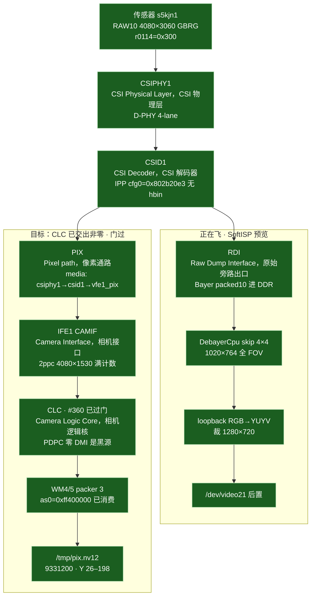
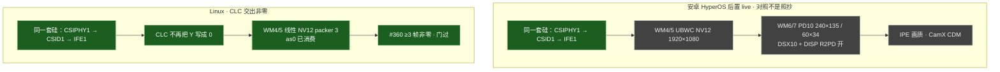
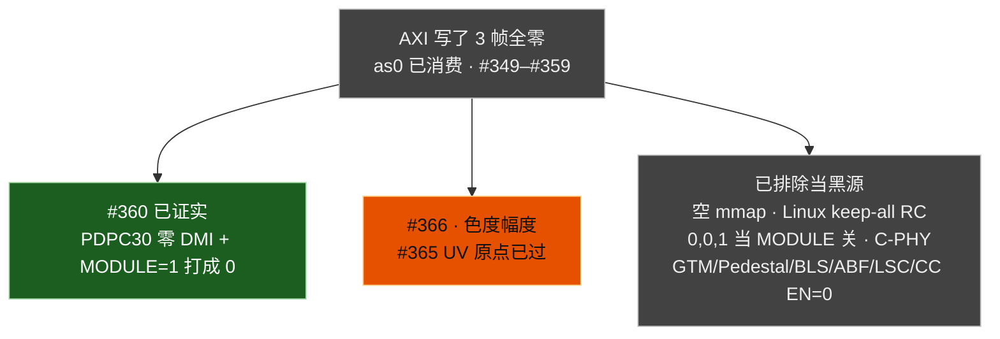

# dagu：相机两路与 IFE 卡死点

对照 **`#365`**（2026-09-17 16:16 CST）。**CLC（Camera Logic Core，相机逻辑核）门已过。** `#365` 色度 WM5 packer `PLAIN_8=1` 后 UV mean≈133、120–136 仓约占满，**绿偏原点过门**。饱和度仍窄（UV 124–147）。桌面仍走 RDI（Raw Dump Interface，原始旁路出口）SoftISP。细账：`dagu-ife-pix-nv12-attempts.md`。

图例：绿 = 板上已证明 · 蓝 = 正在飞的软预览 · 黄 = 寄存器粘住、像素没证明穿过 · 红 = 卡死 · 灰 = 本阶段不做。

## 0. 本阶段目标：CLC 交出非零 NV12 — **已过门**

`#360` `scripts/dagu-ife-pix-test.sh`（IFE1，s5kjn1，1920×1080，STREAMON 12s）：

- `/tmp/pix.nv12` **3 帧非零**：frame0 Y 26–190 / UV 126–235；frame1 Y 27–191 / UV 129–235；frame2 Y 28–198 / UV 120–235
- 来自 IFE PIX + CLC，不是 RDI + `DebayerCpu`
- `as0=0xff400000` 继续消费；无 OVERFLOW；packer stop `dbg=0x2ea`
- dump `pdpc=0x0/0x0`（`#360` 真旁路）；`r0114=0x300`；VFE1 IRQ 15 / CSID1 8
- luma 预览 `out/camera/ife-pix-360-y.png` 是室内实景（罐子），不是噪声、不是全黑

怎么对齐安卓：逆向 live `DumpRegConfig` / `CreateCmdList` 的 **CLC 值**，写成 `camss-vfe-480.c` 的 `writel`。禁止把 `camera.qcom.so`、UBWC、IPE 当 Linux 热路径。没有完整 DSX10 程序禁止空 `0x5e00` / 假 LUT / 写 Dual-IFE `COMP_CFG`。**PDPC30 零 DMI + MODULE=1 禁止再合入**（整幅打成 0）。

Viewfinder 仍 skip 4×4。门过了才**允许**离开 `DebayerCpu`，还没切：Demosaic/CC 已加回，`#365` UV 原点已过，饱和度仍窄。

### 0.1 下一刀 `#366`

`#365` 已刷 B：CST 保持 `0x02000000`，WM5 packer `PLAIN_8=1` 粘住（dump `packer5=0x1`，`offu=0x2000000`）。3 帧非零：Y mean≈107，**UV mean 132.8**，around128≈1.03M/1.037M。绿偏原点过了（`out/camera/ife-pix-365.png`）。UV 只在 124–147，几乎是带 luma 的灰。

`#366`：在 packer 1 + live CST `0x02000000` 上把色度幅度拉回来（CST 矩阵 U/V 行，或 10-bit→8-bit 的取位），让室内实景可辨色，不只是可辨轮廓。**禁止** CST `[9:0]=0x200`、禁止 PDPC 零 DMI、不空 `0x5e00`。Y packer 保持 3。Viewfinder 仍 skip 4×4。

## 1. 总图：CSID 处分叉

一句话：**CAMIF（Camera Interface，相机接口）满计数；live Crop/MNDS/RoundClamp 让 AXI `as0` 上升并 DQBUF 3 帧；`#360` 关掉 PDPC30 之后 DDR 里的 NV12 是室内实景，CLC（Camera Logic Core，相机逻辑核）已交出非零 Y/UV。**

## 2. IFE1 内部：绿到红

```mermaid
flowchart LR
  subgraph IN["已证明进门"]
    A["CSID1 IPP SOF/EOF"]
    B["CAMIF 0x3000101<br/>pix=4080 line=1530"]
    A --> B
  end

  subgraph MID["CLC · #360 已过门"]
    D["Demux / CST12<br/>live AHB 已粘住"]
    E["Crop/MNDS 9 字<br/>0xfef0bf3 / 0xc043dbcf"]
    G["RoundClamp live 0x68<br/>#350 撤回 → overflow"]
    T["PDPC30 零 DMI+EN 打成 0<br/>#360 MODULE=0 才出实景"]
    D --> E --> G --> T
  end

  subgraph OUT["AXI 已写 · 像素非零"]
    H["WM4/5 EN=1 PLAIN<br/>DQBUF 3 × 3110400"]
    I["as0 消费 / as3 ping"]
    J["Y 26–198 UV 120–235"]
    H --> I --> J
  end

  B --> D
  T --> H

  class A,B,H,I,D,E,G,T,J ok

  classDef ok fill:#1b5e20,stroke:#a5d6a7,color:#fff
  classDef warn fill:#f9a825,stroke:#ffe082,color:#111
  classDef stuck fill:#b71c1c,stroke:#ef9a9a,color:#fff
```

`clcstat` 和 `TOP_DEBUG=1` 是盲的，不能用来猜「卡在 Demux 还是 MNDS（MN Down Scaler，M/N 下采样器）」。`as0` 上升已经证明 packer 后面的 AXI 在动；黑在 CLC 里。

## 3. 安卓对照 vs Linux 本阶段

Linux 不搬 UBWC（Universal Bandwidth Compression，高通带宽压缩）和 IPE（Image Processing Engine，图像处理引擎）。对齐的是硅和几何。

## 4. 黑像素上还没证伪的刀

门过了，Viewfinder 仍 skip 4×4，直到 Demosaic/CC 加回且 PIX NV12 画质可飞。

## 5. 逆向日志（进行中）

`DumpRegConfig` 打的是 CamX **IQ 对象**，不是 MMIO。Compact `CreateCmdList` 才是灌进硅的包：

| CLC | CamX compact | 安卓 live IQ | Linux `#336` | 本切 |
|-----|--------------|--------------|--------------|------|
| Demux 0x3090×7 | `@0x52dfbc` 从对象+0x18 | `0x3c003c01, 0x10111011, 0x10101010, 0x10111011, 0x10101010, 0xac, 0xc9` | `1, 0x10001, 0x4000400×3, 0xeeeeeeee, 0x44444444` | 改成 live |
| Demosaic 0x3860×1 | `@0x52dcb0` | `0x4001` | `1` | `#358` MODULE=0；live `0x3878` 仍写 |
| Demosaic 0x3878×2 | 只在 FULL `@0x52d7b4` | IQ 有 `0x80` / `0x800066` | 不写（persist） | 仍不写 |
| CC13 0x3a68×9 | compact 只 `0x3a60×1`；FULL `@0x52925c` 从+0x1c | `A0=0x80, B0=0x800000, C1=0x80` 打包对 | 九个 Q10 标量 `0x400` 对角 | 改成 live 打包 |
| LSC40 0x3668×11 | compact 只 `0x3660×1` | Config0–10 `bf, 7f007f, …, 4000400` | 256×128 自算 mesh | 改成 live Config |
| ABF bank2 0x3460×1 | compact `@0x528688` 只 MODULE；FULL `@0x5275b8` `0x3458×3`+`0x3468×46` | MODULE `0xc101`；SECTION `0x3458`/`0x3468` 是 IQ 对象 | identity DMI + `0xc101` + 46 字 live AHB | compact 不打 `0x3458`/`0x3468` |
| LIN / HDR | 无 compact packer `0x828548`；LIN CalculateHWSetting `@0x4f0158` 把 IQ 半字打成 16 个 AHB 14-bit 对（位移 16）；DMI n=36 在 208KB dmabuf `0x2c8d0`。HDR FULL CDM `@0x77ada8`。Dump 表 `0x2a60×6` 是 DumpRegConfig 描述符 | Module `0x1` + 16 knee；HDR `configModule 0x2` | `#345` EN=1+16 knee 从 `0x2a64` → **line=0**，2a64 读回 0 / 2a68 截断。撤回 EN=0 | 空 EN / Q10 / 这张 AHB 图仍禁 |
| CST12 0x4068×12 | compact `@0x52d178` 只 `0x4060×1`；FULL `@0x52cb7c` 从 IQ+0x1c | DumpRegConfig 不打 CST | 自猜 BT.601 Q10 | compact 不打矩阵 |
| PDPC30 0x2e60×1 | compact `@0x537048` 只 MODULE；FULL `@0x5369ac` `0x2e68×16` + DMI n=`0x90` | 不打 PDPC | EN=1 + 零 DMI + 自猜 Q10 AHB | compact 不打 `0x2e68` |
| GTM 0x3c58×3 / Gamma 0x3e58×3 | FULL 打 DMI `0x3c08`/`0x3e08`（间接 ptr） | preview `1,1,1`；末包 `0,0,1`（第三字才是 MODULE） | identity DMI + `1,1,1` | `#351` `0,0,1` 仍 EN；`#352` `0,0,0` |

`#337` 已刷 B：compact 包粘住（`3090=0x3c003c01`，`3068` 留复位，`cc m00=0x80`，`lsc 3668=0xbf/0x7f007f`，`gic=0xc101`）。STREAMON 仍 0 字节，packer `0x2ea`，`as0=0`，CAMNOC fill=0，`r0114=0x300`。混叠 FULL Demux **不是**剩下的 AXI 卡死点。

DS411 TAP `0x5408` 只在 IQ `+0x6c==5` 时打；`+0x6c==6` 是 DS16 TAP `0x5c08×2`（AHB，不是 DMI LUT）。compact `@0x52e8e0` 对 Display Full（不是 3/5/6）**ret，不打 DSX10**。IFE DSX10 `@0x509548` 无 BL xref。LUT 没有 live 字节不准空 `0x5e00` / 假 LUT / 开 WM6/7。BLS FULL `@0x4e7688` 的 `0x2268×0x2e` 从对象+0x18，`.so` 无常量表。

`#337` ABF `0x3270` 读回 `last=1`（Crop11 keep-all 写成了 1 像素窗）。compact 不打 `0x3270`，已撤回那次写。

`#338` 已刷 B：ABF `3270=0x1000/0x1000`（复位，不是 last=1）。仍 0 字节，packer `0x2ea`，`as0=0`，CAMNOC fill=0，`r0114=0x300`，`viol_id=0` pix=4080 line=1530。Pedestal `2c60=0x1` `2c68` 全 0。compact Pedestal 只 `0x2c60×1`，清零 `0x2c68` 与 #337 Crop11 同类，已停写。

`#339` 已刷 B：Pedestal compact（EN=1 + 零 LUT，不写 `0x2c5c`/`0x2c68`）。`2c68` 读回仍全 0（硅复位就是 0）。仍 0 字节，packer `0x2ea`，`as0=0`。停写 Pedestal AHB **不是**剩下的 AXI 卡死点。

`#340` 已刷 B：PDPC compact（identity DMI + EN=1，不写 `0x2e68`）。overflow `2e60=0x1` `2e68=0x0/0x0/0x0`（硅复位）。仍 0 字节，packer `0x2ea`，`as0=0`，CAMNOC fill=0，`r0114=0x300`，VFE1 IRQ 6 / CSID1 706。停写 PDPC AHB **不是**剩下的 AXI 卡死点。

`#342` 已刷 B：BLS 停 Crop11（identity DMI + MODULE `BIT(0)`，不写 `0x2268`）。overflow `bls=0x1/0x0/0x0/0x0`（PIXEL 本来就 write-only 弹 0）。仍 0 字节，packer `0x2ea`，`as0=0`，CAMNOC fill=0，`r0114=0x300`。停写 BLS Crop11 **不是**剩下的 AXI 卡死点。

未刷 ION/LIN。A 槽 `com.qti.tuned.dagu_qtech_s5kjn1_wide.bin`（52M）里 `dsx10_ife_video_full_dc4` 是 18 个 float ≈0.996，不是 DMI LUT。`IFEDSX10GetInitializationData` 在 `camxifedsx10.cpp::Initialize`（日志串 `@0x5efeb`，分配 `0x1610` 后 memset 0，再 vtable）；`.so` `.rodata` 没有 sel1–13 表。CreateCmdList `@0x509548` 的 `adrp` 源是 log 字符串，LUT 从 IQ 指针进 helper `0x828ca0`。provider 堆上 16 LIN knee 对上 DumpRegConfig；702MB + rw-s 没有 CDM `0x2a08`/`0x5c08` 头。LIN EN=0 已是旁路（line=1530），不是卡死点。

`#344` 已刷 B：CST compact（只 `0x4060×1`，不写 `0x4068`）。overflow `cst=0x1/0x0/0x0`（矩阵硅复位 0）。仍 0 字节。**EN=1 + 矩阵 0 把 RGB 乘成 0**（CC 同类）。FULL `@0x52cb7c` 的 12 字来自 IQ+0x1c。live 对象 `6f01acfe10` vtable ELF `0x8bb7d0` type=`0xf` MODULE=`1`：`live-cst12.txt`。`#347` 打这 12 字，不是自猜 BT.601。

ION CDM：进程内 dump 48 个 <400KB dmabuf。LIN DMI n=36 在 **212992B** 缓冲偏移 `0x2c8d0`（14-bit 对，hi≈4096，9 段×4 通道）。AHB 16 knee 仍对 DumpRegConfig。字节：`live-lin-dmi36.txt`。

`#345` 已刷 B：live DMI36 + MODULE `0x1` + 16 knee 从 `0x2a64`。overflow **line=0 pix=0**，`2a60=0x1` `2a64=0x0` `2a68=0x25102e/0x201c`。packer `0x2ea`，`as0=0`。这张 AHB 图不是硅上的 16 窗；compact Dump 是 `0x2a60×6`。

`#347` 已刷 B：live CST12 IQ+0x1c → `0x4068`。overflow `cst=0x1/0x750259/0x132`（矩阵粘住，不是硅 0）。仍 0 字节，packer `0x2ea`，`as0=0`，CAMNOC fill=0，`line=1530`，`r0114=0x300`，VFE1 IRQ 6 / CSID1 706。live 矩阵 **不是**剩下的 AXI 卡死点。自猜 BT.601 仍禁。HDR 影子仍无，不空 EN。

进程内 Magisk dump（provider 重启后 PID 10210）拿到 **1MB live CDM**（`live-cdm-1mb.bin` / `live-cdm-display-full.txt`）。Display Full 走的是 **FULL CreateCmdList**，不是 compact：

- 无 `0x2268` BLS（compact stub `mov w0,wzr; ret`）
- 无 `0x2a60` LIN / `0x2460` HDR
- Demux `0x3090×7` **并且** `0x3058×3`+`0x3068×10`+`0x30ac×10`（复位 0 的 `0x30ac` 就是注释里 packer 永不 valid 的空窗）
- PDPC `0x2e68×16` = `#345` 误写到 LIN `0x2a64` 的那 16 字
- ABF `0x3260=2`+`0x3268×19`，bank2 `0x3458×3`+`0x3468×46`
- GTM `0x3c58×3`、Gamma `0x3e58×3`、CST word6/10 CDM 是 `0x02000000`（堆 IQ 是 `0x2`）
- Crop/MNDS `0x0fef0bf3` = last 4079×3059 像素域；Linux CAMIF HEIGHT 仍 `pipe_h=in_h/2`。`#349` 抄了这 9 字才让 AXI 动，**不是**把 CAMIF 改成 3059 行
- TAP `0x5408`/`0x5c08` 是 2 字 AHB，不是 DMI LUT。不空 `0x5e00`

`#348` 已刷 B：packet 2 FULL AHB 粘住（`3068=0x3c0`，`3090=0x3c003c01`，`2e68=0x8370040`，`3260=0x2`，`3468=0x3800380`，`3868=0x7540400`，`cst=0x750259`）。`30ac` 首字 `0x443c` 粘住。仍 0 字节 NV12，packer `0x2ea`，`as0=0`，CAMNOC fill=0，`line=1530`，`r0114=0x300`，VFE1 IRQ 6 / CSID1 706。live FULL AHB **不是**剩下的 AXI 卡死点。Crop/MNDS 仍是 Linux 2ppc 4079×1529，没抄安卓 3059。不空 HDR/DSX、不 Dual-IFE `COMP_CFG`。

`#349` 已刷 B：live Crop/MNDS `0xfef0bf3`/`0xc043dbcf` 粘住，TAP `0x5408` 写上，RoundClamp `0x68` 按 live 覆盖。**第一次 DQBUF 3 帧** `/tmp/pix.nv12`=9331200，但三帧 **全零**。无 PIXEL PIPE OVERFLOW。packer go `0x20a` → stop `0x2ea`，VFE1 IRQ 15 / CSID1 8，`r0114=0x300`。不空 `0x5e00`、不开 WM6/7。

`#350` 已刷 B：撤回 RoundClamp 覆盖，只留 Crop/MNDS/TAP。回退成 **0 字节**，`streamon_rc=124`，PIXEL PIPE OVERFLOW `viol_id=0` pix=4080 line=1530。stop `as0=0` `as3=0xffc00000`（ping 锁了、没 consume）。Linux keep-all RC **不是**能替代 live `0x68` 的写法；`0x3c01a3` 按 `(last<<16)|first` 读成空窗是误读。

`#351` 已刷 B：live RC 恢复。GTM/Gamma 打 CDM 末包 `0,0,1`（`0x3c58=0`、`0x3c5c=0`、`0x3c60=1`，**MODULE 仍 EN**）。STREAMON **3 帧** 9331200，仍全零。**stop `as0=0xff400000/0xff5fa400` as3=`0xff000000`** —— AXI 消费了，不是空 mmap。无 OVERFLOW，`r0114=0x300`。identity DMI + MODULE=1 把像素写成 0。

`#352` 已刷 B：GTM/Gamma `0,0,0` 粘住（dump `wb=0x0 gamma=0x0`，`gtm=0x3001` 仍是 LSC）。仍 3 帧全零，`as0=0xff400000`，无 OVERFLOW，`r0114=0x300`。**MODULE=0 不是剩下的黑像素点**（也没触发「EN=0 硬堵 RGB」）。identity GTM/Gamma 排除。

`#353` 已刷 B：Pedestal `MODULE_CFG=0` 粘住（dump `ped=0x0`，`bls cfg=0x1`）。仍 3 帧全零，`as0=0xff400000`，无 OVERFLOW，`r0114=0x300`。零 LUT 按 CamX 是 subtract-0，旁路不该也确实没改变亮度。Pedestal EN 排除。

`#354` 已刷 B：BLS `MODULE_CFG=0` 粘住（dump `bls cfg=0x0`）。仍 3 帧全零，`as0=0xff400000`，无 OVERFLOW，`r0114=0x300`。overflow 时代的「BLS EN=0 砖墙」**没有**在 AXI 时代复现。复位 `0x2268` 不是剩下的黑像素点。

`#355` 已刷 B：ABF `MODULE_CFG=0` 粘住（dump `abf=0x0`，live `0x3268` 仍写）。仍 3 帧全零，`as0=0xff400000`，无 OVERFLOW，`r0114=0x300`。live ABF bank1 排除。bank2 `gic=0xc101` 当时还开着。

`#356` 已刷 B：LSC `0x3660=0` 粘住（dump `gtm=0x0`）。仍 3 帧全零，`as0=0xff400000`，无 OVERFLOW，`r0114=0x300`。live LSC 网格排除。

`#357` 已刷 B：ABF bank2 `0x3460=0` 粘住（dump `gic=0x0`）。仍 3 帧全零，`as0=0xff400000`，无 OVERFLOW，`r0114=0x300`。bank2 排除。

`#358` 已刷 B：Demosaic `MODULE_CFG=0` 粘住（dump `demosaic=0x0/0x80`，live `0x3868`/`0x3878` 仍写）。仍 3 帧全零，`as0=0xff400000` `as3=0xff400000`，无 OVERFLOW，`r0114=0x300`，VFE1 IRQ 13 / CSID1 6。Demosaic `0x4001` 排除。

`#359` 已刷 B：CC `MODULE_CFG=0` 粘住（dump `cc=0x0/0x0/0x80`，live `0x3a68` 仍写）。仍 3 帧全零，`as0=0xff400000` `as3=0xff400000`，无 OVERFLOW，`r0114=0x300`，VFE1 IRQ 14 / CSID1 8。stop `bus=0x4`（不是 overflow）。live CC13 排除。

`#360` 已刷 B：PDPC30 `0x2e58={0,0,0}` 粘住（dump `pdpc=0x0/0x0`）。**3 帧非零**：Y max 190/191/198，UV max 235。`as0=0xff400000`，无 OVERFLOW，`r0114=0x300`，VFE1 IRQ 15 / CSID1 8。luma `out/camera/ife-pix-360-y.png` 是室内实景。**零 DMI + MODULE=1 是黑像素源。**

`#361` 已刷 B：Demosaic `0x4001` 加回（dump `demosaic=0x4001/0x80`，`pdpc=0x0/0x0`）。仍 3 帧非零：Y 0–255 mean≈113，UV 0–255 mean≈21。`as0=0xff400000`，`r0114=0x300`。彩色 `out/camera/ife-pix-361.png` 是同一室内实景，**整幅偏绿**。

`#362` 已刷 B：CC `EN=1` 加回（dump `cc=0x1/0x0/0x80`）。仍 3 帧非零：Y 60–209，UV mean 仍 ≈21。`as0=0xff400000`，`r0114=0x300`。绿偏没退。**CC 不是绿源。**

`#363` 已刷 B：色度 RoundClamp MID C `0x17→0x16`、POST/OUT C `7→6`（对齐 Y 的 8-bit 取数；live CDM C 仍是 7，那是 UBWC 10-bit）。仍 3 帧非零：Y mean≈113，UV mean **21.1**，120–136 仓 0。`as0=0xff400000`，`r0114=0x300`，VFE1 IRQ 15 / CSID1 8。**linear packer 3 取 LSB 的假说在 RoundClamp 上被证伪。** `#364` dump 事后确认 `postc70` round 6 已粘住。

`#364` 已刷 B：CST 原点 `[9:0]=0x200` 粘住（`offu=0x200 offv=0x200`）。3 帧 **Y mean≈0.1 UV=0**。低 10 位不是原点，会把矩阵乘成 0。已撤回 live `0x02000000`。

`#365` 已刷 B：CST `0x02000000` + WM5 `packer5=0x1` 粘住。3 帧非零：Y 1–254 mean≈107，**UV mean 132.8**（U 133 / V 132），around128 满仓。绿偏原点过门。UV 只 124–147，几乎是灰。下一刀 `#366`：色度幅度，PDPC 保持旁路，Y packer 仍 3。

compact LIN **没有** packer `0x828548` 打 `0x2a60`（Dump 表 `0x2a60×6` 只给 DumpRegConfig）。FULL CalculateHWSetting 的 16 knee 不是那扇 6 字窗。

HDR：provider 堆上仍有 type=`0x18` MODULE=`0x2` 对象（`live-hdr30-ahb.txt`），字段对 DumpRegConfig。FULL `@0x77ada8` 经 helper `0x778f58` 从 **寄存器影子** 打 `0x2460×4`+`0x2468×9`+`0x25bc×4`+`0x2658×2`，不是把堆上连续字当 MMIO（#345 同类）。不刷。

DSX / TAP：live CDM **确实**打 TAP `0x5408×2`=`0x307,0x9016c7d` 和 `0x5c08×2`=`0xf07,0x9016c7d`（AHB，不是 DMI LUT）。compact `@0x52e8e0` 对 Display Full ret 是另一条 HWL；这条 CDM 走 FULL。IFE DSX10 DMI 仍无字节，不空 `0x5e00` / 不开 WM6/7。#348 没写 TAP，overflow `ds411=0x0/0x9016c7d` 仍是硅复位。#349 写了 TAP、没开 `0x5e00`，仍然 DQBUF。

HDR FULL `@0x77ada8` 从 `[ctx+0xc0]+0x2460` 影子打 `0x2460×4`+`0x2468×9`+`0x25bc×4`+`0x2658×2`。堆上 `0x02050205` 多数是半字 LUT 假阳性，不是影子。type=`0x18` 对象仍在 `live-hdr30-ahb.txt`。不把连续堆字当 `0x2460` 刷（#345 同类）。
