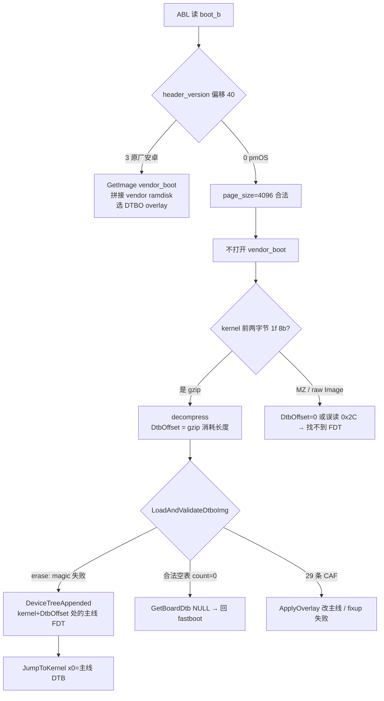

# 原厂 v3 Xiaomi ABL 上，header 0 + Image.gz-dtb 为何被选中、以及为何能跳核

日期：2026-09-01。  
对象：Pad 5 Pro 11"（`elish`）postmarketOS / Armbian 的自造 `boot.img`，对照本仓库第一台 12.4"（`dagu`，HyperOS OS2）ABL。  
包装格式本身见 [elish-pmos-boot-format.md](elish-pmos-boot-format.md)。本文回答两件事：**他们为什么用这套格式**，以及 **ABL 内部哪几条路径让它成功**。

## 0. 结论（先读这个）

1. 11" 出厂 boot 是 **header v3 + vendor_boot + 29 条 dtbo**。pmOS 没有把机器「改回 v2」。它造了一份 **header 0** 的 `boot.img`，kernel 载荷是 `gzip(Image) || FDT`（俗称 `Image.gz-dtb`），再 `erase dtbo_b`。
2. Qualcomm ABL（UEFI `LinuxLoader`）从 LK 时代起就把 **gzip 核 + 尾附 DTB** 当成一等公民。CAF `BootLinux.c` 在 `header_version < 3` 时 **不打开 `vendor_boot`**，并在 `GZipPkgCheck()` 里把 gzip 解压的 **source 消耗长度写进 `DtbOffset`**，后面的 FDT 正好落在 `kernel + DtbOffset`。U-Boot 官方文档对「经 ABL 启 Linux」写的是同一句话：*Android bootloader expect gzipped kernel with appended dtb*。
3. 选这套格式是工程约束，不是品味：一份 `boot_b` 就够；不动 `vendor_boot`（里面是安卓 vendor ramdisk + CAF DTB）；v3 会把 vendor ramdisk 和 generic ramdisk **内存拼接**，安卓 first-stage 会污染 pmOS initramfs；`boot-deploy` 到现在都没有生成 `vendor_boot` 的路径；`erase dtbo_b` 让 DTBO 校验失败，走 appended 分支，避免 CAF overlay 改主线节点。
4. 小米 `abl` 的 LinuxLoader 本体在 EFI FV 里，**生产包加密/压缩，不能反汇编出函数**。下面的控制流来自：CAF `QcomModulePkg`（祖先源码）+ 两份 `abl.elf` 的 ELF/FV 外壳比对 + elish 真机已跑通 + 这台 dagu 上已做过的失败对照。凡是二进制里看不到的，会标明是推断。

## 1. 证据分层

| 层 | 是什么 | 能证明什么 | 不能证明什么 |
|--|--|--|--|
| A | 原厂线刷包 / 活机 dump 的 `boot` `vendor_boot` `dtbo` 文件头 | 出厂是 v3 | 自造镜像怎么走 |
| B | `pmaports` `deviceinfo`、`boot-deploy` `create_bootimg()`、kernel `APKBUILD` | pmOS **故意**打 gzip 兼容镜像，ZBOOT 只给 `linux.efi` | ABL 源码 |
| C | elish / dagu `abl` ELF + EFI FV 头 | 同一族 SM8250 LinuxLoader，加载址相同；FV 头之后高熵 | 函数级控制流 |
| D | CAF `QcomModulePkg` `BootLinux.c` / `LocateDeviceTree.c`（SHIFTPHONES/sos-3.x 公开树，版权 Linux Foundation / QIC） | header&lt;3、gzip→`DtbOffset`、DTBO 无效走 appended、`GetBoardDtb` 空表返回 NULL | 小米 fork 是否删过某条分支 |
| E | elish wiki + Armbian `zz-update-abl-kernel` 真机成功 | 这族 ABL **至少在 11" HyperOS 1 上**仍执行 D 的旧路径 | 12.4 HyperOS 2 是否逐字节相同 |
| F | 这台 dagu 实验日志 | 从零 mkbootimg、合法空 DTBO、`Image.gz` 无 concat 会失败；magiskboot 改原厂 v3 能 jump | 尚未做「完整三件套」对照 |

本文 C 用到的文件：

| 镜像 | 来源 | 文件 SHA-256 | 加载段 SHA-256（PHDR `p_type=PT_LOAD`） |
|--|--|--|--|
| elish `abl.elf` | `elish_images_OS1.0.2.0.TKYCNXM` | `53e95850…527fbe8c` | `042ccccc…88446b73` |
| dagu `abl_a.img` | 活机 dump OS2.0.10.0.ULZCNXM | `e3f9e86d…36118059`（2 MiB 分区尾部全 0） | `cff3adb5…b6194ab7` |

`abl_a` 与 `abl_b` 哈希相同。

## 2. 他们为什么用这种方式

不是「ABL 只认 v2」。是 **在不动安卓槽、不实现 vendor_boot 打包器的前提下，复用 ABL 仍然实现着的旧 Linux 启动协议**。

### 2.1 双系统槽是第一约束

wiki 写明 Linux 只进 **B 槽**，`dtbo_a` 留给安卓。目标函数是：

```
min  { 被改写的 A/B 分区 }
s.t.  ABL 能 JumpToKernel(主线 DTB)，且切回 A 仍是完整 HyperOS
```

v3 路径的最小集合是 `boot` + `vendor_boot` + `dtbo` + 通常 `vbmeta`。旧路径的最小集合是 **`boot` + 擦掉的 `dtbo`**。`vendor_boot_b` 可以留着原厂垃圾，因为根本不会被打开。

### 2.2 header v3 会把安卓 vendor ramdisk 拼进 initramfs

CAF `LoadAddrAndDTUpdate()`：

```c
if (Info->HeaderVersion >= BOOT_HEADER_VERSION_THREE) {
    CopyMem(RamdiskLoadAddr,
            VendorImageBuffer + PageSize,
            VendorRamdiskSize);
    RamdiskLoadAddr += VendorRamdiskSize;
}
CopyMem(RamdiskLoadAddr, boot_ramdisk, RamdiskSize);
```

注释原文：*This concatenation would result in an overlay for .gzip and .cpio formats.*

原厂 `vendor_boot` 里是 GKI **vendor ramdisk**（安卓 first-stage、模块、fstab）。pmOS 的 ramdisk 是自己的 init。两者在内存里首尾相接，gzip/cpio 解压后是 **union overlay**。主线核会先执行安卓 first-stage，或解压失败。  
所以：**只要 header 仍是 3，即使 DTB 改对了，ramdisk 语义也是错的**，除非同时造一份空的/兼容的 `vendor_boot`。pmOS 没有这条打包器。

header 0 时这段 `if` 不进，ramdisk 只有 `boot.img` 里那一份。这是格式选择的硬原因。

### 2.3 `boot-deploy` 没有 v3 / vendor_boot

`create_bootimg()` 只在 `deviceinfo_header_version == "2"` 时追加 `--header_version 2 --dtb`。elish `deviceinfo` **不设**该字段 → mkbootimg 默认 header **0**。没有 `--vendor_boot`，没有 GKI 拼接。  
这是 2016 年以来 pmOS 高通机的默认，不是为 elish 新发明的。

### 2.4 gzip 核是 ABL 的旧协议，APKBUILD 写明了「为了 boot.img」

`linux-postmarketos-qcom-sm8250` 的 `APKBUILD`：

```sh
if [ -e arch/arm64/boot/vmlinuz.efi ]; then
    # ZBOOT EFI decompressor for EFI booting
    install ... vmlinuz.efi  →  /boot/linux.efi
    # Old GZIP'd kernel image for boot.img compatibility
    install ... vmlinuz      →  /boot/vmlinuz
fi
```

配置里 `CONFIG_EFI_ZBOOT=y`、`CONFIG_EFI_STUB=y`。ZBOOT PE 给 **将来的 EFI 启动**（`linux.efi`）。刷进 `boot_b` 的是 **gzip 核**。  
若把 `vmlinuz.efi`（`MZ`）当 kernel 塞进 mkbootimg：`is_gzip_package()` 为假，ARM64 Image magic 对不上，ABL 会按 32-bit 核从偏移 `0x2C` 读 DTB 指针，那是 PE 头里的垃圾。APKBUILD 的分支就是为了避开这条死路。

Armbian `zz-update-abl-kernel` 更直接：`gzip -c /boot/vmlinuz-*-sm8250 > Image.gz`，再 `cat Image.gz dtb`。

U-Boot 经 ABL 启动的官方步骤与此逐字相同（gzip 再 concat dtb，mkbootimg 不写 header 3）。

### 2.5 主线 DTB 不能叠 CAF DTBO

原厂 dtbo **29** 条。活机 dagu 走 idx=15，约 494 KiB CAF pinctrl/PMIC fragment，带 `__fixups__`。主线树没有对应的 CAF 符号布局；apply 成功会改节点，失败则 Load Error。  
`erase dtbo_b` 的目的不是「空表」，是 **让 DTBO 镜像校验失败**，从而不进入 `GetBoardDtb()` / `ApplyOverlay()`。见 §4.4。

### 2.6 一份镜像、一个 fastboot 命令、可 `fastboot boot`

OrangeFox：把 recovery 改名为 `boot.img` 再 `fastboot boot`。同一套 `BootLinux()`，镜像来源是 RAM。v3 还要在 RAM 里同时提供 vendor_boot，fastboot 协议做不到（`fastboot boot` 只送一份 boot 镜像）。旧格式让 recovery/试验核可以不写分区。

## 3. ABL 二进制外壳（逆向能看到的部分）

两份 `abl` 都是：

```
ELF32 LSB ARM, e_type=ET_EXEC, e_machine=EM_ARM (40)
e_entry = 0x9FA00000
PHDR0  p_type=0  p_offset=0       p_filesz=0x94      # ELF + 程序头
PHDR1  p_type=0  p_offset=0x1000  p_vaddr=0x9FA30000 p_filesz=0x1A38  # 哈希/签名段
PHDR2  p_type=1  p_offset=0x3000  p_vaddr=0x9FA00000 p_filesz=0x30000 # 可加载段
```

PHDR2 开头是 **标准 EFI Firmware Volume 2**：

| 字段 | 值 |
|--|--|
| ZeroVector | 16 字节 0 |
| FileSystemGuid | `78e58c8c-3d8a-1c4f-9935-896185c32dd3` = **`EFI_FIRMWARE_FILE_SYSTEM2_GUID`**（磁盘小端） |
| FvLength | `0x30000` |
| Signature | `_FVH` |
| Attributes | `0x3FEFF` |
| HeaderLength | 72 |
| Revision | 2 |

这与公开分析「`ABL_FV_IMG` → `FV.FVMAIN` 里的 `LinuxLoader.efi`」一致（见 Inoki *Android bootloader analysis -- ABL(1)*）。加载地址 `0x9FA00000` 是 SM8250 上 Xiaomi/Qualcomm ABL 的惯用窗口。

**72 字节 FV 头两机完全相同。** 第一处字节差在文件偏移 `PHDR2+0x58`（FFS 区）。整段 196608 字节只有 16.79% 相同。头之后每个 16 KiB 窗口 unique byte ≈ 256，**高熵**：生产包对 FFS 做了加密或强压缩，`strings` 几乎为空，找不到 `vendor_boot` / `DTB offset is NULL` / `ANDROID!` 这类 ASCII。因此 **不能从本机 `abl` 反汇编 `BootLinux`**，只能证明：

- 11" HyperOS 1 与 12.4 HyperOS 2 仍是 **同一族 LinuxLoader FV**（同一 GUID、同一入口、同一 FV 头）；
- 载荷哈希不同 → 不是同一构建，OS2 可以改过分支，但没有换加载器架构。

dagu 分区镜像 2 MiB，有效 ELF 约 204 KiB，其余全 0；elish 线刷包是去填充的 204 KiB `abl.elf`。

## 4. CAF 控制流（祖先源码，对应「为什么能成功」）

以下函数名、条件、注释来自公开 `QcomModulePkg`。小米闭源 fork 以它为祖先；11" 真机行为与之吻合。

### 4.1 用哪套头：偏移 40 的 `header_version`

v0–v2 与 v3 的 `header_version` **都在 boot 镜像偏移 40**。ABL 一律：

```c
Info->HeaderVersion = ((boot_img_hdr *)ImageBuffer)->header_version;
```

| 镜像 | 偏移 36 `page_size`（v0 布局） | 偏移 40 |
|--|--|--|
| 原厂 v3 | `reserved[3] = 0` | **3** |
| pmOS header 0 | **4096** | **0** |

随后 `CheckImageHeader()`：`if (!KernelSize || !*PageSize) return EFI_BAD_BUFFER_SIZE`。  
把 v3 当 v0 读会得到 `page_size=0`，直接拒。所以 ABL **必须先看 version 再选结构体**。pmOS 的 4096 让旧解析合法。

`UpdateBootParamsSizeAndCmdLine()`：

```c
if (Info->HeaderVersion < BOOT_HEADER_VERSION_THREE) {
    KernelSize / RamdiskSize / PageSize / cmdline  ← 全部来自 boot.img
    return;          /* 不 GetImage("vendor_boot") */
}
GetImage(..., "vendor_boot");   /* v3：magic 必须 VNDRBOOT */
```

**成功条件 1：** header &lt; 3 → 不读 vendor_boot，不拼接 vendor ramdisk。

### 4.2 gzip 包检测与 `DtbOffset` 的产生

`UpdateKernelModeAndPkg()`：

```c
if (is_gzip_package(kernel, KernelSize))   /* 典型：前两字节 1f 8b */
    BootingWithGzipPkgKernel = TRUE;
```

`GZipPkgCheck()` 在 `BootLinux()` 里、定位 DTB **之前**调用：

```c
if (BootingWithGzipPkgKernel) {
    decompress(kernel, KernelSize, KernelLoadAddr, OutAvaiLen,
               &BootParamlistPtr->DtbOffset,  /* OUT */
               &OutLen);
}
```

`decompress()` 源文件不在我们拉到的树的显眼路径；从调用约定可以确定它必须同时完成：

1. 把 gzip 成员 inflate 到 `KernelLoadAddr`（得到 ARM64 `Image`，magic `ARM\x64`）；
2. 把 **源缓冲区里 gzip 成员消耗的字节数** 写进 `DtbOffset`。

`Image.gz-dtb` 磁盘布局：

```
[ gzip(Image) | CRC32 | ISIZE ] [ FDT: d0 0d fe ed ... ]
                 gzip 成员结束 ↑
                               DtbOffset 指向这里
```

FDT **不**在 gzip 里，ABL **不必**在压缩流里搜 magic。inflate 结束后，剩余字节就是合法 FDT。  
这解释了为什么必须是 `cat Image.gz dtb`，而不是 `cat Image dtb` 再 gzip、也不是只 gzip 不 concat。

非 gzip 的 64-bit `Image`：CAF **不会**从 `0x2C` 读 DTB 指针（那是 32-bit zImage）。未打 PATCHED_KERNEL 头的 raw Image，`DtbOffset` 可保持 0。随后 `DeviceTreeAppended()`：

```c
if (!dtb_offset) {
    DEBUG("DTB offset is NULL");
    goto out;   /* 失败 */
}
```

**成功条件 2：** kernel 必须是 gzip，且 gzip 流后面必须有 FDT，让 `decompress()` 写出非 0 的 `DtbOffset`。  
这就是「append_dtb」在 ABL 里的精确定义，不是 mkbootimg 的 `--dtb` 槽（那是 header v2）。

### 4.3 选 DT：appended vs overlay

`DTBImgCheckAndAppendDT()` 在 gzip 处理之后。header 0 时它**不会**改 `ImageBuffer`/`DtbOffset`（改偏移的代码在 `HeaderVersion > 1` 里，给 v2 的 `--dtb` 段和 v3 的 vendor_boot DTB）。

然后：

```c
DtboImgInvalid = LoadAndValidateDtboImg(Info, BootParamlistPtr);
if (!DtboImgInvalid) {
    /* DTBO 不可用：走 kernel 尾附 DTB */
    Dtb = DeviceTreeAppended(ImageBuffer, ImageSize, DtbOffset, LoadAddr);
} else {
    /* DTBO 可用：SoC DTB + overlay */
    SocDtb = GetSocDtb(...);
    if (GetDtboNeeded()) {
        BoardDtb = GetBoardDtb(Info, DtboImgBuffer);
        if (!BoardDtb) return EFI_NOT_FOUND;   /* Load Error，不 Jump */
        ApplyOverlay(...);
    }
}
```

变量名 `DtboImgInvalid` 与返回值语义相反：结合 `if (!…) { appended }` 与 erase 后必须走 appended，**函数返回 FALSE = DTBO 不能用，TRUE = 能用**。erase 后分区为 `0xFF`，magic 不是 `0xD7B7AB1E`，校验失败 → FALSE → appended。  
`DeviceTreeAppended()` 从 `kernel + DtbOffset` 起按 FDT totalsize 往下走，用 `qcom,msm-id` / `board-id` / `pmic-id` 做 best match。

pmOS 树：

```
qcom,msm-id = <QCOM_ID_SM8250 0x20001>;
qcom,board-id = <0x2f 0>;
```

SoC 能配上。board/pmic 不一定「全中」；那只影响 overlay 是否还能跳过，见下。

**成功条件 3：** DTBO 校验失败（erase / 无 magic），从而不 `ApplyOverlay`。

### 4.4 为什么是 erase，不能是合法空表

`GetBoardDtb()`：

```c
DtboTableEntriesCount = fdt32_to_cpu(DtboTableHdr->DtEntryCount);
for (DtboCount = 0; DtboCount < DtboTableEntriesCount; DtboCount++) {
    /* VARIANT_MATCH */
}
if (!BestDtbInfo.Dtb) {
    DEBUG("Unable to find the Board Dtb");
    return NULL;
}
```

| DTBO 内容 | `LoadAndValidateDtboImg` | 随后 |
|--|--|--|
| `fastboot erase`（无 magic） | FALSE → appended，**不调用** `GetBoardDtb` | Jump，用尾附 DTB |
| magic 对、`DtEntryCount=0` | 往往 TRUE（表头合法） | overlay 路径，循环 0 次，`BestDtb=NULL`，**不 Jump** |
| 29 条 CAF | TRUE | apply idx=15，主线节点被改或 fixup 失败 |

这台 dagu 上刷 `dtbo-empty.img`（合法空表）约 6 s 回 fastboot，与第三行一致。wiki 的 erase 是第一行。两者不是同一种「空」。机制记录：[dagu-dtbo-abl.md](dagu-dtbo-abl.md)。

`GetSocDtb()` 在 msm/board/pmic **全中** 时置 `DtboNeed = FALSE`（日志 *Exact DTB match found. DTBO search is not required*）。主线 DTB 很少带齐 CAF 的 pmic-id，wiki 不赌这条，仍然 erase。

### 4.5 Jump

DT 放到 `DeviceTreeLoadAddr`，cmdline 写好，`JumpToKernel`。ARM64 约定 x0 = FDT。尾附那份主线 DTB 就是 x0。核是解压后的 `Image`（`text_offset` 等按 ARM64 Image 协议）。

## 5. 端到端路径（pmOS 成功时）



缺任何一件（header 3、无 gzip、无尾附 FDT、合法空 DTBO），就会掉进右边的失败框。

## 6. 这台 dagu 上已观测到的偏差

OS2 `abl` 与 elish OS1 是同一族 FV，**不是**换过加载器。未解密前不能断言 OS2 删了 gzip 分支。已做实验与 §4 的对应：

| 实验 | 相对成功路径缺了什么 | 结果 |
|--|--|--|
| 从零 mkbootimg v2/v3 | 可能 AVB/头字段；v3 还要合法 vendor_boot；往往不是 gzip-dtb | 拒或秒回 |
| `Image.gz` 无 concat FDT | §4.2 `DtbOffset` 对不上 FDT | 失败 |
| 合法空 DTBO + 原厂 v3 boot | §4.4 overlay 空循环 | ~6 s 回 fastboot |
| magiskboot 改原厂 v3 + stub DTBO | 走的是 **v3 右支**，不是 pmOS 左支 | **能 Jump**（P0 USB 另论） |
| `fastboot boot` | 这台不收 | 与 OrangeFox 在 11" 上的 RAM 启动不同 |

因此：**不能**从「elish 能用旧路径」推出「dagu OS2 已删除旧路径」；只能推出「我们还没按三件套（header 0 + gzip-dtb + erase）在这台机上做对照」。对照脚本：`scripts/build-bootimg-legacy.sh` + `scripts/flash-boot-legacy.sh`（只写 B 槽）。默认 P0 仍是 magiskboot v3 + stub。

## 7. 仍无法从二进制确认的点

1. `decompress()` 写 `DtbOffset` 的精确单位（gzip 源消耗 vs 解压后 Image 大小）。磁盘布局要求它等于 **gzip 成员长度**；若小米改成「解压后大小」，`DeviceTreeAppended` 的 `ImageBuffer` 仍指向未解压 blob 就会错。11" 成功 ⇒ 至少 elish 那份 ABL 与 CAF 约定一致。
2. `LoadAndValidateDtboImg` 是否校验 magic、是否在 GetImage 失败时返回 FALSE。erase 在 11" 成功 ⇒ 至少「无 magic」走进了 appended。
3. OS2 是否增加了「header 必须 ≥3」或 AVB 强制。dagu 从零 mkbootimg 失败可能来自 AVB/签名槽，不必是删了 gzip。
4. FV 内 LinuxLoader 无法提取，不能做函数级 diff。

## 8. 参考文献（源码与产物）

- CAF：`QcomModulePkg/Library/BootLib/BootLinux.c`（`UpdateBootParamsSizeAndCmdLine`、`UpdateKernelModeAndPkg`、`GZipPkgCheck`、`DTBImgCheckAndAppendDT`、`LoadAddrAndDTUpdate`）
- CAF：`QcomModulePkg/Library/BootLib/LocateDeviceTree.c`（`DeviceTreeAppended`、`GetSocDtb`、`GetBoardDtb`）
- AOSP：`system/tools/mkbootimg/include/bootimg/bootimg.h`（v0/v3 布局，version 均在 +40）
- U-Boot：`docs/board/qualcomm/board.html`（经 ABL 启 Linux 必须 gzip+append dtb）
- pmaports：`device-xiaomi-elish/deviceinfo`、`linux-postmarketos-qcom-sm8250/APKBUILD`
- 本仓库产物：elish 线刷包 `abl.elf`、dagu dump `abl_a.img`；解析命令见本文 §1/§3

格式清单与刷机步骤仍以 [elish-pmos-boot-format.md](elish-pmos-boot-format.md) 为准。空 DTBO：[dagu-dtbo-abl.md](dagu-dtbo-abl.md)。硬件差：[elish-pmos-vs-dagu.md](elish-pmos-vs-dagu.md)。
