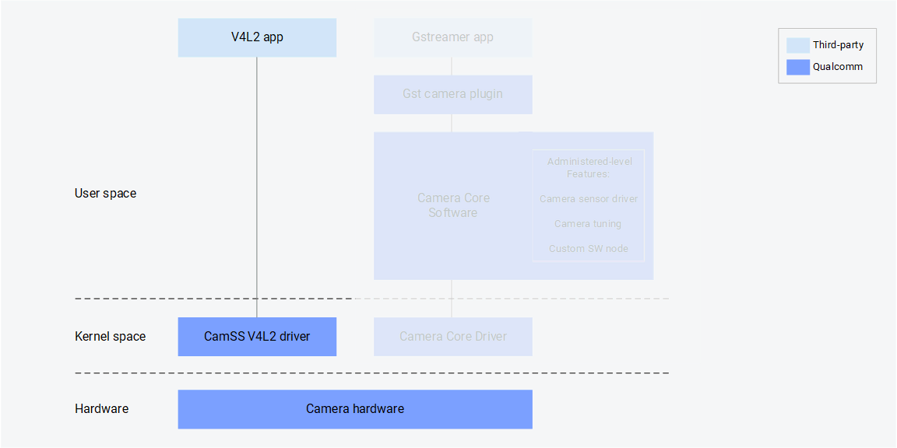
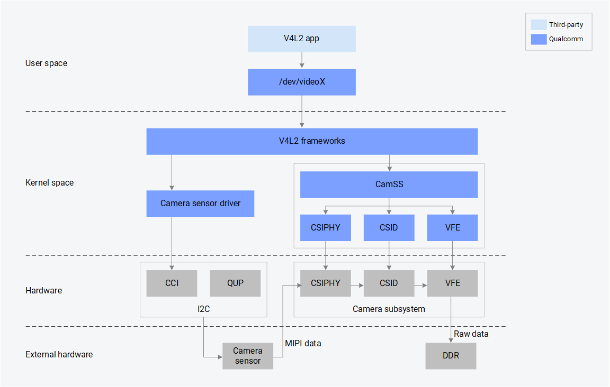

# V4L2 Interface

Source: [https://docs.qualcomm.com/doc/80-70015-17/topic/v4l2_interface.html](https://docs.qualcomm.com/doc/80-70015-17/topic/v4l2_interface.html)

V4L2 framework within the Linux kernel supports video devices. It provides an API
        that allows user space applications to interact with devices such as cameras and video
        capture cards.

More information on V4L2 is available from [kernel.org](https://www.kernel.org/doc/html/v4.9/media/kapi/v4l2-core.html).

Qualcomm supports the V4L2 interface camera ISP driver for raw frame dump functionality
            in the upstream kernel.

## CamSS driver

The Qualcomm camera subsystem (CamSS) driver in the upstream kernel implements the
        V4L2, media controller, and V4L2 subdev interfaces.

Camera sensors using the V4L2 subdev interface in the kernel are supported.

The CamSS driver consists of:

- CSIPHY module – Handles the physical layer of the CSI2 receivers. A separate camera
                sensor can be connected to each CSIPHY module.
- CSI Decoder (CSID) module – Handles the protocol and application layers of the CSI2
                receivers. A CSID can decode a data stream from any CSIPHY.
- Video Front End (VFE) module – Represents the Image Front End (IFE) that contains
                Raw Dump Interface (RDI) input interfaces that bypass the image processing pipeline.
                The VFE also contains the AXI bus interface which writes output data to memory.

        
        
The CamSS driver implements the V4L2 interface. Each CSIPHY, CSID, and VFE module is
            represented by a single V4L2 sub-device.

As shown in the following diagram, each CSIPHY can connect to each CSID. Each CSID can
            connect to each VFE. Each RDI port has an individual video node.

        

CamSS V4L2 drivers are in
                &lt;kernel\_root&gt;/drivers/media/platform/qcom/camss.
                &lt;kernel\_root&gt; is the directory of the Linux kernel.

The following code snippet shows a `v4l2_subdev_internal_ops` for the
            CamSS driver.

    static const struct v4l2_subdev_internal_ops csiphy_v4l2_internal_ops = {
        .open = csiphy_init_formats,
    };
    …
    static const struct v4l2_subdev_internal_ops csid_v4l2_internal_ops = {
        .open = csid_init_formats,
    };
    …
    static const struct v4l2_subdev_internal_ops vfe_v4l2_internal_ops = {
        .open = vfe_init_formats,
    };
    Copy to clipboard

The CamSS driver only uses the open interface to initialize the supported formats. It is
            called when the subdev device node is opened by an application.

The following code snippet shows a `v4l2_subdev_ops` for the CSID module.
            The CSIPHY and VFE modules have similar `v4l2_subdev_ops`.

    static const struct v4l2_subdev_ops csid_v4l2_ops = {
        .core = &csid_core_ops,
        .video = &csid_video_ops,
        .pad = &csid_pad_ops,
    };
    …
    
    static const struct v4l2_subdev_core_ops csid_core_ops = {
        .s_power = csid_set_power,
        .subscribe_event = v4l2_ctrl_subdev_subscribe_event,
        .unsubscribe_event = v4l2_event_subdev_unsubscribe,
    };
    
    static const struct v4l2_subdev_video_ops csid_video_ops = {
        .s_stream = csid_set_stream,
    };
    
    static const struct v4l2_subdev_pad_ops csid_pad_ops = {
        .enum_mbus_code = csid_enum_mbus_code,
        .enum_frame_size = csid_enum_frame_size,
        .get_fmt = csid_get_format,
        .set_fmt = csid_set_format,
    };
    Copy to clipboard

These interfaces are called by the V4L2 framework or drivers in various contexts (for
            example, `ioctl`, `setup_link`,
                `start_streaming`). For
            example:

    v4l2_subdev_call(subdev, pad, get_fmt, NULL, &fmt);Copy to clipboard

The following code snippet shows a media\_device\_ops for the CamSS driver and
            media\_entity\_operations for the CSIPHY, CSID, and VFE modules.

    static const struct media_device_ops camss_media_ops = {
        .link_notify = v4l2_pipeline_link_notify,
    };
    …
    static const struct media_entity_operations csiphy_media_ops = {
        .link_setup = csiphy_link_setup,
        .link_validate = v4l2_subdev_link_validate,
    };
    …
    static const struct media_entity_operations csid_media_ops = {
        .link_setup = csid_link_setup,
        .link_validate = v4l2_subdev_link_validate,
    };
    …
    static const struct media_entity_operations vfe_media_ops = {
        .link_setup = vfe_link_setup,
        .link_validate = v4l2_subdev_link_validate,
    };
    Copy to clipboard

`Camss_media_ops` is registered when the CamSS driver is registered
                (`camss_probe`). The CSIPHY, CSID, and VFE media entity operation
                `.link_setup` is called in the context of`
                media_device_setup_link`.

## Using a V4L2 application to capture raw frame data

Source: [https://docs.qualcomm.com/doc/80-70015-17/topic/v4l2_interface.html](https://docs.qualcomm.com/doc/80-70015-17/topic/v4l2_interface.html)

How to capture raw frame data using an application that supports the V4L2
        interface.

### Enable CamSS driver

1. Download upstream kernel source code using the following command.

        devtool modify linux-qcom-customCopy to clipboard

    This downloads the kernel source code to
                            the following
                            location.

        <WORKSPACE>/build-qcom-wayland/workspace/sources/linux-qcom-custom/Copy to clipboard
2. Apply the following change to enable the CamSS driver in the device
                        tree:

        <WORKSPACE>/build-qcom-wayland/workspace/sources/linux-qcom-custom/arch/arm64/boot/dts/qcom/qcs6490-rb3gen2.dts
        
        &camss {
        -	status = "disabled";
        +	status = "okay";
         	ports {
         		#address-cells = <1>;
         		#size-cells = <0>;Copy to clipboard
3. Build the image following the Yocto build instructions in [Build Guide](https://docs.qualcomm.com/bundle/publicresource/topics/80-70015-254/build_addn_info.html).
4. Flash the image following the instructions in [Flash Images](https://docs.qualcomm.com/bundle/publicresource/topics/80-70015-254/flash_images.html).

### Build and push the media controller utility and Yavta application

1. Build Yavta and the media controller.

        bitbake yavtaCopy to clipboard
2. Push the binaries to the device. In the following example,
                        `<workspace>` is the directory of the Qualcomm software
                        release.
Note: Connect to the device console using SSH.
                        See [How To SSH?](https://docs.qualcomm.com/bundle/publicresource/topics/80-70015-254/how_to.html#use-ssh) for instructions.

        scp <WORKSPACE>/build-qcom-wayland/tmp-glibc/deploy/ipk/armv8-2a/v4l-utils_1.22.1-r0_armv8-2a.ipk root@[ip-addr]:/var/cache/camera/
        scp <WORKSPACE>/build-qcom-wayland/tmp-glibc/deploy/ipk/armv8-2a/yavta_0.0-r2_armv8-2a.ipk root@[ip-addr]:/var/cache/camera/
        scp <WORKSPACE>/build-qcom-wayland/tmp-glibc/deploy/ipk/armv8-2a/media-ctl_1.22.1-r0_armv8-2a.ipk root@[ip-addr]:/var/cache/camera/
        scp <WORKSPACE>/build-qcom-wayland/tmp-glibc/deploy/ipk/armv8-2a\libv4l_1.22.1-r0_armv8-2a.ipk root@[ip-addr]:/var/cache/camera/Copy to clipboard
3. Create a shell connection to the
                    device:

        ssh root@[ip-addr]Copy to clipboard
4. Disable the camera module. 
    The camera
                        module cannot coexist with the CamSS driver.

    - Move the camera.ko module out from /lib/modules/\*
                            to make it not load automatically, then reboot the
                            device.

            # mount -o rw,remount /
            # mv /lib/modules/*/updates/camera.ko /Copy to clipboard
5. Install the media-ctl, libv4l, v4l-utils, and yavta
                    packages.

        # opkg --nodeps install /var/cache/camera/media-ctl_1.22.1-r0_armv8-2a.ipk --force-reinstall
        # opkg --nodeps install /var/cache/camera/libv4l_1.22.1-r0_armv8-2a.ipk --force-reinstall
        # opkg --nodeps install /var/cache/camera/v4l-utils_1.22.1-r0_armv8-2a.ipk --force-reinstall
        # opkg --nodeps install /var/cache/camera/yavta_0.0-r2_armv8-2a.ipk --force-reinstallCopy to clipboard
6. Optionally, add the sensor driver and CamSS
                        modules.

        # modprobe imx412
        # modprobe qcom-camss Copy to clipboard

This is an optional step since the
                        imx412 and qcom-camss modules in /lib/modules are loaded automatically.
                        Modprobe is used to add/remove modules from the Linux Kernel. The imx412 and
                        qcom-camss modules are located in the following paths on the device:
    - /lib/modules/\*/kernel/drivers/media/i2c/imx412.ko
    - /lib/modules/\*/kernel/drivers/media/platform/qcom/camss/qcom-camss.ko

Loading of the qcom\_camss and imx412 modules can be verified
                        with the following lsmod
                        command:

        # lsmod | grep qcom_camss
        # lsmod | grep imx412Copy to clipboard

### Check the media node number

Run the following command to print the media device node number for the CamSS
                driver.

If /dev/media0 does not list the qcom-camss driver, try with /dev/media1.

    # media-ctl -p -d /dev/media0 | grep camss
    driver          qcom-camss
    bus info        platform:acaf000.camssCopy to clipboard

### Find the sensor name
 
Run the following command to print the sensor name
            to the terminal.

    # cat /sys/dev/char/81\:*/name | grep imx
    imx412 19-001aCopy to clipboard

### Configure the media controller

The media controller utility (media-ctrl) is a [V4L2
                    utility](https://git.linuxtv.org/v4l-utils.git) used to configure camera subsystem subdevices. Use
                    `media-ctl --help` to print usage information. 
Note: 
Replace *[x]* with the number found via [Check the media node number](https://docs.qualcomm.com/doc/80-70015-17/topic/v4l2_interface.html#id_vy4_yf2_wcc__d12e133).

For example, 

    # media-ctl -d /dev/media0 --resetCopy to clipboard

1. Reset all links to
                    inactive:

        # media-ctl -d /dev/media[x] --resetCopy to clipboard
2. Configure the camera sensor format and resolution on pipeline
                        nodes:

        # media-ctl -d /dev/media[x] -V '"imx412 19-001a":0[fmt:SRGGB10/4056x3040 field:none]'Copy to clipboard
3. Configure CSIPHY with 4056x3040
                    resolution:

        # media-ctl -d /dev/media[x] -V '"msm_csiphy3":0[fmt:SRGGB10/4056x3040]' 
        # media-ctl -d /dev/media[x] -V '"msm_csiphy3":1[fmt:SRGGB10/4056x3040]'Copy to clipboard
4. Configure CSID with 4056x3040
                    resolution:

        # media-ctl -d /dev/media[x] -V '"msm_csid0":0[fmt:SRGGB10/4056x3040]'
        # media-ctl -d /dev/media[x] -V '"msm_csid0":1[fmt:SRGGB10/4056x3040]'Copy to clipboard
5. Configure ISP with 3840x2160
                    resolution:

        # media-ctl -d /dev/media[x] -V '"msm_vfe0_rdi0":0[fmt:SRGGB10/4056x3040]'
        # media-ctl -d /dev/media[x] -V '"msm_vfe0_rdi0":1[fmt:SRGGB10/4056x3040]'Copy to clipboard
6. Link the
                    pipeline:

        # media-ctl -d /dev/media[x] -l '"msm_csiphy3":1->"msm_csid0":0[1]'
        # media-ctl -d /dev/media[x] -l '"msm_csid0":1->"msm_vfe0_rdi0":0[1]'Copy to clipboard

### Capture images

The [Yavta test application](https://git.ideasonboard.org/yavta.git) validates the camera using the
                V4L2 interface.

Run Yavta to capture images:

    # yavta -B capture-mplane -c -I -n 5 -f SRGGB10P -s 4056x3040 -F /dev/video0 --capture=5 --file='frame-#.raw'Copy to clipboard

## libcamera framework and application

libcamera is an open-source software framework. It handles control of the V4L2 camera
        interface and exposes a native C++ API to upper layers. The applications and upper-level
        frameworks run based on the [libcamera framework](https://www.kernel.org/doc/html/v4.9/media/kapi/v4l2-core.html).

See [https://libcamera.org/docs.html#libcamera-architecture](https://libcamera.org/docs.html#libcamera-architecture) for more detail about the libcamera architecture.

<?xml version="1.0" encoding="UTF-8" standalone="no"?>
<!DOCTYPE svg PUBLIC "-//W3C//DTD SVG 1.1//EN" "http://www.w3.org/Graphics/SVG/1.1/DTD/svg11.dtd">
<!-- Generated by Microsoft Visio, SVG Export libcamera_framework.svg Page-1 -->
<svg xmlns="http://www.w3.org/2000/svg" xmlns:xlink="http://www.w3.org/1999/xlink" xmlns:ev="http://www.w3.org/2001/xml-events" width="7.13889in" height="5.57639in" viewbox="0 0 514 401.5" xml:space="preserve" color-interpolation-filters="sRGB" class="st10">
<defs id="Markers">	<g id="lend4">		<path d="M 2 1 L 0 0 L 2 -1 L 2 1 " style="stroke:none"></path>	</g>	<marker id="mrkr4-35" class="st9" refx="-7.04" orient="auto" markerunits="strokeWidth" overflow="visible">		<use xlink:href="#lend4" transform="scale(-3.52,-3.52) "></use>	</marker></defs><g>	<title>Page-1</title>	<g id="shape11-1" transform="translate(18.5,-18.5)">		<title>Sheet.11</title>		<rect x="0" y="37" width="477" height="364.5" rx="13.5" ry="13.5" class="st1"></rect>	</g>	<g id="shape1-3" transform="translate(27.5,-221)">		<title>Sheet.1</title>		<path d="M0 401.5 L459 401.5" class="st2"></path>	</g>	<g id="shape2-6" transform="translate(27.5,-257)">		<title>Sheet.2</title>		<desc>User space</desc>		<rect x="0" y="365.5" width="108" height="36" class="st3"></rect>		<text x="19.33" y="387.7" class="st4">User space</text>		</g>	<g id="shape3-9" transform="translate(27.5,-149)">		<title>Sheet.3</title>		<desc>Kernel space</desc>		<rect x="0" y="365.5" width="108" height="36" class="st3"></rect>		<text x="13.82" y="387.7" class="st4">Kernel space</text>		</g>	<g id="shape4-12" transform="translate(27.5,-41)">		<title>Sheet.4</title>		<desc>Hardware</desc>		<rect x="0" y="365.5" width="108" height="36" class="st3"></rect>		<text x="23.74" y="387.7" class="st4">Hardware</text>		</g>	<g id="shape5-15" transform="translate(27.5,-113)">		<title>Sheet.5</title>		<path d="M0 401.5 L459 401.5" class="st2"></path>	</g>	<g id="shape6-18" transform="translate(284,-329)">		<title>Sheet.6</title>		<desc>Libcamera-based app</desc>		<rect x="0" y="365.5" width="166.5" height="36" rx="9" ry="9" class="st5"></rect>		<text x="16.04" y="387.7" class="st4">Libcamera-based app</text>		</g>	<g id="shape7-21" transform="translate(284,-257)">		<title>Sheet.7</title>		<desc>Libcamera framework</desc>		<rect x="0" y="365.5" width="166.5" height="36" rx="9" ry="9" class="st5"></rect>		<text x="15.01" y="387.7" class="st4">Libcamera framework</text>		</g>	<g id="shape9-24" transform="translate(284,-149)">		<title>Sheet.9</title>		<desc>CamSS V4L2 driver</desc>		<rect x="0" y="365.5" width="166.5" height="36" rx="9" ry="9" class="st6"></rect>		<text x="23.42" y="387.7" class="st7">CamSS V4L2 driver</text>		</g>	<g id="shape10-27" transform="translate(284,-41)">		<title>Sheet.10</title>		<desc>Camera hardware</desc>		<rect x="0" y="365.5" width="166.5" height="36" rx="9" ry="9" class="st6"></rect>		<text x="28.01" y="387.7" class="st7">Camera hardware</text>		</g>	<g id="shape12-30" transform="translate(762,72.5) rotate(90)">		<title>Sheet.12</title>		<path d="M0 401.5 L28.96 401.5" class="st8"></path>	</g>	<g id="shape13-36" transform="translate(762,144.5) rotate(90)">		<title>Sheet.13</title>		<path d="M0 401.5 L64.96 401.5" class="st8"></path>	</g></g>
</svg>

libcamera is validated using the [cam utility](https://libcamera.org/getting-started.html#basic-testing-with-cam-utility).

### Capture raw frame data

The following steps describe how to capture raw frame data with the camera utility app using the V4L2 interface.

1. Enable the CamSS driver.
    1. Download upstream kernel source code using the following command.

            devtool modify linux-qcom-customCopy to clipboard

        This
                                downloads the kernel source code to the following
                            location.

            <WORKSPACE>/build-qcom-wayland/workspace/sources/linux-qcom-custom/Copy to clipboard
    2. Apply the following change to enable the CamSS driver in the device
                            tree:

            <WORKSPACE>/build-qcom-wayland/workspace/sources/linux-qcom-custom/arch/arm64/boot/dts/qcom/qcs6490-rb3gen2.dts
                
            &camss {
            -	status = "disabled";
            +	status = "okay";
                ports {
                       #address-cells = <1>;
                       #size-cells = <0>;Copy to clipboard
2. Build the image following the Yocto build command in [Build Guide](https://docs.qualcomm.com/bundle/publicresource/topics/80-70015-254/build_addn_info.html)
3. Flash the image following the instructions in [Flash images](https://docs.qualcomm.com/bundle/publicresource/topics/80-70015-254/flash_images.html)
4. Disable the camera module.

    The camera module cannot coexist with the CamSS driver.

    - Move the camera.ko module out from /lib/modules/\*
                            to make it not load automatically, then reboot the
                            device.

            # mount -o rw,remount /
            # mv /lib/modules/*/updates/camera.ko /Copy to clipboard
5. Compile and push libcamera utilities.

bitbake libcameraCopy to clipboard
6. Push the binaries to the device. In the following example,
                        `<workspace>` is the directory of the Qualcomm software
                        release.
Note: Connect to the device console using SSH.
                        See [How To SSH?](https://docs.qualcomm.com/bundle/publicresource/topics/80-70015-254/how_to.html#use-ssh) for instructions.

        scp <WORKSPACE>/build-qcom-wayland/tmp-glibc/deploy/ipk/armv8-2a/ libcamera_202105+git0+acf8d028ed-r0_armv8-2a.ipk root@[ip-addr]:/var/cache/camera/
        scp <WORKSPACE>/build-qcom-wayland/tmp-glibc/deploy/ipk/armv8-2a/ libevent-pthreads-2.1-7_2.1.12-r0_armv8-2a.ipk root@[ip-addr]:/var/cache/camera/
        scp <WORKSPACE>/build-qcom-wayland/tmp-glibc/deploy/ipk/armv8-2a/ libevent-2.1-7_2.1.12-r0_armv8-2a.ipk root@[ip-addr]:/var/cache/camera/Copy to clipboard
7. Create a shell connection to the
                    device:

        ssh root@[ip-addr]Copy to clipboard
8. Install libcamera
                    utilities

        # opkg --nodeps install /var/cache/camera/libcamera_202105+git0+acf8d028ed-r0_armv8-2a.ipk --force-reinstall
        # opkg --nodeps install /var/cache/camera/libevent-pthreads-2.1-7_2.1.12-r0_armv8-2a.ipk --force-reinstall
        # opkg --nodeps install /var/cache/camera/libevent-2.1-7_2.1.12-r0_armv8-2a.ipk --force-reinstallCopy to clipboard
9. Run the `cam` utility.

        #  cam -c 1 --capture=10 --file='frame-#.raw'Copy to clipboard

This runs
                    the utility and captures 10 raw frames in the root directory and saves them into
                    files. 
    Check the console log messages for information about the resolution
                        and format of the dumped
                    images.

        Using camera /base/soc@0/cci@ac4b000/i2c-bus@1/camera@1a as cam0
        [0:15:01.067615799] [2155] INFO Camera camera.cpp:945 configuring streams: (0) 4056x3040-SRGGB10_CSI2P
        cam0: Capture 10 framesCopy to clipboard

Last Published: Oct 17, 2024

[Previous Topic
Getting Started](https://docs.qualcomm.com/bundle/publicresource/80-70015-17/topics/getting_started.md) [Next Topic
GStreamer Camera Application](https://docs.qualcomm.com/bundle/publicresource/80-70015-17/topics/gstreamer_camera_application.md)