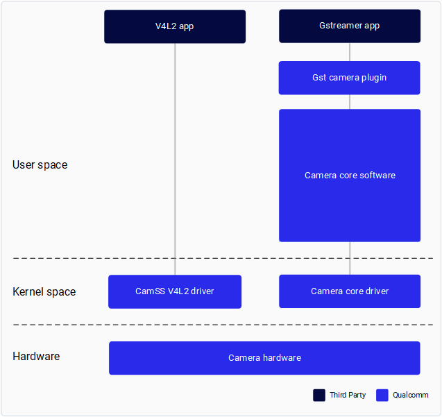

# Camera overview

[<svg xmlns="http://www.w3.org/2000/svg" xmlns:xlink="http://www.w3.org/1999/xlink" viewbox="0 0 640 400" width="640" height="400" style="cursor:auto !important" aria-label="../_images/camera_overview_video.svg">
    <defs>
      
  </defs>
  <foreignobject x="0" y="0" width="640" height="400">
    <body xmlns="http://www.w3.org/1999/xhtml">
        <iframe width="640" height="400" src="https://players.brightcove.net/1414329538001/4JiZQnWhg_default/index.html?videoId=6362726364112" allowfullscreen="" allow="encrypted-media"></iframe>
    

 Last Published: Jul 02, 2025

</body>
    </foreignobject>
</svg>](https://players.brightcove.net/1414329538001/4JiZQnWhg_default/index.html?videoId=6362726364112)

This document explains the camera subsystem that receives data through a MIPI CSI interface.

USB camera data is delivered though a USB interface, and the camera subsystem doesn’t involve USB camera data transaction. See [USB camera configuration](https://docs.qualcomm.com/bundle/publicresource/topics/80-70020-8/usb.html) for USB camera usage.

Network camera data is delivered though a network interface, and the camera subsystem doesn’t involve network camera data transaction. The device can receive network camera data through the GStreamer [rtspsrc](https://gstreamer.freedesktop.org/documentation/rtsp/rtspsrc.html?gi-language=c) plugin.

## Camera components

The following diagram shows the components of Qualcomm Camera.

The following components are provided by Qualcomm:

| Component | Description |
| --- | --- |
| Gst camera plugin (qtiqmmfsrc) | GStreamer plugin for Qualcomm’s camera subsystem |
| Camera Core Software | Qualcomm’s proprietary camera software that provides the interface to develop camera sensor drivers, camera tuning, and custom software nodes |
| Camera Core Driver | Qualcomm camera subsystem driver in the downstream Linux kernel |
| CamSS V4L2 driver | Qualcomm camera subsystem driver in the upstream Linux kernel |

Qualcomm provides a GStreamer plug-in to enable application developers to interface with the Qualcomm camera subsystem. See GStreamer-camera-application for application development.

Qualcomm provides an interface for camera sensor driver developers and IQ tuning engineers to develop their own sensor drivers and perform custom IQ tuning.
See Camera Sensor Driver Development and Tuning in the [Camera Addendum document](https://docs.qualcomm.com/bundle/resource/topics/80-70020-17A).

Access to the meta- qcom-extras layer is required for camera sensor driver development and custom IQ tuning. For the access level, refer to [Mapping access levels](https://docs.qualcomm.com/bundle/publicresource/topics/80-70020-254/build_addn_info.html#sync-firmware).

## Prerequisites

- Set up your infrastructure as described in the [Qualcomm Linux Build Guide](https://docs.qualcomm.com/bundle/publicresource/topics/80-70020-254/introduction.html)
- Flash the latest software release to the development board
- Set up SSH connection:

> 
> 
> 1. Enable SSH in Permissive mode by performing the steps mentioned in [Use SSH](https://docs.qualcomm.com/bundle/publicresource/topics/80-70020-254/how_to.html#use-ssh).
>     2. Connect to the device by running the following command:
> 
> 
> ssh root@<device_IP_address>
>             Copy to clipboard
> 
> 
>         For example, if the IP address of the device is 10.92.160.222, run the following command:
> 
> 
> ssh root@10.92.160.222
>             Copy to clipboard

Last Published: Jul 02, 2025

[Previous Topic
Camera documentation](https://docs.qualcomm.com/bundle/publicresource/80-70020-17/topics/camera-documentation.md) [Next Topic
Stream cameras](https://docs.qualcomm.com/bundle/publicresource/80-70020-17/topics/stream-cameras.md)