# Stream cameras

This page describes how to connect camera sensors to your reference hardware platform and provides information about available APIs.

## Set up the camera

Tab QCS6490
Tab QCS9075
Tab QCS8275

> 
> 
> **RB3G2 MIPI CSI connection on vision mezzanine board**
> 
> 
> OV9282 and IMX577 are the default camera sensors.
> 
> 
> Connect the OV9282 module to CAM0A and the IMX577 module to CAM3 port as shown:
> 
> 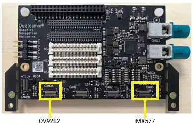
> 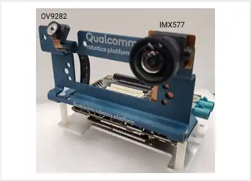
> 
> **SW2300 DIP switch on interposer board**
> 
> 
> To use the CAM3 slot of the vision mezzanine board, switch 1 of the SW2300 DIP switch on the interposer board must be set to OFF. This switch is set to OFF by default.
> 
> 
> To use the CAM1 and CAM2 slots of the interposer board:
> 
> 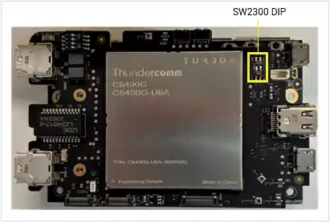
> 
> **RB2G2 GMSL connection on vision mezzanine board**
> 
> 
> There are two GMSL slots (GMSL1 and GMSL2) on the mezzanine board of Qualcomm’s RB3G2 Vision Kit platform. Two GMSL cameras can be connected to these slots.
> 
> 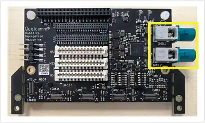
> 
> The GMSL1 slot can be used without any hardware setting. To use the GMSL2 slot, switch 1 of the SW2300DIP switch on the interposer board must be set to ON. This switch is set to OFF by default.
> See [SW2300 Dip switch on interposer board](https://docs.qualcomm.com/doc/80-70020-17/topic/stream-cameras_RB4_VERSION.html#sw2300-dip).
> 
> 
> **RB3G2 MIPI CSI camera on interposer board**
> 
> 
> Connect OV9282 module to CAM1 and IMX577 module to CAM2 on the interposer board.
> 
> 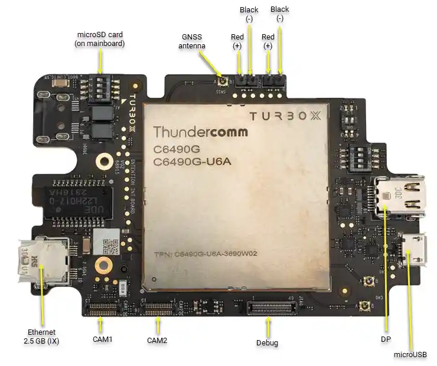
> 
> Set CSI1\_DIP\_SW and CSI2\_DIP\_SW to ON as shown in the right side image). As shown in #7 of the following image, the switch is set OFF by default. Change it to ON to use CAM/CAM2 on the Core Kit.
> 
> 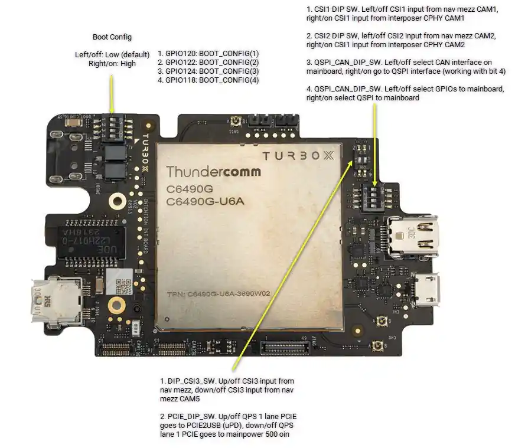
> 
> **Supported resolutions and features**
> 
> 
> The following table shows the supported resolutions each camera module.
> 
> 
> 
> 
> 
> 
> | Resolution | Aspect Ratio | IMX577 (CAM3) | OV9282 (CAM0A) | AR0231 (GMSL) |
> | --- | --- | --- | --- | --- |
> | 4000 x 3000 | 4:3 | Yes | No | No |
> | 3840 x 2160 | 16:9 | Yes | No | No |
> | 2976 x 2976 | 1:1 | Yes | No | No |
> | 2592 x 1940 | 4:3 | Yes | No | No |
> | 2048 x 1536 | 4:3 | Yes | No | No |
> | 1920 x 1440 | 4:3 | Yes | No | No |
> | 1928 x 1208 | 16:10 | Yes | No | Yes |
> | 1920 x 1080 | 16:9 | Yes | No | Yes |
> | 1440 x 1080 | 4:3 | Yes | No | Yes |
> | 1280 x 720 | 16:9 | Yes | Yes | Yes |
> | 1024 x 768 | 4:3 | Yes | Yes | Yes |
> | 800 x 600 | 4:3 | Yes | Yes | Yes |
> | 640 x 480 | 4:3 | Yes | Yes | Yes |
> | 640 x 360 | 16:9 | Yes | Yes | Yes |
> | 320 x 240 | 4:3 | Yes | Yes | Yes |

The following table shows the supported features of each camera module.

| Feature | IMX577 (CAM3) | OV9282 (CAM0A) | AR0231 (GMSL) |
| --- | --- | --- | --- |
| SHDR | Yes | No | No |
| LDC | Yes | No | No |
| EIS | Yes | No | No |

This section explains how to connect camera sensors on the QCS9075 reference hardware platform RB8 device.

**Connect MIPI CSI cameras on RB8**

RB8 will be offered in one kit version called the core kit. This core kit supports only MIPI CSI cameras. The GMSL cameras are supported using a separate add-on GMSL mezzanine board that needs to be connected to core kit.

In the RB8 EVT (core kit + GMSL mezzanine) hardware, there are four MIPI CSI (C/D-PHY) connectors present on the RB8 core kit/main board and four GMSL ports (0 to 3) present on the GMSL mezzanine board.

The following diagram shows the MIPI connectors on the RB8 core kit/main board.

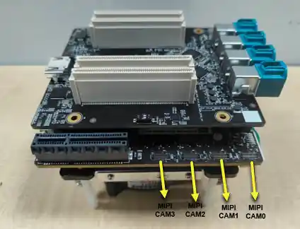

**Connect GMSL cameras on RB8**

There are four GMSL ports (0 to 3) present on the GMSL mezzanine board. Each GMSL port connects with a MAX96724 quad GMSL deserializer. Each deserializer is connected to one CSI.

The following diagram shows the GMSL ports on the RB8 device. Note that the GMSL port numbering is not in sequence - It is defined based on the CSI index to which a GMSL port is connected.

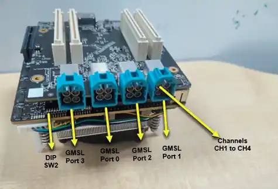

Note

In the current release, three GMSL ports (0, 2, and 3) are supported to connect GMSL cameras. Port 1 is not enabled due to a hardware issue.

- Each GMSL port contains four slots (1 to 4, also referred to as channels) and supports connection to four GMSL cameras on a single port
- With the existing software configuration in this release, a single GMSL port supports connection to only one GMSL camera on any of its four slots. GMSL Port-0 supports single Bayer camera, and Port-2 and Port-3 each support a single YUV camera. You can use any slot on a port to connect a GMSL camera.
- The current release supports OX03f10 Bayer GMSL and OX03f10 YUV GMSL cameras. You can connect one OX03F10 Bayer GMSL on GMSL Port-0 and two OX03F10 YUV GMSL cameras each on Port-2 and Port-3.

**Set DIP switches**

QCS9075 has four CSI PHYs. Each CSI PHY is routed to connect to either a MIPI camera port or a GMSL camera port controlled using DIP switch SW2 present on the core kit/main board.

The following diagram shows DIP switch SW2 present on the core kit/main board.

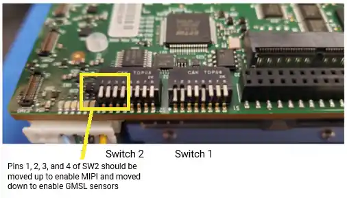

The following table explains the required DIP switch SW2 settings needed to use MIPI and GMSL camera ports.

| **SWITCH** | **OFF (default from factory)** | **ON** | **Connection when on** | **Connection when off (default from factory)** |
| --- | --- | --- | --- | --- |
| SW2 - 1 | HIGH | LOW | CSI0 connected to GMSL mezzanine | CSI0 connected to main board |
| SW2 - 2 | HIGH | LOW | CSI1 connected to GMSL mezzanine | CSI1 connected to main board |
| SW2 - 3 | HIGH | LOW | CSI2 connected to GMSL mezzanine | CSI2 connected to main board |
| SW2 - 4 | HIGH | LOW | CSI3 connected to GMSL mezzanine | CSI3 connected to main board |

**Supported resolutions and features**

The following table shows the supported resolutions each camera module on the RB8 platform.

| **Resolution** | **Aspect Ratio** | **0X3F10 Bayer GMSL** | **0X3F10 YUV GMSL** | **OV9282 (CAM0A)** |
| --- | --- | --- | --- | --- |
| 1920 x 1536 | 5:4 | No | Yes | No |
| 1920 x 1440 | 4:3 | No | Yes | No |
| 1928 x 1208 | 16:10 | No | Yes | No |
| 1920 x 1080 | 16:9 | No | Yes | No |
| 1824 x 1536 | 19:16 | Yes | Yes | No |
| 1440 x 1080 | 4:3 | Yes | Yes | No |
| 1280 x 720 | 16:9 | Yes | Yes | Yes |
| 1024 x 768 | 4:3 | Yes | Yes | Yes |
| 800 x 600 | 4:3 | Yes | Yes | Yes |
| 640 x 480 | 4:3 | Yes | Yes | Yes |
| 640 x 360 | 16:9 | Yes | Yes | Yes |
| 320 x 240 | 4:3 | Yes | Yes | Yes |

Advanced features such as SHDR, LDC, and EIS are not supported on QCS9075.

**Concurrent camera support on RB8**

The following tables explain the concurrent camera use cases which are supported in the current release.

- RB8 MIPI sensor

> 
> 
> | **Sensor** | **CAM0** | **CAM1** | **CAM2** | **CAM3** | **Mode** | **Note** |
>     | --- | --- | --- | --- | --- | --- | --- |
>     | MIPI OV9282 | TRUE | TRUE | TRUE | TRUE | Independent sensor testing | Concurrency testing of OV9282 |
>     | MIPI OV9282 | TRUE | TRUE | FALSE | FALSE | Concurrency testing of OV9282 | A maximum of 2 MIPI sensor concurrency is supported |
- RB8 GMSL sensor

> 
> 
> | **Group** | **Sensor** | **Ch1** | **Ch2** | **Ch3** | **Ch4** | **Note** |
>     | --- | --- | --- | --- | --- | --- | --- |
>     | Des0 | 0x3F10 GMSL Bayer | TRUE | TRUE | TRUE | TRUE | A maximum of one sensor can be connected per deserializer |
>     | Des1 | NA | FALSE | FALSE | FALSE | FALSE | Hardware issue can not be validated |
>     | Des2 | 0x3F10 GMSL YUV | TRUE | TRUE | TRUE | TRUE | A maximum of one sensor can be connected per deserializer |
>     | Des3 | 0x3F10 GMSL YUV | TRUE | TRUE | TRUE | TRUE | A maximum of one sensor can be connected per deserializer |
- RB8 GMSL sensor + MIPI sensor

> 
> 
> | **Group** | **Sensor** | **Ch1** | **Ch2** | **Ch3** | **Ch4** | **Note** |
>     | --- | --- | --- | --- | --- | --- | --- |
>     | CAM0 | MIPI OV9282 | TRUE | TRUE | TRUE | TRUE |  |
>     | CAM1 | MIPI OV9282 | TRUE | TRUE | TRUE | TRUE |  |
>     | Des2 | 0x3F10 GMSL YUV | TRUE | TRUE | TRUE | TRUE | A maximum of one sensor can be connected per deserializer |
>     | Des3 | 0x3F10 GMSL YUV | TRUE | TRUE | TRUE | TRUE | A maximum of one sensor can be connected per deserializer |

This section explains how to connect camera modules on the QCS8275 reference platform Ride SX hardware.

**Connect GMSL camera module on Ride SX hardware**

- In the QCS8275 reference platform Ride SX hardware, four GMSL ports (0 to 3) are present. Three GMSL ports (0 to 2) are supported to connect GMSL cameras. Each GMSL port connects with MAX96724 quad GMSL deserializer. Port 3 is a dummy port.
- There are no MIPI CSI camera ports available on this hardware.
- Each GMSL port contains four slots (1 to 4, also referred to as channels) and supports connection of four GMSL cameras to a single port.
- With the existing software configuration in this release, a single GMSL port supports connection to only one GMSL camera on any of its four slots. GMSL Port-0 supports single Bayer camera, and Port-1 and Port-2 each supports single YUV camera. Any slot can be used on these ports.
- The current release supports OX03f10 Bayer GMSL and OX03f10 YUV GMSL cameras. You can connect one OX03F10 Bayer GMSL on GMSL Port-0 and two OX03F10 YUV GMSL cameras each on Port-1 and Port-2.

The following diagram shows connection of a OX03F10 Bayer GMSL camera on GMSL Port-0.

> 
> 
> 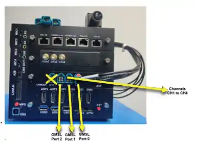

**Supported resolutions and features**

The following table shows the supported resolutions each camera module on the Ride SX platform.

> 
> 
> | **Resolution** | **Aspect Ratio** | **0X3F10 Bayer GMSL** | **0X3F10 YUV GMSL** |
> | --- | --- | --- | --- |
> | 1920 x 1536 | 5:4 | No | Yes |
> | 1920 x 1440 | 4:3 | No | Yes |
> | 1928 x 1208 | 16:10 | No | Yes |
> | 1920 x 1080 | 16:9 | No | Yes |
> | 1824 x 1536 | 19:16 | Yes | Yes |
> | 1440 x 1080 | 4:3 | Yes | Yes |
> | 1280 x 720 | 16:9 | Yes | Yes |
> | 1024 x 768 | 4:3 | Yes | Yes |
> | 800 x 600 | 4:3 | Yes | Yes |
> | 640 x 480 | 4:3 | Yes | Yes |
> | 640 x 360 | 16:9 | Yes | Yes |
> | 320 x 240 | 4:3 | Yes | Yes |
> 
> 
> 
> Advanced features such as SHDR, LDC, and EIS are not supported on QCS8275.

## Choose the stream API

Qualcomm Linux supports following APIs for camera.

- [GStreamer API](https://docs.qualcomm.com/doc/80-70020-17/topic/stream-cameras_RB4_VERSION.html#gstreamer-api)

    GStreamer is an open-source multimedia framework. Qualcomm provides a GStreamer plugin (qtiqmmfsrc) that allows developers to control the camera subsystem in applications.
See [Qualcomm GStreamer plugins](https://docs.qualcomm.com/bundle/publicresource/topics/80-70020-50/qim-sdk-plugins.html) for more information.
- [V4L2 API](https://docs.qualcomm.com/doc/80-70020-17/topic/stream-cameras_RB4_VERSION.html#v4l2-api) (QCS6490 only)

    V4L2 is a framework within the Linux kernel that provides support for video capture, video output, and other multimedia devices. Developers can operate the camera using the V4L2 API.
The V4L2 API, which uses the CAMSS driver, is suitable for developers who only need to obtain raw images from the camera.

## Stream camera with the GStreamer API

gst-launch-1.0 is a command-line GStreamer utility used to build and run a GStreamer pipeline.
The pipeline is specified as a collection of elements with properties separated by exclamation marks (!).

### Prerequisites

To use [gst-launch-1.0](https://gstreamer.freedesktop.org/documentation/tools/gst-launch.html?gi-language=c) and GStreamer plugins, QIM-SDK (meta-qcom-qim-product-sdk) must be installed on the device.
See [Qualcomm Linux Build Guide](https://docs.qualcomm.com/bundle/publicresource/topics/80-70020-254/introduction.html) for QIM-SDK build and installation information.

Note

Connect to the device console using SSH. See [How To SSH?](https://docs.qualcomm.com/bundle/publicresource/topics/80-70020-254/how_to.html#use-ssh) for instructions.

Run the following command in an SSH terminal:

# mount -o rw,remount /usr
    Copy to clipboard

Tab QCS6490
Tab QCS9075
Tab QCS8275

Note

Ensure that MIPI cameras are connected to CSI slots. The OV9282 MIPI camera should be connected to the CAM 0A slot and the IMX577 MPI camera should be be connected to the CAM3 slot.

**Single camera stream start**

1. Run the following command in the device terminal:

gst-launch-1.0 -e qtiqmmfsrc name=camsrc camera=0 ! 'video/x-raw,format=NV12,\
    width=1280,height=720,framerate=30/1' ! fakesink
    Copy to clipboard

2. This command starts the camera with 720p at 30 FPS configuration. The frame coming from the camera sensor is thrown away by fakesink.
If the gst pipeline status is changed to “PLAYING” as shown below, this indicates that the camera is running.
Since this command dumps camera frames to fakesink, nothing will be saved on the device.

gbm_create_device(187): Info: backend name is: msm_drm
    Setting pipeline to PAUSED ...
    Pipeline is live and does not need PREROLL ...
    Setting pipeline to PLAYING ...
    New clock: GstSystemClock
    Copy to clipboard

To stop the camera, press **CTRL+C**.

**Video encoding**

1. Run the following command in the device terminal:

gst-launch-1.0 -e qtiqmmfsrc name=camsrc camera=0 ! \
    video/x-raw,format=NV12,width=1280,height=720,framerate=30/1,\
    interlace-mode=progressive,colorimetry=bt601 ! v4l2h264enc \
    capture-io-mode=4 output-io-mode=5 extra-controls="controls,video_bitrate=6000000,\
    video_bitrate_mode=0;" ! h264parse ! mp4mux ! filesink location=/opt/mux_avc.mp4
    Copy to clipboard

This command starts the camera with 720p at 30 FPS configuration and saves it as a video file after h264 video encoding. If the gst pipeline status is changed to “PLAYING”, this indicates the camera is running.

To stop the camera, press **CTRL+C**.

2. `/opt/mux_avc.mp4` is generated on the device. The recorded content can be pulled from the device by running the following scp command on the host PC:

$ scp -r root@[ip-addr]:/opt/mux_avc.mp4 .
    Copy to clipboard

**Video encoding and snapshot**

1. Run the following command in the device terminal:

gst-pipeline-app -e qtiqmmfsrc name=camsrc camera=0 ! \
    video/x-raw,format=NV12,width=1280,height=720,framerate=30/1,\
    interlace-mode=progressive,colorimetry=bt601 ! v4l2h264enc \
    capture-io-mode=4 output-io-mode=5 extra-controls="controls,video_bitrate=6000000,\
    video_bitrate_mode=0;" ! h264parse ! mp4mux ! filesink location=/opt/mux_avc.mp4 \
    camsrc.image_1 ! "image/jpeg,width=1280,height=720,framerate=30/1" \
    ! multifilesink location=/opt/frame%d.jpg async=false sync=true enable-last-sample=false
    Copy to clipboard

2. Press **Enter**. This command will print the following menu and wait for user input.

##################################### MENU #####################################
    
    ============================== Pipeline Controls==============================
    (0) NULL: Set the pipeline into NULL state
    (1) READY: Set the pipeline into READY state
    (2) PAUSED: Set the pipeline into PAUSED state
    (3) PLAYING: Set the pipeline into PLAYING state
    
    ==================================== Other====================================
    (p) Plugin Mode: Choose a plugin which to control
    (q) Quit : Exit the application
    
    Choose an option:
    Copy to clipboard

3. Use the following menu steps to take a snapshot while recording video.

(1) ready -> (3) Playing -> (p)Plugin Mode : Select (8)camerasrc -> (37) capture-image -> (1): still - Snapshot ->(1) Snapshot count ( 'guint' value for arg1)
    Copy to clipboard

4. To stop the camera, press **Enter**, press **b** (back), and then press **q** (quit). The recorded video file and snapshot images are saved in `/opt/`. The recorded content can be pulled from the device by running the following scp command on the host PC:

$ scp -r root@[ip-addr]:/opt/<file name> .
    Copy to clipboard

Note

Ensure that the camera (MIPI or GMSL) sensor is connected to the RB8 device. You can connect OV9282 MIPI cameras on CSI slots. Connect OX03f10 Bayer GMSL camera to GMSL Port-0 and OX03f10 YUV GMSL cameras to Port-2 and Port-3.

Note

There are random CSI errors on GMSL Port-0 that stop Bayer GMSL camera streaming. This issue will be fixed in the next GA release.

**Single camera stream start**

Run the following command in the device terminal:

gst-launch-1.0 -e qtiqmmfsrc name=camsrc camera=0 ! 'video/x-raw,format=NV12,\
    width=1280,height=720,framerate=30/1' ! fakesink
    Copy to clipboard

The following command starts the camera with 720p at 30 FPS configuration. The frame coming from the camera sensor is thrown away by fakesink.
If the gst pipeline status is changed to “PLAYING” as shown below, this indicates that the camera is running.
Since this command dumps camera frames to fakesink, nothing will be saved on the device.

gbm_create_device(187): Info: backend name is: msm_drm
    Setting pipeline to PAUSED ...
    Pipeline is live and does not need PREROLL ...
    Setting pipeline to PLAYING ...
    New clock: GstSystemClock
    Copy to clipboard

To stop the camera, press **CTRL+C**.

**Video encoding**

1. Run the following command in the device terminal:

gst-launch-1.0 -e qtiqmmfsrc name=camsrc camera=0 ! \
        video/x-raw,format=NV12,width=1280,height=720,framerate=30/1,\
        interlace-mode=progressive,colorimetry=bt601 ! v4l2h264enc \
        capture-io-mode=4 output-io-mode=5 extra-controls="controls,video_bitrate=6000000,\
        video_bitrate_mode=0;" ! h264parse ! mp4mux ! filesink location=/opt/mux_avc.mp4
        Copy to clipboard

    This command starts the camera with 720p at 30 FPS configuration and saves it as a video file after h264 video encoding. If the gst pipeline status is changed to “PLAYING”, this indicates the camera is running.

    To stop the camera, press **CTRL+C**.
2. `/opt/mux_avc.mp4` is generated on the device. The recorded content can be pulled from the device by running the following scp command on the host PC:

$ scp -r root@[ip-addr]:/opt/mux_avc. mp4 .
        Copy to clipboard

**Video encoding and snapshot**

The snapshot use case is not enabled on QCS9075 and will not work in the current release.

> 
> 
> Note
> 
> 
> Ensure the GMSL camera is connected to the Ride SX device. You can connect the OX03f10 Bayer GMSL camera to GMSL Port-0 and OX03f10 YUV GMSL cameras to Port-1 and Port-2.

**Single camera stream start**

Run the following command in the device terminal:

gst-launch-1.0 -e qtiqmmfsrc name=camsrc camera=0 ! 'video/x-raw,format=NV12,\
    width=1280,height=720,framerate=30/1' ! fakesink
    Copy to clipboard

The following command starts the camera with 720p at 30 FPS configuration. The frame coming from the camera sensor is thrown away by fakesink.
If the gst pipeline status is changed to “PLAYING” as shown below, this indicates that the camera is running.
Since this command dumps camera frames to fakesink, nothing will be saved on the device.

gbm_create_device(187): Info: backend name is: msm_drm
    Setting pipeline to PAUSED ...
    Pipeline is live and does not need PREROLL ...
    Setting pipeline to PLAYING ...
    New clock: GstSystemClock
    Copy to clipboard

To stop the camera, press **CTRL+C**.

**Video encoding**

1. Run the following command in the device terminal:

gst-launch-1.0 -e qtiqmmfsrc name=camsrc camera=0 ! \
        video/x-raw,format=NV12,width=1280,height=720,framerate=30/1,\
        interlace-mode=progressive,colorimetry=bt601 ! v4l2h264enc \
        capture-io-mode=4 output-io-mode=5 extra-controls="controls,video_bitrate=6000000,\
        video_bitrate_mode=0;" ! h264parse ! mp4mux ! filesink location=/opt/mux_avc.mp4
        Copy to clipboard

    This command starts the camera with 720p at 30 FPS configuration and saves it as a video file after h264 video encoding. If the gst pipeline status is changed to “PLAYING”, this indicates the camera is running.

    To stop the camera, press **CTRL+C**.
2. `/opt/mux_avc.mp4` is generated on the device. The recorded content can be pulled from the device by running the following scp command on the host PC:

$ scp -r root@[ip-addr]:/opt/mux_avc. mp4 .
        Copy to clipboard

**Video encoding and snapshot**

The snapshot use case is not enabled on QCS8275 and will not work in the current release.

### Other GStreamer Samples

The QIM SDK includes [GStreamer sample applications for camera](https://docs.qualcomm.com/bundle/publicresource/topics/80-70020-50/camera-sample-applications.html)
and sample applications for [AI/ML and other multimedia applications](https://docs.qualcomm.com/bundle/publicresource/topics/80-70020-50/example-applications.html).

Note

Before using the sample applications, ensure that the installation prerequisites for gst- launch-1.0 and GStreamer plugins are met.

See [Multimedia use case examples](https://docs.qualcomm.com/bundle/publicresource/topics/80-70020-50/multimedia-use-cases.html) for examples using gst-launch-1.0.

### Stream camera with the V4L2 API

Tab QCS6490
Tab QCS9075
Tab QCS8275

The V4L2 framework within the Linux kernel supports video devices. It provides an API that allows user space applications to interact with devices such as cameras and video capture cards.

More information on V4L2 is available from [kernel.org](https://www.kernel.org/doc/html/v4.9/media/kapi/v4l2-core.html).

Qualcomm supports the V4L2 interface camera ISP driver for raw frame dump functionality in the upstream kernel.

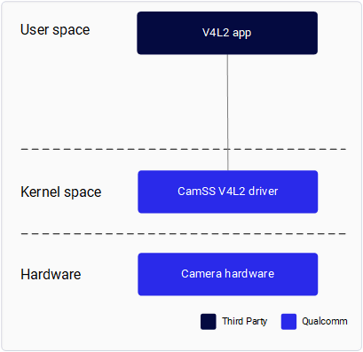

**CamSS driver**

The Qualcomm camera subsystem (CamSS) driver in the upstream kernel implements the V4L2, media controller, and V4L2 subdev interfaces.

Camera sensors using the V4L2 subdev interface in the kernel are supported.

The CamSS driver consists of:

- CSIPHY module – Handles the physical layer of the CSI2 receivers. A separate camera sensor can be connected to each CSIPHY module.
- CSI Decoder (CSID) module – Handles the protocol and application layers of the CSI2 receivers. A CSID can decode a data stream from any CSIPHY.
- Video Front End (VFE) module – Represents the Image Front End (IFE) that contains Raw Dump Interface (RDI) input interfaces that bypass the image processing pipeline. The VFE also contains the AXI bus interface which writes output data to memory.

The CamSS driver implements the V4L2 interface. Each CSIPHY, CSID, and VFE module is represented by a single V4L2 sub-device.

As shown in the following diagram, each CSIPHY can connect to each CSID. Each CSID can connect to each VFE. Each RDI port has an individual video node.

CamSS V4L2 drivers are in `<kernel_root>/drivers/media/platform/qcom/camss`. `<kernel_root>` is the directory of the Linux kernel.

The following code snippet shows a v4l2\_subdev\_internal\_ops for the CamSS driver.

static const struct v4l2_subdev_internal_ops csiphy_v4l2_internal_ops = {
      .open = csiphy_init_formats,
    };
    …
    static const struct v4l2_subdev_internal_ops csid_v4l2_internal_ops = {
      .open = csid_init_formats,
    };
    …
    static const struct v4l2_subdev_internal_ops vfe_v4l2_internal_ops = {
      .open = vfe_init_formats,
    };
    Copy to clipboard

The CamSS driver only uses the open interface to initialize the supported formats. It is called when the subdev device node is opened by an application.

The following code snippet shows a `v4l2_subdev_ops` for the CSID module. The CSIPHY and VFE modules have similar `v4l2_subdev_ops`.

static const struct v4l2_subdev_ops csid_v4l2_ops = {
       .core = &csid_core_ops,
       .video = &csid_video_ops,
       .pad = &csid_pad_ops,
    };
    …
    static const struct v4l2_subdev_core_ops csid_core_ops = {
       .s_power = csid_set_power,
       .subscribe_event = v4l2_ctrl_subdev_subscribe_event,
       .unsubscribe_event = v4l2_event_subdev_unsubscribe,
    };
    
    static const struct v4l2_subdev_video_ops csid_video_ops = {
       .s_stream = csid_set_stream,
    };
    
    static const struct v4l2_subdev_pad_ops csid_pad_ops = {
       .enum_mbus_code = csid_enum_mbus_code,
       .enum_frame_size = csid_enum_frame_size,
       .get_fmt = csid_get_format,
       .set_fmt = csid_set_format,
    };
    Copy to clipboard

These interfaces are called by the V4L2 framework or drivers in various contexts (for example, `ioctl`, `setup_link`, `start_streaming`). For example:

v4l2_subdev_call(subdev, pad, get_fmt, NULL, &fmt);``
    Copy to clipboard

The following code snippet shows a `media_device_ops` for the CamSS driver and `media_entity_operations` for the CSIPHY, CSID, and VFE modules.

static const struct media_device_ops camss_media_ops = {
       .link_notify = v4l2_pipeline_link_notify,
    };
    …
    static const struct media_entity_operations csiphy_media_ops = {
       .link_setup = csiphy_link_setup,
       .link_validate = v4l2_subdev_link_validate,
    };
    …
    static const struct media_entity_operations csid_media_ops = {
       .link_setup = csid_link_setup,
       .link_validate = v4l2_subdev_link_validate,
    };
    …
    static const struct media_entity_operations vfe_media_ops = {
       .link_setup = vfe_link_setup,
       .link_validate = v4l2_subdev_link_validate,
    };
    Copy to clipboard

`Camss_media_ops` is registered when the CamSS driver is registered (`camss_probe`). The CSIPHY, CSID, and VFE media entity operation. `link_setup` is called in the context of `media_device_setup_link`.

**V4L2 sample application - Yavta**

This section describes how to capture raw frame data using an application that supports the V4L2 interface.

**Enable CamSS driver**

1. Download upstream kernel source code using the following command.

devtool modify linux-qcom-custom
    Copy to clipboard

This downloads the kernel source code to `<WORKSPACE>/build-qcom-wayland/workspace/sources/linux-qcom-custom/`.

2. Apply the following change to enable the CamSS driver in the device tree:

<WORKSPACE>/build-qcom-wayland/workspace/sources/linux-qcom-custom/arch/ arm64/boot/dts/qcom/qcs6490-addons-rb3gen2.dtsi
    
    &camss {
    -       status = "disabled";
    +       status = "okay";
            ports {
               #address-cells = <1>;
               #size-cells = <0>;
    csiphy3_ep: endpoint {
    };
    
    &cci1 {
    -       status = "disabled";
    +       status = "okay";
    };
    Copy to clipboard

3. Apply the following patch that is needed to fix a functional issue. This patch will be mainlined in a the next release.

--- a/drivers/media/platform/qcom/camss/camss.c
        +++ b/drivers/media/platform/qcom/camss/camss.c
        @@ -3514,12 +3514,13 @@ static int camss_configure_pd(struct camss *camss)
           return ret;
        }
        
        +#if 0
           ret = devm_pm_opp_set_clkname(camss->dev, "vfe0");
           if (ret) {
              dev_err(dev, "devm_pm_opp_set_clkname failed %d\n", ret);
              return ret;
           }
        -
        +#endif
           camss->genpd_link = device_link_add(camss->dev, camss->genpd,
              DL_FLAG_STATELESS | DL_FLAG_PM_RUNTIME |
              DL_FLAG_RPM_ACTIVE);
           @@ -3528,6 +3529,7 @@ static int camss_configure_pd(struct camss *camss)
              ret = -EINVAL;
              goto fail_pm;
           }
        
        +#if 0
           ret = devm_pm_opp_of_add_table(camss->dev);
           if (ret) {
              @@ -3535,6 +3537,7 @@ static int camss_configure_pd(struct camss *camss)
              device_link_del(camss->genpd_link);
              goto fail_pm;
           }
        +#endif
        
           return 0;
        
         --
         2.25.1
        Copy to clipboard
4. Edit the `linux-qcom-custom_%.bbappend` or .bb file in `<workspace>/layers/meta-qcom-hwe/recipes-kernel/linux/linux-qcom-custom` to include the patches from step 3:

SRC_URI += "file://camss_enable_change.patch"
        
        or
        
        SRC_URI:qcom-custom-bsp += "file://camss_enable_change.patch"
        Copy to clipboard
5. Build the image following the Yocto build instructions in [Build Guide](https://docs.qualcomm.com/bundle/publicresource/topics/80-70020-254/build_addn_info.html).
6. Flash the image following the instructions in [Flash Images](https://docs.qualcomm.com/bundle/publicresource/topics/80-70020-254/flash_images.html).

**Build and push the media controller utility and Yavta application**

1. Build Yavta and the media controller.

bitbake yavta
    Copy to clipboard

2. Push the binaries to the device. In the following example, `<workspace>` is the directory of the Qualcomm software release.

Note

Connect to the device console using SSH. See [How To SSH?](https://docs.qualcomm.com/bundle/publicresource/topics/80-70020-254/how_to.html#use-ssh) for instructions.

Note

The version number in the ipk file name may be different in your build. Use v4l- utils, yavta, media-ctl, libv4l in your build.

scp <WORKSPACE>/build-qcom-wayland/tmp-glibc/deploy/ipk/armv8-2a/v4l-utils_1.22.1-r0_armv8-2a.ipk root@[ip-addr]:/var/cache/camera/
    scp <WORKSPACE>/build-qcom-wayland/tmp-glibc/deploy/ipk/armv8-2a/yavta_0.0-r2_armv8-2a.ipk root@[ip-addr]:/var/cache/camera/
    scp <WORKSPACE>/build-qcom-wayland/tmp-glibc/deploy/ipk/armv8-2a/media-ctl_1.22.1-r0_armv8-2a.ipk root@[ip-addr]:/var/cache/camera/
    scp <WORKSPACE>/build-qcom-wayland/tmp-glibc/deploy/ipk/armv8-2a/libv4l_1.22.1-r0_armv8-2a.ipk root@[ip-addr]:/var/cache/camera/
    Copy to clipboard

3. Create a shell connection to the device:

ssh root@[ip-addr]
    Copy to clipboard

4. Disable the camera module.

    - The camera module cannot coexist with the CamSS driver.
    - Move the camera.ko module out from `/lib/modules/6.6.90-qli-1.5-*/camera/` to make it not load automatically, then reboot the device.

# mount -o rw,remount /usr
    # mv /lib/modules/6.6.90-qli-1.5-*/camera/camera*.ko /
    # reboot
    Copy to clipboard

5. Create a shell connection to the device.

ssh root@[ip-addr]
    Copy to clipboard

6. Install the media-ctl, libv4l, v4l-utils, and yavta packages.

# mount -o rw,remount /usr
    
    # opkg --nodeps install /var/cache/camera/media-ctl_1.22.1-r0_armv8-2a.ipk --force-reinstall
    # opkg --nodeps install /var/cache/camera/libv4l_1.22.1-r0_armv8-2a.ipk --force-reinstall
    # opkg --nodeps install /var/cache/camera/v4l-utils_1.22.1-r0_armv8-2a.ipk --force-reinstall
    # opkg --nodeps install /var/cache/camera/yavta_0.0-r2_armv8-2a.ipk --force-reinstall
    Copy to clipboard

7. Optionally, add the sensor driver and CamSS modules.

# modprobe imx412
    # modprobe qcom-camss
    Copy to clipboard

This is an optional step since the imx412 and qcom-camss modules in /lib/modules are loaded automatically. Modprobe is used to add/remove modules from the Linux Kernel. The imx412 and qcom-camss modules are located in the following paths on the device:

- `/lib/modules/*/kernel/drivers/media/i2c/imx412.ko`
- `/lib/modules/*/kernel/drivers/media/platform/qcom/camss/qcom- camss.ko`

Loading of the qcom\_camss and imx412 modules can be verified with the following lsmod command:

# lsmod | grep qcom_camss # lsmod | grep imx412
    Copy to clipboard

**Check the media node number**

Run the following command to print the media device node number for the CamSS driver.

If /dev/media0 does not list the qcom-camss driver, try with /dev/media1.

# media-ctl -p -d /dev/media0 | grep camss
    driver      qcom-camss
    bus info    platform:acaf000.camss
    Copy to clipboard

**Find the sensor name**

Run the following command to print the sensor name to the terminal:

# cat /sys/dev/char/81\:*/name | grep imx imx412 19-001a
    imx577 17-001a
    Copy to clipboard

**Configure the media controller**

The media controller utility (media-ctrl) is a [V4L2 utility](https://git.linuxtv.org/v4l-utils.git) used to configure camera subsystem subdevices. Use `media-ctl --help` to print usage information.

Note

Replace [x] with the number found via :ref. &lt;Check the media node number&gt;. For example, `# media-ctl -d /dev/media0 --reset`.

1. Reset all links to inactive:

# media-ctl -d /dev/media[x] --reset
    Copy to clipboard

2. Configure the camera sensor format and resolution on pipeline nodes:

# media-ctl -d /dev/media[x] -V '"imx577 17-001a":0[fmt:SRGGB10/4056x3040 field:none]'
    Copy to clipboard

3. Configure CSIPHY with 4056x3040 resolution:

# media-ctl -d /dev/media[x] -V '"msm_csiphy3":0[fmt:SRGGB10/ 4056x3040]'
    # media-ctl -d /dev/media[x] -V '"msm_csiphy3":1[fmt: SRGGB10/4056x3040]'
    Copy to clipboard

4. Configure CSID with 4056x3040 resolution:

# media-ctl -d /dev/media[x] -V '"msm_csid0":0[fmt:SRGGB10/4056x3040] '
    # media-ctl -d /dev/media[x] -V '"msm_csid0":1[fmt:SRGGB10/ 4056x3040]'
    Copy to clipboard

5. Configure ISP with 3840x2160 resolution:

# media-ctl -d /dev/media[x] -V '"msm_vfe0_rdi0":0[fmt:SRGGB10/ 4056x3040]'
    # media-ctl -d /dev/media[x] -V '"msm_vfe0_rdi0":1[fmt: SRGGB10/4056x3040]'
    Copy to clipboard

6. Link the pipeline:

# media-ctl -d /dev/media[x] -l '"msm_csiphy3":1->"msm_csid0":0[1]'
    # media-ctl -d /dev/media[x] -l '"msm_csid0":1->"msm_vfe0_rdi0":0[1]'
    Copy to clipboard

**Capture images**

The [Yavta test application](https://git.ideasonboard.org/yavta.git) validates the camera using the V4L2 interface. Run Yavta to capture images:

# yavta -B capture-mplane -c -I -n 5 -f SRGGB10P -s 4056x3040 -F /dev/video0 --capture=5 --file='frame-#.raw'
    Copy to clipboard

**V4L2 sample application - libcamera**

**libcamera framework and application**

Note

There is a known functional issue with the libcamera version used in GA1.5 release which will be fixed in next release. If there is any requirement with libcamera, contact Qualcomm for guidance.

libcamera is an open-source software framework. It handles control of the V4L2 camera interface and exposes a native C++ API to upper layers. The applications and upper-level frameworks run based on the [libcamera framework](https://www.kernel.org/doc/html/v4.9/media/kapi/v4l2-core.html).

See [libcamera architecture](https://libcamera.org/docs.html#libcamera-architecture) for more detail about the libcamera architecture.

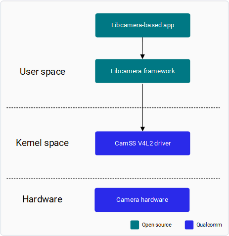

libcamera is validated using the [cam utility](https://libcamera.org/getting-started.html#basic-testing-with-cam-utility).

Capture raw frame data

The following steps describe how to capture raw frame data with the camera utility app using the V4L2 interface.

1. Enable the CamSS driver.

    1. Download upstream kernel source code using the following command.

devtool modify linux-qcom-custom
        Copy to clipboard

    This downloads the kernel source code to `<WORKSPACE>/build-qcom-wayland/workspace/sources/linux-qcom-custom/`.

    2. Apply the following change to enable the CamSS driver in the device tree:

<WORKSPACE>/build-qcom-wayland/workspace/sources/linux-qcom-custom/arch/ arm64/boot/dts/qcom/qcs6490-addons-rb3gen2.dtsi
        
        &camss {
        -       status = "disabled";
        +       status = "okay";
                ports {
                      #address-cells = <1>;
                      #size-cells = <0>;
        csiphy3_ep: endpoint {
        };
        
        &cci1 {
        -       status = "disabled";
        +       status = "okay";
        };
        Copy to clipboard

    3. Apply the following patch that is needed to fix a functional issue. This patch will be mainlined in a the next release.

--- a/drivers/media/platform/qcom/camss/camss.c
        +++ b/drivers/media/platform/qcom/camss/camss.c
        @@ -3514,12 +3514,13 @@ static int camss_configure_pd(struct camss *camss)
           return ret;
        }
        
        +#if 0
           ret = devm_pm_opp_set_clkname(camss->dev, "vfe0");
           if (ret) {
              dev_err(dev, "devm_pm_opp_set_clkname failed %d\n", ret);
              return ret;
           }
        -
        +#endif
           camss->genpd_link = device_link_add(camss->dev, camss->genpd,
              DL_FLAG_STATELESS | DL_FLAG_PM_RUNTIME |
              DL_FLAG_RPM_ACTIVE);
           @@ -3528,6 +3529,7 @@ static int camss_configure_pd(struct camss *camss)
              ret = -EINVAL;
              goto fail_pm;
           }
        
        +#if 0
           ret = devm_pm_opp_of_add_table(camss->dev);
           if (ret) {
              @@ -3535,6 +3537,7 @@ static int camss_configure_pd(struct camss *camss)
              device_link_del(camss->genpd_link);
              goto fail_pm;
           }
        +#endif
        
           return 0;
        
         --
         2.25.1
        Copy to clipboard
2. Edit the `linux-qcom-custom_%.bbappend` or .bb file in `<workspace>/layers/meta-qcom-hwe/recipes-kernel/linux/linux-qcom-custom` to include the patches from step 1:

SRC_URI += "file://camss_enable_change.patch"
        
        or
        
        SRC_URI:qcom-custom-bsp += "file://camss_enable_change.patch"
        Copy to clipboard
3. Build the image following the Yocto build command in [Build Guide](https://docs.qualcomm.com/bundle/publicresource/topics/80-70020-254/build_addn_info.html).
4. Flash the image following the instructions in [Flash images](https://docs.qualcomm.com/bundle/publicresource/topics/80-70020-254/flash_images.html).
5. Disable the camera module.

    The camera module cannot coexist with the CamSS driver. Move the camera.ko module out from `/lib/modules/6.6.90-qli-1.5-*/camera/*` to make it not load automatically, then reboot the device.

# mount -o rw,remount /usr
        # mv /lib/modules/6.6.90-qli-1.5-*/camera/camera*.ko /
        # reboot
        Copy to clipboard
6. Compile and push libcamera utilities.

bitbake libcamera
        Copy to clipboard
7. Push the binaries to the device. In the following example, `<workspace>` is the directory of the Qualcomm software release.

Note

Connect to the device console using SSH. See [How To SSH?](https://docs.qualcomm.com/bundle/publicresource/topics/80-70020-254/how_to.html#use-ssh) for instructions.

scp <WORKSPACE>/build-qcom-wayland/tmp-glibc/deploy/ipk/armv8-2a/libcamera_202105+git0+acf8d028ed-r0_armv8-2a.ipk root@[ip-addr]:/var/cache/camera/
    scp <WORKSPACE>/build-qcom-wayland/tmp-glibc/deploy/ipk/armv8-2a/libevent-pthreads-2.1-7_2.1.12-r0_armv8-2a.ipk root@[ip-addr]:/var/cache/camera/
    scp <WORKSPACE>/build-qcom-wayland/tmp-glibc/deploy/ipk/armv8-2a/libevent-2.1-7_2.1.12-r0_armv8-2a.ipk root@[ip-addr]:/var/cache/camera/
    Copy to clipboard

8. Create a shell connection to the device:

ssh root@[ip-addr]
        Copy to clipboard
9. Optionally, add the sensor driver and CamSS modules.

# modprobe imx412
        # modprobe qcom-camss
        Copy to clipboard

    This is an optional step becuase the imx412 and qcom-camss modules in `/lib/modules` are loaded automatically.
Modprobe is used to add/remove modules from the Linux Kernel. The imx412 and qcom-camss modules are located in the following paths on the device:

    - `/lib/modules/*/kernel/drivers/media/i2c/imx412.ko`
    - `/lib/modules/*/kernel/drivers/media/platform/qcom/camss/qcom- camss.ko`

    Loading of the qcom\_camss and imx412 modules can be verified with the following lsmod command:

# lsmod | grep qcom_camss
        # lsmod | grep imx412
        Copy to clipboard
10. Install libcamera utilities:

> 
> 
> # mount -o rw,remount /usr
>     
>     # opkg --nodeps install /var/cache/camera/libcamera_202105+git0+acf8d028ed-r0_armv8-2a.ipk --force-reinstall
>     # opkg --nodeps install /var/cache/camera/libevent-pthreads-2.1-7_2.1.12-r0_armv8-2a.ipk --force-reinstall
>     # opkg --nodeps install /var/cache/camera/libevent-2.1-7_2.1.12-r0_armv8-2a.ipk --force-reinstall
>     Copy to clipboard

11. Run the cam utility:

> 
> 
> # cam -c 1 --capture=10 --file='frame-#.raw'
>     Copy to clipboard

This runs the utility and captures 10 raw frames in the root directory and saves them into files.

Check the console log messages for information about the resolution and format of the dumped images.

Using camera /base/soc@0/cci@ac4b000/i2c-bus@1/camera@1a as cam0 [0:15:01.067615799] [2155] INFO Camera camera.cpp:945 configuring streams:
    (0) 4056x3040-SRGGB10_CSI2P
    cam0: Capture 10 frames
    Copy to clipboard

Note

This section is only applicable for QCS6490.

Note

This section is only applicable for QCS6490.

## USB camera

Qualcomm Linux devices provide driver support for USB web cameras that adhere to the USB video class (UVC) standard.
The UVC video driver exposes these cameras as V4L2 video devices, which can be accessed through the character device nodes such as /dev/videoX.
See [USB camera configuration](https://docs.qualcomm.com/bundle/publicresource/topics/80-70020-8/usb.html?) for an USB camera usage.
The sample application [gst-usb-single-camera-app](https://docs.qualcomm.com/bundle/publicresource/topics/80-70020-50/usb-camera.html?) can be used for USB camera validation.

## Network camera

A network camera can be supported with the open source GStreamer plugin.
Getting a camera stream from the network depends on the network protocols supported by the GStreamer plugin.
Developers can use an open source GStreamer plugin (for example, rtspsrc) to handle camera streams from the network and create a pipeline as needed.
See [rtspsrc](https://gstreamer.freedesktop.org/documentation/rtsp/rtspsrc.html?gi-language=c) for plugin details.

The sample application [gst-ai-multistream-inference](https://docs.qualcomm.com/bundle/publicresource/topics/80-70020-50/multistream-inference.html?) can also be used for network camera validation.
For developing a GStreamer application on the Qualcomm platform, see [Qualcomm Intelligent Multimedia SDK](https://docs.qualcomm.com/bundle/publicresource/topics/80-70020-50/overview.html?).

Last Published: Jul 02, 2025

[Previous Topic
Camera overview](https://docs.qualcomm.com/bundle/publicresource/80-70020-17/topics/camera-overview.md) [Next Topic
Enhance camera output](https://docs.qualcomm.com/bundle/publicresource/80-70020-17/topics/enhance-camera-output.md)