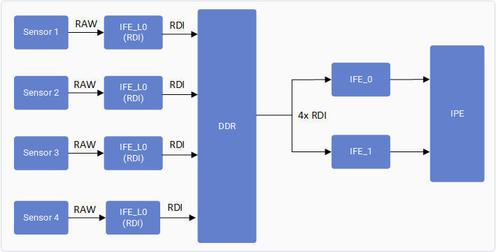

# Support multi-camera using offline IFE

**dagu 归档备注（不是 PIX（Pixel path，像素通路）手册）：**
本章只适用于 QCS9075。通路是 IFE_Lite（Image Front End Lite，轻量图像前端）
RDI（Raw Dump Interface，原始旁路出口）→ DDR → SFE Lite fetch → 离线
IFE（Image Front End，图像前端）。禁止拿 Lite / 离线 fetch 修
imx596 / s5kjn1 满幅 IFE（Image Front End，图像前端）1。禁止把
`qtiqmmfsrc` NV12（YUV 4:2:0 semi-planar，半平面亮度/色度）当 Linux
CAMSS（Camera Subsystem，相机子系统）线性 Display Full dest。

Note

This section is only applicable for QCS9075.

QCS9075 has two IFEs that support de-bayering (bayer-to-YUV processing) of the bayer camera images in real-time. This allows for support of concurrent streaming from two bayer cameras.

The Offline IFE feature allows the IFE to run in offline mode and supports de-bayering of two cameras using single IFE. This allows for support concurrent streaming from four bayer cameras.

Each Sensor is connected to one IFE-Lite hardware instance and data is dumped to DDR using the RDI port. A single IFE hardware is being used to read data from two IFE-Lites using bus fetch engine SFE Lite and processing data in Offline mode.

With this approach, instead of directly feeding the camera frames to IFE, frames are routed from IFE\_LITE and dumped in DDR. Then they’re provided to IFE using the fetch engine SFE Lite for bayer-to-YUV processing.

By enabling this feature, the following camera concurrency use cases are possible to run:

- Four OV9292 MIPI cameras connected to 4 MIPI CSI slots 0, 1, 2 ,and 3

## Test procedure

Note

Connect to the device console using SSH. See [How To SSH?](https://docs.qualcomm.com/bundle/publicresource/topics/80-70022-254/how_to.html#use-ssh) for instructions.

To collect the user log, run the following command in the device:

# journalctl -f > /opt/user_log.txt
    Copy to clipboard

To collect the kernel log, run the following command in the device:

# dmesg -w  > /opt/kernel_log.txt
    Copy to clipboard

Run a GST command with `multicamera-hint=true`  for each camera to enable this feature. For example:

gst-launch-1.0 -e qtiqmmfsrc name=camsrc camera=0 multicamera-hint=true ! \
    video/x-raw,format=NV12,width=1280,height=720,framerate=30/1,\
    interlace-mode=progressive,colorimetry=bt601 ! v4l2h264enc \
    capture-io-mode=4 output-io-mode=5 extra-controls="controls,video_bitrate=6000000,\
    video_bitrate_mode=0;" ! h264parse ! mp4mux ! filesink location=/opt/mux_avc.mp4
    Copy to clipboard

Similarly run other cameras with the `multicamera-hint=true` option.

## Log verification

Check for the following prints in user logs:

CamX: [CORE_CFG]3509 3556 [CORE   ] camxpipeline.h:4222 SetPipelineStatus() RealTimeFeatureZSLPreviewRawOfflineIFE_0_cam_0 status is now PipelineStatus::STREAM_ON
    Copy to clipboard

Check for the following prints in kernel logs:

CAM_INFO: CAM-ISP: cam_ife_hw_mgr_print_acquire_info: 1733: 0:4:11.835 Acquired Single IFE[0] SFE[0] OFFLINE: Y with [9 pix] [0 pd] [0 rdi] ports for ctx:1
    Copy to clipboard

Last Published: Oct 15, 2025

[Previous Topic
Enhance camera output](https://docs.qualcomm.com/bundle/publicresource/80-70022-17/topics/enhance-camera-output.md) [Next Topic
Support software TNR/MCTF](https://docs.qualcomm.com/bundle/publicresource/80-70022-17/topics/support-software-tnr-mctf.md)