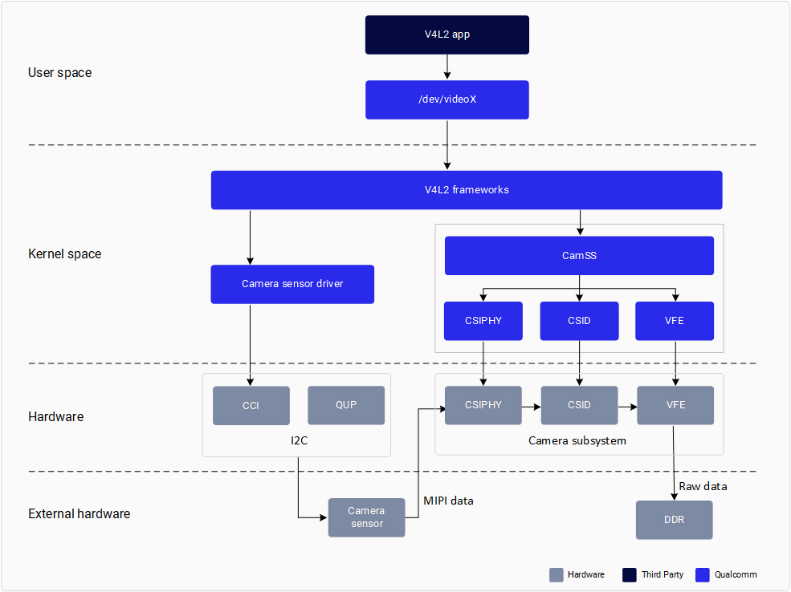
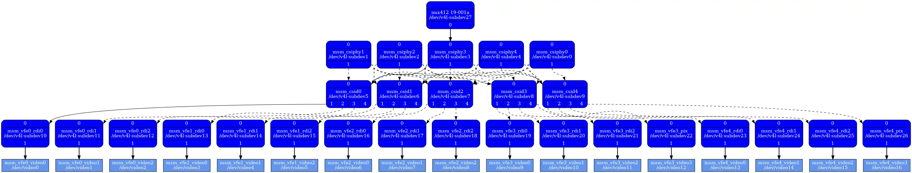

# Stream cameras（摘录：V4L2 / CAMSS）

全文是 QCS6490 / QCS9075 的 `qtiqmmfsrc` 板级 GStreamer，约 1.4MB 图，
不是 Titan 480 PIX（Pixel path，像素通路）线性手册。本地只留
V4L2（Video for Linux 2，Linux 视频接口）/
CAMSS（Camera Subsystem，相机子系统）架构段。
原文：https://docs.qualcomm.com/doc/80-80022-17/topic/stream-cameras.html
Last Published: 2026-05-26。

The V4L2 API, which uses the CAMSS driver, is suitable for developers who only need to obtain raw images from the camera.

Qualcomm supports the V4L2 interface camera ISP driver for raw frame dump functionality in the upstream kernel.

#### CAMSS driver

The Qualcomm camera subsystem (CAMSS) driver in the upstream kernel implements the V4L2, media controller, and V4L2 subdev interfaces.

The CAMSS driver consists of:

- CSIPHY module – Handles the physical layer of the CSI2 receivers. A separate camera sensor can be connected to each CSIPHY module.
- CSI Decoder (CSID) module – Handles the protocol and application layers of the CSI2 receivers. A CSID can decode a data stream from any CSIPHY.
- Video Front End (VFE) module – Represents the Image Front End (IFE) that contains Raw Dump Interface (RDI) input interfaces that bypass the image processing pipeline. The VFE also contains the AXI bus interface which writes output data to memory.

The CAMSS driver implements the V4L2 interface. Each CSIPHY, CSID, and VFE module is represented by a single V4L2 sub-device.

As shown in the following diagram, each CSIPHY can connect to each CSID. Each CSID can connect to each VFE. Each RDI port has an individual video node.

CAMSS V4L2 drivers are in `<kernel_root>/drivers/media/platform/qcom/camss`.

dagu 用法：官方公开保证的是 RDI（Raw Dump Interface，原始旁路出口）raw dump。
飞行件产品口仍是满幅 IFE（Image Front End，图像前端）
PIX（Pixel path，像素通路）线性 NV12（YUV 4:2:0 semi-planar，半平面亮度/色度）。
禁止把这一章当成「停在 SoftISP（Software Image Signal Processor，软件图像信号处理器）」的许可。
禁止把后面的 `qtiqmmfsrc` / offline IFE（Image Front End，图像前端）GStreamer 当
PIX（Pixel path，像素通路）出帧手册。
