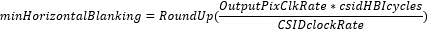
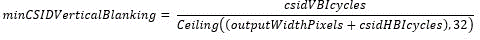
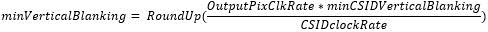

# Camera IFE clock configuration

Source: [https://docs.qualcomm.com/doc/80-88500-1/topic/68_Camera_IFE_clock_configuration.html](https://docs.qualcomm.com/doc/80-88500-1/topic/68_Camera_IFE_clock_configuration.html)

The following sensor-based factors determine the IFE clock rate:
      
- Input frame dimensions for the sensor mode in use. Input dimensions are specified in terms of the pixel width and height of the frame being fed into the IFE from the sensor.
- The horizontal and vertical blanking periods for the sensor mode in use.
- The sensor output clock rate for the sensor mode in use.

The following are the IFE blanking requirements of the Qualcomm Spectra™ ISP:

- Minimum horizontal blanking – 64
- Minimum vertical blanking – 32

The input dimensions and the blanking periods are specified in the corresponding sensor’s XML configuration file. Following is an example configuration of a sensor mode:

    <resolutionData>
    <streamInfo>
    <streamConfiguration>
    <vc range="[0,3]">0</vc>
    <dt>43</dt>
    <frameDimension>
    <xStart>0</xStart>
    <yStart>0</yStart>
    <width>5488</width>
    <height>4112</height>
    </frameDimension>
    <!--Minimum horizontal blanking interval in terms of the sensor’s output pixel clock rate -->
    <minHorizontalBlanking>467</minHorizontalBlanking>
    <!--Minimum vertical blanking interval in terms lines -->
    <minVerticalBlanking>278</minVerticalBlanking>
    <outputPixelClock>784800000</outputPixelClock>Copy to clipboard

The frame width, height, blanking information, and sensor output pixel clock rate are provided by the sensor vendor for each sensor mode. The blanking information provided by sensor vendors may not be the minimum blanking period but the average blanking period. To calculate the IFE clock rate optimally and correctly, do not use the average blanking period as this can result in `CAMIF` overflows. Instead, specify the smallest horizontal and vertical blanking periods for a given frame.

## Configure the blanking values

Usually sensor vendors do not provide the smallest blanking period in their data sheets. In
        such cases, use the hardware capability of the Qualcomm Spectra to measure the smallest
        horizontal blanking interval (HBI) and the smallest vertical blanking interval (VBI) to get
        the correct values. 
Note: Always use the
          smallest values observed over many seconds. Also, this measurement must be done with the
          highest frame rate supported by the sensor in each mode. To get the highest frame rate,
          ensure that the device is tested at around 1000 lux and verify that the highest frame rate
          is indeed being achieved. The Qualcomm Spectra hardware reports the HBI and VBI intervals
          in terms of CSID clock rate.

To measure the smallest HBI and VBI values, do the following:

1. Get the KMD log:
          
adb shell "echo 0x80 > /sys/kernel/debug/camera_ife/ife_csid_debug"
        adb shell "echo 0x1 > /sys/kernel/debug/camera_ife/ife_camif_debug" adb logcat -b kernel > kmd.logCopy to clipboard
2. Search for `cam_ife_csid_get_hbi_vbi` and get minimum
            `HBI[11:0](0xFFF)` and `VBI[31:0] (0xFFFFFFFF)`, then fill
            `csidHBIcycles` and `csidVBIcycles`

        07-25 03:52:51.427 0 0 W cam_ife_csid_get_hbi_vbi: 292 callbacks suppressed
        07-25 03:52:51.427 0 0 I CAM_INFO: CAM-ISP: cam_ife_csid_get_hbi_vbi: 3090 Device csid4 index 0 Resource 4 HBI: 0x665016d VBI: 0x32e98 07-25 03:52:51.427 0 0 I CAM_INFO: CAM-ISP: cam_ife_csid_get_hbi_vbi: 3090 Device
        csid4 index 1 Resource 4 HBI: 0x665016d VBI: 0x32e98 07-25 03:52:51.461 0 0 I CAM_INFO: CAM-ISP: cam_ife_csid_get_hbi_vbi: 3090 Device csid4 index 0 Resource 4 HBI: 0x665016d VBI: 0x32e99 07-25 03:52:51.461 0 0 I CAM_INFO: CAM-
        ISP: cam_ife_csid_get_hbi_vbi: 3090 Device csid4 index 1 Resource 4 HBI: 0x665016d VBI: 0x32e99 07-25 03:52:51.494 0 0 I CAM_INFO: CAM-ISP:
        cam_ife_csid_get_hbi_vbi: 3090 Device csid4 index 0 Resource 4 HBI: 0x665016d VBI: 0x32e98 07-25 03:52:51.494 0 0 I CAM_INFO: CAM-ISP:
        cam_ife_csid_get_hbi_vbi: 3090 Device csid4 index 1 Resource 4 HBI: 0x665016d VBI: 0x32e98 07-25 03:52:51.527 0 0 I CAM_INFO: CAM-ISP:
        cam_ife_csid_get_hbi_vbi: 3090 Device csid4 index 0 Resource 4 HBI: 0x665016d VBI: 0x32e98 07-25 03:52:51.527 0 0 I CAM_INFO: CAM-ISP:
        cam_ife_csid_get_hbi_vbi: 3090 Device csid4 index 1 Resource 4 HBI: 0x665016d VBI: 0x32e98Copy to clipboard

    As seen in the example, there may be a slight variation in the HBI and VBI values.

For the HBI, only bits 0 to 11 should be used to extract the minimum HBI. So from the
            log, the minimum HBI is `0x16d`. Convert this minimum HBI value to the
            sensor’s output pixel clock domain as:   

    - `OutputPixClkRate` is the sensor’s output pixel clock rate in
              Hz.
    - `csidHBIcycles` is the HBI value as reported by the Qualcomm Spectra
              hardware. In the example logs, this value is 0x16d.
    - `CSIDclockRate`is the clock rate of the CSID block being used for
              this use case. This clock rate can be read using the following commands while the use
              case is active:
        - For IFE0:

                adb shell cat /d/clk/cam_cc_ife_0_csid_clk/clk_measureCopy to clipboard
        - For IFE1:

                adb shell cat /d/clk/cam_cc_ife_1_csid_clk/clk_measureCopy to clipboard

    To get the `CSIDclockRate`, use the following commands:

        adb shell mount -t debugfs none /sys/kernel/debug/Copy to clipboard

        adb shell cat /d/clk/cam_cc_csid_clk/clk_measureCopy to clipboard

To calculate the minimum VBI, use the following formula:   

Where, `minCSIDVerticalBlanking` is in the CSID clock domain, convert it
            to the sensor’s output pixel clock domain as:   

    Examples:

    `CSIDclockRate` = 399997872 (400 MHz)

    `Sensor Op`=577650000 (577 MHz)

    `csid_HBI_cycles` = 0x5420129

    bit0 to bit11-&gt; 0x129 = 297 `minHorizontalBlanking` =
            (577 \* 297)/400 = 429

    `minVerticalBlanking = (OutputPixClkRate * csidVBIcycle) / (Ceiling
              ((outputWidthPixel + csidHBIcycles), 32) * CSIDclockRate)`

    `csid_VBIcycles`=0x2518a0 = 2431136

    `sensorOutputWidth` = 4000

    `minCSIDVerticlBlanking`=2431136/(4000+429) = 549

    `minVerticalBlanking`=(577 \* 549)/ 400 = 791

**Parent Topic:** [Sensor hardware configuration](https://docs.qualcomm.com/doc/80-88500-1/topic/62_Sensor_hardware_configuration.html)

Last Published: Aug 18, 2023

[Previous Topic
CCI operation speed](https://docs.qualcomm.com/bundle/publicresource/80-88500-1/topics/65_Configure_CCI_operation_speed.md) [Next Topic
Power regulator configuration](https://docs.qualcomm.com/bundle/publicresource/80-88500-1/topics/69_Power_regulator_configuration.md)