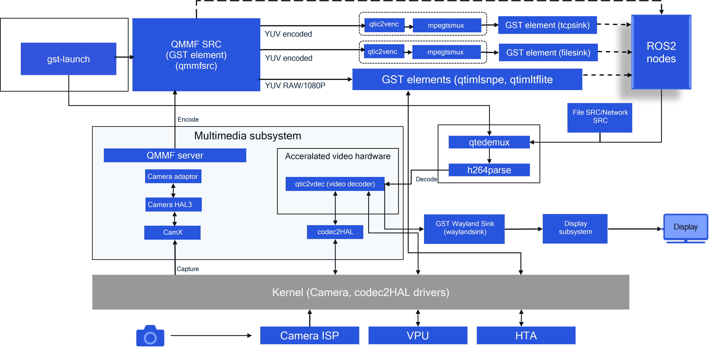

# Camera

Source: [https://docs.qualcomm.com/doc/80-88500-4/topic/122_Camera.html](https://docs.qualcomm.com/doc/80-88500-4/topic/122_Camera.html)

The camera architecture uses the QMMF SRC GST plugin. The SRC plugin handles the
    encoding of the camera frames.

The architecture for the camera subsystem, including video, is shown in the following figure.

It is also possible to bypass the QMMF SRC to talk directly to the camera HAL3. However, the
      encoding has to be handled at the output of the camera HAL3.

The camera subsystem includes multiple components:

- QMMF SRC plugin (GST element)
- QMMF server (daemon)
- Camera adaptation layers
- Camera HAL3
- CamX
- Codec2
- VPU for video encoding and decoding
- Feature-rich ISP drivers

Figure : Camera and video architecture
      
      

For information on configuring the camera test application, see <cite class="cite">Qualcomm Robotics RB5
        Platform Software User Guide</cite> (80-88500-3).

- **[Camera capture and encode](https://docs.qualcomm.com/doc/80-88500-4/topic/123_Camera_capture_and_encode.html)**  

The qmmfsrc plugin can be used to capture camera frames via the QMMF service and     provide multiple encoded (AVC/HEVC) bitstreams and YUV streams.
- **[Qualcomm Spectra 480](https://docs.qualcomm.com/doc/80-88500-4/topic/124_Qualcomm_Spectra_480.html)**  

An image signal processor (ISP) tunes the camera parameters to ensure that the device     captures high quality images. The Qualcomm Spectra 480 ISP supports tuning for seven concurrent     cameras at the hardware level. However, the number of cameras enabled end to end at software     level may be different.
- **[ISP tuning process](https://docs.qualcomm.com/doc/80-88500-4/topic/125_ISP_tuning_process.html)**  

The camera tuning is done using an image signal processor (ISP) and an on-device image     tuning tool. It is an iterative process where the entire process or sections of the process is     repeated several times.
- **[CHI](https://docs.qualcomm.com/doc/80-88500-4/topic/126_CHI.html)**  

The camera HAL interface (CHI) API aims to separate the Camera2/HAL3 interface for using a camera and supplement it with a fully flexible image processing driver.
- **[Topology graph XML](https://docs.qualcomm.com/doc/80-88500-4/topic/128_Topology_graph_XML.html)**  

The hardware and software image processing nodes are required to produce desired     output, and the connections between those nodes determine how data flows through the camera     subsystem. This set of nodes and connections is called a topology.
- **[CamX](https://docs.qualcomm.com/doc/80-88500-4/topic/129_CamX.html)**  

The CamX component contains the camx and chicdk layers. Feature2 is added in the chicdk     layer.

Last Published: Aug 18, 2023

[Previous Topic
Wireless connectivity](https://docs.qualcomm.com/bundle/publicresource/80-88500-4/topics/121_Wireless_connectivity.md) [Next Topic
Camera capture and encode](https://docs.qualcomm.com/bundle/publicresource/80-88500-4/topics/123_Camera_capture_and_encode.md)