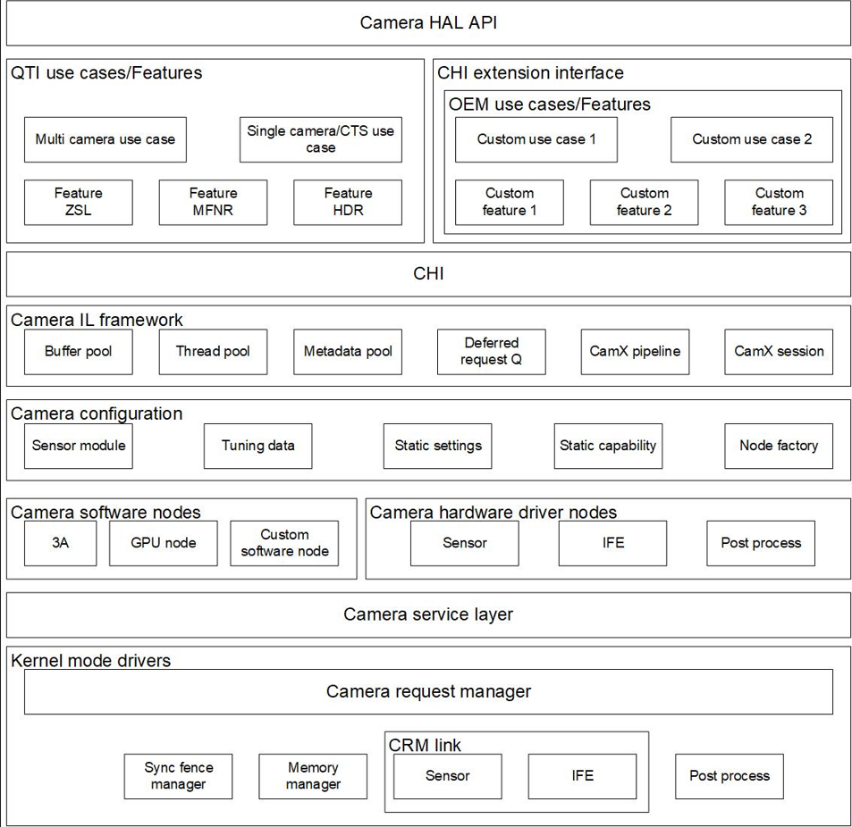

# CamX

Source: [https://docs.qualcomm.com/doc/80-88500-4/topic/129_CamX.html](https://docs.qualcomm.com/doc/80-88500-4/topic/129_CamX.html)

The CamX component contains the camx and chicdk layers. Feature2 is added in the chicdk
    layer.

Figure : CamX architecture
      
      

**Parent Topic:** [Camera](https://docs.qualcomm.com/doc/80-88500-4/topic/122_Camera.html)

Last Published: Aug 18, 2023

[Previous Topic
Topology graph XML](https://docs.qualcomm.com/bundle/publicresource/80-88500-4/topics/128_Topology_graph_XML.md) [Next Topic
Video](https://docs.qualcomm.com/bundle/publicresource/80-88500-4/topics/130_Video.md)