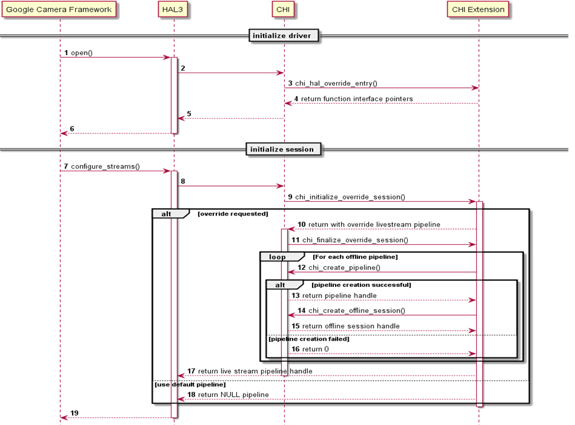

# CHI architecture model

Source: [https://docs.qualcomm.com/doc/80-88500-4/topic/127_CHI_architecture_model.html](https://docs.qualcomm.com/doc/80-88500-4/topic/127_CHI_architecture_model.html)

The CHI driver provides the default nodes to enable the camera use cases. You can add
    functionalities to the existing CHI driver for a unique camera experience. It is a simple yet
    powerful interface to seamlessly add image processing functionalities in the camera
    pipeline.

The CHI topology XML is a single XML with a collection of topologies for different camera use
      cases. It is loaded when the HAL process is initialized. It is essentially a Key + Data store,
      where a key is useful to choose a specific data from the available set. The data in CHI
      topology XML is the DAG (topology), and the key is per-session settings + collection of
      streams. Qualcomm provides default topologies for common use cases. You can edit the default
      XML and create their own topology XML containing custom topologies. The CHI API provides an
      interface to explicitly select a custom topology.

## Use case

The following sequence diagram describes a sample use case of the CHI with custom plug in and topology.

Figure : Use case of CHI with custom plugin and topology
        
        

**Parent Topic:** [CHI](https://docs.qualcomm.com/doc/80-88500-4/topic/126_CHI.html)

Last Published: Aug 18, 2023

[Previous Topic
CHI](https://docs.qualcomm.com/bundle/publicresource/80-88500-4/topics/126_CHI.md) [Next Topic
Topology graph XML](https://docs.qualcomm.com/bundle/publicresource/80-88500-4/topics/128_Topology_graph_XML.md)