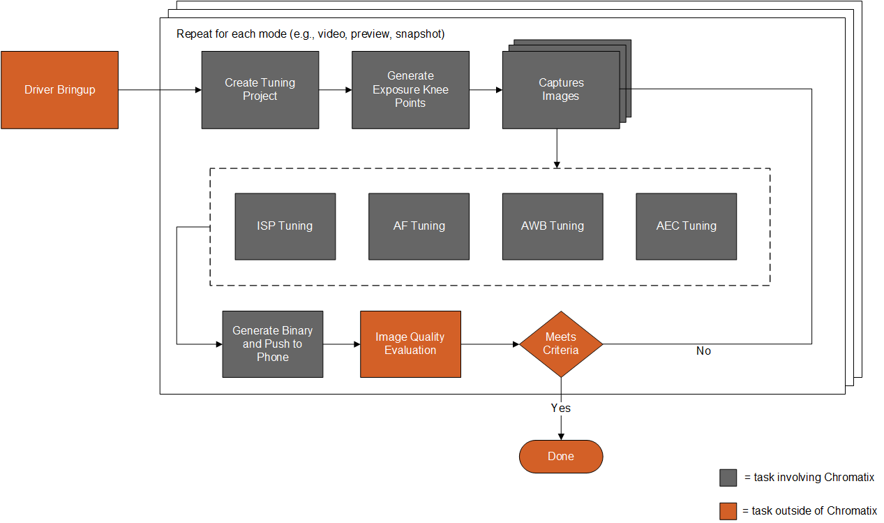

# ISP tuning process

Source: [https://docs.qualcomm.com/doc/80-88500-4/topic/125_ISP_tuning_process.html](https://docs.qualcomm.com/doc/80-88500-4/topic/125_ISP_tuning_process.html)

The camera tuning is done using an image signal processor (ISP) and an on-device image
    tuning tool. It is an iterative process where the entire process or sections of the process is
    repeated several times.

Figure : Camera tuning process
      
      

The colored boxes represent tasks involving the Qualcomm® Chromatix™ Camera Calibration Tool
      (image tuning tool) and show how they fit in the overall tuning process. Prerequisite tasks
      for ISP tuning begin after driver bringup is complete and ISP tuning itself occurs mostly in
      parallel with AF, AWB, and AEC tuning. Changes in these other areas may have an impact on ISP
      tuning, so maintain best practices in team communication and collaboration to minimize
      avoidable delays.

After completing the initial tuning and saving your Chromatix project, subsequent iterations for
      the same project usually begin by opening the existing project and refining the parameters
      with additional basic or advanced tuning.

Table : Camera tuning process

| Task | Description |
| --- | --- |
| Prerequisites | Perform tasks that are prerequisite to ISP tuning: create a new project, load the settings on the device, and capture images with the device. |
| Initial tuning | Perform ISP tuning in multiple iterations. Evaluate the results of tuning at any time using the simulation feature. |
| Simulate the tuning | Use the simulation feature at any time during the tuning process to see how a specific set of parameters for a specific series of tuning modules affect the raw image. Use the simulator to check the image results as it passes through each tuning module to identify where a specific issue is introduced. |
| Image quality evaluation | After each tuning session, capture new test images with the tuned device and objectively (numerically) measure image quality. |
| Load tuned settings | At this stage of the process, generate binary files that contain tuned parameters and load the settings on the device. |

**Parent Topic:** [Camera](https://docs.qualcomm.com/doc/80-88500-4/topic/122_Camera.html)

Last Published: Aug 18, 2023

[Previous Topic
Qualcomm Spectra 480](https://docs.qualcomm.com/bundle/publicresource/80-88500-4/topics/124_Qualcomm_Spectra_480.md) [Next Topic
CHI](https://docs.qualcomm.com/bundle/publicresource/80-88500-4/topics/126_CHI.md)