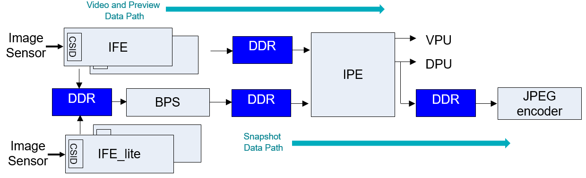
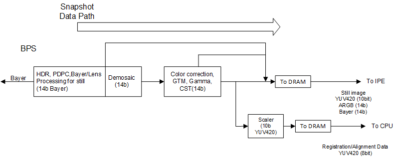

# Qualcomm Spectra 480

Source: [https://docs.qualcomm.com/doc/80-88500-4/topic/124_Qualcomm_Spectra_480.html](https://docs.qualcomm.com/doc/80-88500-4/topic/124_Qualcomm_Spectra_480.html)

An image signal processor (ISP) tunes the camera parameters to ensure that the device
    captures high quality images. The Qualcomm Spectra 480 ISP supports tuning for seven concurrent
    cameras at the hardware level. However, the number of cameras enabled end to end at software
    level may be different.

Table : Specifications of Camera ISP

| Feature | Qualcomm Spectra 480 |
| --- | --- |
| Maximum real-time sensor input resolution | <ul class="ul"><li class="li">2x full IFE processing – 25 MP (4:3), 18 MP (16:9 aspect ratio)</li> <li class="li">5x IFE_Lite processing – Mono/YUV interface for miscellaneous CV use cases</li> </ul> |
| Camera interfaces | <ul class="ul"><li class="li">DPHY 1.2 – 4/4/4/4/4/4 (2.5 Gbps/lane)</li> <li class="li">CPHY 1.2 – 10.28 Gbps/T</li> <li class="li">Connect up to 12x cameras, 7x concurrent</li> </ul> |
| ZSL performance | <ul class="ul"><li class="li">2x 25M at 30 fps – Dual camera</li> <li class="li">1x 64M at 30 fps – Single camera</li> </ul> |
| Video | 10-bit 4K/120, 8K/30 support with inline hardware EIS |
| Image quality and imaging   improvements | <ul class="ul"><li class="li">PDPC for R, B and G; 2x1 and 2x2 OCL</li> <li class="li">PDLib for 2PD and sparse PD</li> <li class="li">Machine learning-based face detection hardware</li> <li class="li">MCTF with local motion compensation</li> <li class="li">Mid/low frequency denoising improvements and local contrast enhancement</li> <li class="li">Adaptive lens shading correction to recover highlight details</li> <li class="li">Binning correction to remove artifacts due to sensor binning</li> <li class="li">Video super resolution</li> <li class="li">quadCFA binning</li> </ul> |
| Bayer Processing Segment (BPS) tap-out points | <ul class="ul"><li class="li">YUV 4:2:0</li> <li class="li">Bayer</li> <li class="li">RGB</li> </ul> |
| Power improvements | <ul class="ul"><li class="li">All Qualcomm Robotics RB5 camera use cases can be exercised at lower voltage</li> <li class="li">Inline hardware EIS</li> <li class="li">Multiple outputs from one pass (SIMO)</li> <li class="li">Better compression to reduce bandwidth and power consumption</li> <li class="li">4K at 120 fps camcorder support</li> </ul> |

Figure : High-level architecture of Qualcomm Spectra 480
      
      

- Camera Serial Interface Decoder (CSID) module
- Image Front End (IFE) (x 2)
- IFE\_Lite (x 5)
- BPS for snapshot
- Image Processing Engine (IPE)
- VPU: Codec
- DPU

Figure : High-level architecture of Qualcomm Spectra 480 (BPS)
      
      

- BPS:
    - Snapshot path only
    - Bayer processing, for example, demosaic, PDAF pixel correction (including 2x1/2x2 OCL), lens
            shading correction, and so on
    - Downscaling for registration and alignment of sequential frames for multi-frame processing
    - Multiple format support for flexible hybrid of hardware and software
    - No HNR in BPS

**Parent Topic:** [Camera](https://docs.qualcomm.com/doc/80-88500-4/topic/122_Camera.html)

Last Published: Aug 18, 2023

[Previous Topic
Camera capture and encode](https://docs.qualcomm.com/bundle/publicresource/80-88500-4/topics/123_Camera_capture_and_encode.md) [Next Topic
ISP tuning process](https://docs.qualcomm.com/bundle/publicresource/80-88500-4/topics/125_ISP_tuning_process.md)