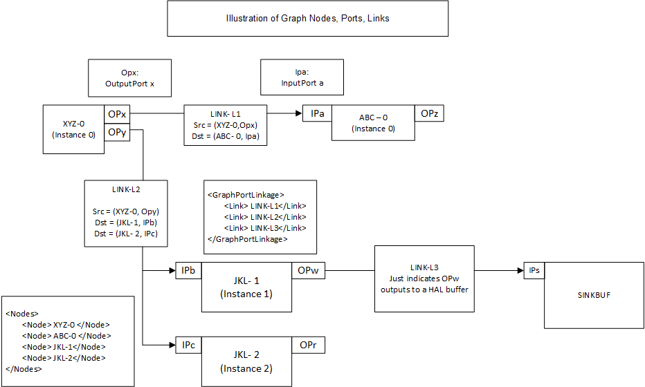

# Topology graph XML

Source: [https://docs.qualcomm.com/doc/80-88500-4/topic/128_Topology_graph_XML.html](https://docs.qualcomm.com/doc/80-88500-4/topic/128_Topology_graph_XML.html)

The hardware and software image processing nodes are required to produce desired
    output, and the connections between those nodes determine how data flows through the camera
    subsystem. This set of nodes and connections is called a topology.

A use case is defined by a set of targets to be processed, and a set of per-session settings
      which further define how the data should be processed. Each use case is represented by a
      topology, which is the connection between the information passed into the HAL3 API, and the
      concrete definition of how to process the data. The list of all the use cases and their
      corresponding topologies are encoded in an XML file. A use case is selected during
      configure\_streams based on two sections in the XML and an XSD schema, which defines the
      structure of the XML, is provided. Tools are provided to package the XML files as an offline
      binary for consumption by the CHI driver.

Figure : Relationship between nodes, ports, and links
      
      

For additional information, see the following documents:

- For information on generating new use cases in XML, see <cite class="cite">Qualcomm Spectra ISP Camera
          CHI API Reference</cite> (80-PC212-1).
- For information on generating custom CHI nodes, see <cite class="cite">CHI Customization Guide</cite>
        (80-PN984-4).

**Parent Topic:** [Camera](https://docs.qualcomm.com/doc/80-88500-4/topic/122_Camera.html)

Last Published: Aug 18, 2023

[Previous Topic
CHI architecture model](https://docs.qualcomm.com/bundle/publicresource/80-88500-4/topics/127_CHI_architecture_model.md) [Next Topic
CamX](https://docs.qualcomm.com/bundle/publicresource/80-88500-4/topics/129_CamX.md)