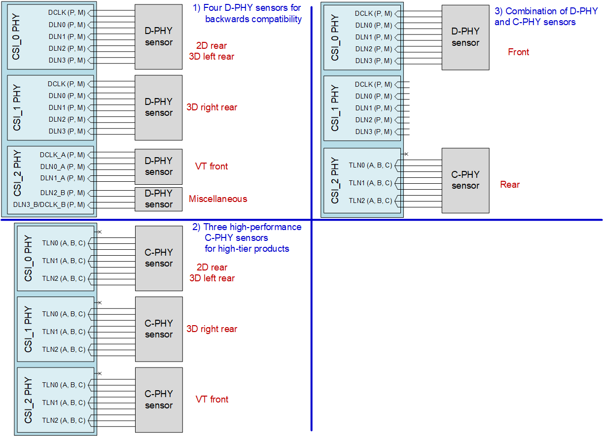

# Camera

Source: [https://docs.qualcomm.com/doc/80-PV086-5P/topic/camera-support.html](https://docs.qualcomm.com/doc/80-PV086-5P/topic/camera-support.html)

## Qualcomm Spectra 480 camera ISP

The QRB5165 device uses the Qualcomm Spectra 480 camera architecture, which has six interfaces for external cameras – six 4-lane interfaces with CSI D-PHY 1.2 or C-PHY 1.2.

Each of the D-PHY and C-PHY has a 1.2 interface has a data rate of 2.5 Gbps/lane and 1.2 interface has a data rate of 10.26 Gbps per T (4.5 Gsps/T) respectively.

The QRB5165 device can be connected to six cameras (4 + 4 + 4 + 4 + 4 + 4) or up to 12
        (D-PHY)/18 (C-PHY) cameras. It can support seven concurrent camera usages. In case of dual
        camera, sync is done through the VSYNC pin.

The QRB5165 camera architecture supports HVX streaming.

The Qualcomm Spectra 480 camera architecture can support a 25 MP + 25 MP + 2 MP + 2 MP +
        2 MP + 2 MP + 2 MP ISP configuration.

- IFE0 – 25 MP
- IFE1 – 25 MP
- IFE\_Lite0 – 2 MP raw interface
- IFE\_Lite1 – 2 MP raw interface
- IFE\_Lite2 – 2 MP raw interface
- IFE\_Lite3 – 2 MP raw interface
- IFE\_Lite4 – 2 MP raw interface

Up to seven concurrent cameras

Dedicated computer vision processor (CVP) located in VPU

- Offload fundamental CV tasks from CPU, Compute DSP, GPU, and NPU
- Lower overall use-case power and increase system performance

## CSI differential and three-phase

The CSI differential and three-phase configuration are listed below:

- Six 4-lane CSI (4 + 4 + 4 + 4 + 4 + 4) D-PHY 1.2 at 2.5 Gbps per lane or six 3-trio C-PHY 1.2 at 30.78 Gbps.
- C-PHY 1.2 is supported on the QRB5165 chipset, which uses single-ended signaling with an embedded clock (three wires per trio).

Figure :  1. Camera support – example configurations for combination PHY
        
        

Note: When a CSI PHY is used in a 2 + 1 dual-camera mode, only DLN3 can be used as CLK for the second camera.

Note: These are only example configurations. Other configurations are possible.

## Dedicated camera I^2^C ports for the camera control interface

In addition to the QUP I^2^C ports, there are four I^2^C ports that are
        dedicated to the camera control interface (CCI); do not use GPIO\_101–GPIO\_108 as
        general-purpose I^2^C ports.

Depending on the use case, the front and rear cameras can either share the CCI\_I2C ports, or can have separate CCI\_I2C ports.

It can support up to seven CAM\_MCLK running at 19.2 MHz by default.

- CAM\_MCLKx peak-to-peak jitter &lt; 400 ps with default frequency.
- Contact QTI customer engineering before using any CAM\_MCLK frequency other than 19.2
          MHz, to investigate if jitter is acceptable for such cases.

## Camera related GPIOs

The following table lists the camera related GPIOs.

Table :  1. Camera related GPIOs

| GPIO no. | Function | Comments |
| --- | --- | --- |
| 92 | #CAM1\_RST\_N | Camera 1 reset |
| 93 | #CAM0\_RST\_N | Camera 0 reset |
| 94 | CAM\_MCLK0 | Sensor 0 master clock |
| 95 | CAM\_MCLK1 | Sensor 1 master clock |
| 96 | CAM\_MCLK2 | Sensor 2 master clock |
| 97 | CAM\_MCLK3 | Sensor 3 master clock |
| 98 | CAM\_MCLK4 | Sensor 4 master clock |
| 99 | CAM\_MCLK5 | Sensor 5  master clock |
| 100 | CAM\_MCLK6 | Sensor 6 master clock |
| 101 | CCI\_I2C\_SDA0 | I^2^C master 0 SDA |
| 102 | CCI\_I2C\_SCL0 | I^2^C master 0 SCL |
| 103 | CCI\_I2C\_SDA1 | I^2^C master 1 SDA |
| 104 | CCI\_I2C\_SCL1 | I^2^C master 1 SCL |
| 105 | CCI\_I2C\_SDA2 | I^2^C master 2 SDA |
| 106 | CCI\_I2C\_SCL2 | I^2^C master 2 SCL |
| 107 | CCI\_I2C\_SDA3 | I^2^C master 3 SDA |
| 108 | CCI\_I2C\_SCL3 | I^2^C master 3 SCL |
| 109 | CCI\_TIMER0/#CAM3\_RST\_N | CCI timer/Cam 3 reset |
| 110 | CCI\_TIMER1 | CCI timer |
| 111 | CCI\_TIMER2 | CCI timer |
| 112 | CCI\_TIMER3/CCI\_ASYNC\_IN1 | CCI timer/camera interrupt |
| 113 | CCI\_TIMER4/CCI\_ASYNC\_IN2 | CCI timer/camera interrupt |
| 114 | CCI\_ASYNC\_IN0/#CAM6\_RST\_N | Camera interrupt/cam 6 reset |

**Parent Topic:** [Multimedia](https://docs.qualcomm.com/doc/80-PV086-5P/topic/multimedia.html)

Last Published: Jul 07, 2023

[Previous Topic
Display](https://docs.qualcomm.com/bundle/publicresource/80-PV086-5P/topics/display-support.md) [Next Topic
Audio](https://docs.qualcomm.com/bundle/publicresource/80-PV086-5P/topics/audio.md)